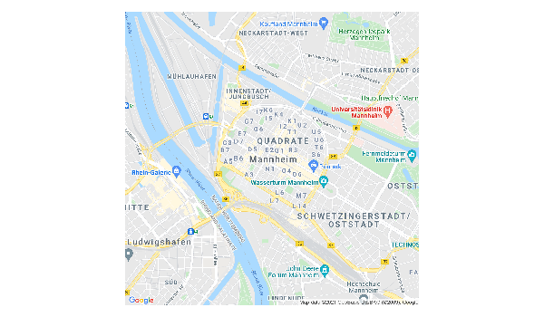

# Google Places API
<chauthors>Lukas Isermann and Clara Husson</chauthors>
<br><br>


## Provided services/data

* *What data/service is provided by the API?*

The following five requests are available: Place Search, Place Details, Place Photos, Place Autocomplete and Query Autocomplete. Place Search returns a list of places along with summary information about each place based on a user's location (by proximity) or search string. Once you find a place_id from a Place Search, you can request more details about a particular place by doing a Place Details request. A Place Details request returns more detailed information about the indicated place such as its complete address, phone number, user rating and reviews. Place Photos provides access to the millions of place-related photos stored in Google's Place database. When you get place information using a Place Details request, photo references will be returned for relevant photographic content. Find Place, Nearby Search, and Text Search requests also return a single photo reference per place, when relevant. Place Autocomplete automatically fills in the name and/or address of a place as users type. Query Autocomplete service provides a query prediction for text-based geographic searches, by returning suggested queries as you type.

**Note:** You can display Places API results on a Google Map, or without a map but it is prohibited to use Places API data on a map that is not a Google map.


## Prerequesites
* *What are the prerequisites to access the API (authentication)? *


The prerequisites to access Google Places API are a Google Cloud project (to create it you need a Google account to log into the Google Cloud Platform) and an API Key. Before creating your API Key, don’t forget to enable Places API! To create your API key, go the APIs & Services > Credentials > API key page. 


## Simple API call
* *What does a simple API call look like?*

The API provides different searches and services that can be accessed via HTTP Urls. These Urls requests all take the same general form and pattern:

https://maps.googleapis.com/maps/api/place/service/output?parameters

Here, service can take the inputs findplacefromtext for find place requests, nearbysearch to look for nearby places, details for a request of place details and more. output may take the value json or xml, dependent on the requested output format. 

Furthermore, certain parameters are required for all requests. Most importantly, every request must entail a key parameter, indicating the API key. Second, all search places requests take an input parameter that identifies the search target and an inputtype parameter that identifies the type of input given in the input parameter. For place requests, the inputtype parameter can take the values textquery and phonenumber. 

Nearby requests take a location parameter setting longitude and latitude of the requested place as well as a radius parameter. Detail request, however, take a mandatory parameter place_id, which indicates the place for which the details are requested. 

Additionally, different optional parameters can be used. These entail a language parameter, a fields parameter indicating the types of place data to return and more. 


An examples for an API request for pizza places in Mannheim can look like this:

https://maps.googleapis.com/maps/api/place/textsearch/xml?query=pizza&location=49.487459,8.466039&radius=5000&key=YOUR_API_KEY


## API access
* *How can we access the API from R (httr + other packages)?* 

Instead of typing the API request into our browser, we can use the httr package’s GET function to access the API from R.

```{r echo=TRUE, eval=FALSE}


# Option 1: Accessing the API with base "httr" commands
library(httr)

key <- "YOURAPIKEY"

res<-GET("https://maps.googleapis.com/maps/api/place/textsearch/json?", query = list(
           query = "pizza",
           location = "49.487459,8.466039",
           radius = 5000,
           key = key
         ))


```

Alternatively, we can use a wrapper function for R provided by the R-Package googleway.

*Authentication*

```{r echo=TRUE, eval=F}
key <- "YOURAPIKEY"
set_key(key)
```

*API call*

*Step 1: Load packages*

```{r message=FALSE, warning=FALSE}
library(ggplot2)
library(tidyverse)
library(googleway)
```


<!-- A cache version of location is available in "figures/rds/google_places_location.RDS" -->

```{r eval=F}
# Option 2: Accessing the API with googleway

# Request 'Mannheim' to get latitude and longitude information
location <- googleway::google_places("Mannheim")
```

```{r, echo = FALSE, message = FALSE}
location <- readRDS("figures/rds/google_places_location.RDS")
```

```{r warning=F, message=F}
# Save latitude and longitude information in vector
location <- location$results$geometry
location <- c(location$location$lat, location$location$lng)
```


<!-- A cache version of this plot is available in "figures/rds/google_places_plot1.RDS" -->

```{r eval=F}
# Plot places to google map
library(mapsapi)
# for this you will also need to activate the "maps static API"
r = mapsapi::mp_map(center = ("49.48746,8.466039"), zoom = 14, key = key, quiet = TRUE)
library(stars)

plot(r)
```

```{r echo=F, out.width="100%", fig.align='center'}

```


<!-- A cache version of pizza is available in "figures/rds/google_places_pizza.RDS" -->

```{r eval=F}
# Google places request with googleway
pizza <- google_places("Pizza", location = location, radius = 5000, place_type = "food")
```

```{r, echo = FALSE, message = FALSE}
pizza <- readRDS("figures/rds/google_places_pizza.RDS")
```


```{r echo=T, warning=F, message=F}
# Plot rankings as barplot
pizza$results %>%
  ggplot() +
  geom_col(aes(x = reorder(name, rating), y = rating)) +
  geom_text(aes(x = reorder(name, rating), y = rating),
                label = paste0(pizza$results$user_ratings_total, " \n ratings"), size = 2) +
  ylab("Average Rating")+
  xlab("") +
  ggtitle("Pizza Places in Mannheim by Rating") +
  theme_minimal() +
  theme(
    axis.text.x = element_text(angle = 90, size = 8, hjust=0.95,vjust=0.2))


```

```{r echo=T, eval=F, warning=F, message=F}
# Plot pizza places to google map
#important: in order to display the map correctly, you will also have to enable the Maps JavaScript API on GCP
# unfortunately we can not display an intercative card in this document, but check out the below code in your own rmd-file! 

map<-googleway::google_map(location = location)
googleway::add_markers(map, data = pizza$results$geometry$location)
```


## Social science examples
* *Are there social science research examples using the API?*

In his study “Using Google places data to analyze changes in mobility during the COVID-19 pandemic”, @Konrad2020-rl looked at the “popular times” data provided by Google Places to measure the effect of social distancing effort on mobility.


