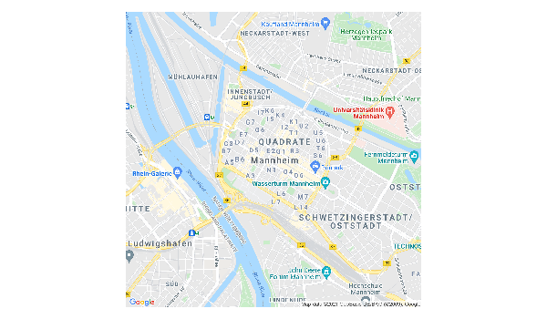
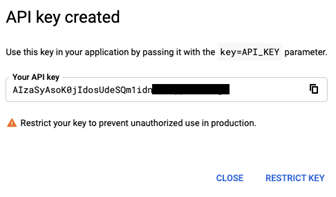

```{r functions-not-run, eval=FALSE, include=FALSE}
# FUNCTION: ORDER CHAPTERS ALPHABETICALLY
# Hong's function to order chapters alphabetically
# Use this to reorder chapters alphabetically
require(fs)
require(stringr)
require(purrr)

all_rmds <- dir_ls(regexp = "^[0-9].+[rR]md$")

old_chap_numbers <- str_extract(all_rmds, "^[0-9]+")
new_chap_numbers <- rep(NA, length(old_chap_numbers))

fixed_loc <- old_chap_numbers %in% c("01", "02", "99")

new_chap_numbers[fixed_loc] <- old_chap_numbers[fixed_loc]

chap_names <- str_extract(all_rmds, "[A-zA-Z_]+")

new_chap_numbers[!fixed_loc] <- formatC(match(chap_names[!fixed_loc], sort(chap_names[!fixed_loc])) + 2, width = "2", flag = "0")

gen_fname <- function(x, y) {
  paste0(x, "-", y, ".Rmd")
}

new_rmd_names <- map2_chr(new_chap_numbers, str_to_title(chap_names), gen_fname)

file_move(all_rmds, new_rmd_names)
```


```{r functions-run, include=FALSE}


# FUNCTION: 


#setwd("~/dev/apis_for_social_scientists_a_review")
.gen_pacman_chunk <- function(x = NULL) {
  if (is.null(x)) {
    file_name <- knitr::current_input()
  } else {
    file_name <- stringr::str_subset(dir(), x)[1]
  }
  lines_text <- readLines(file_name) 
  packages <- gsub("library\\(|\\)", "",  
                  unlist(stringr::str_extract_all(lines_text,  
                                         "library\\([a-zA-z0-9]*\\)|p_load\\([a-zA-z0-9]*\\)"))) 
  packages <- packages[packages!="pacman"] 
  packages <- packages[packages!="p_load("] 
  packages <- paste("# install.packages('pacman')", "library(pacman)", "p_load('", paste(packages, collapse="', '"), "')",sep="") 
  packages <- stringr::str_wrap(packages, width = 80) 
  packages <- gsub("install.packages\\('pacman'\\)", "install.packages\\('pacman'\\)\n", packages) 
  packages <- gsub("library\\(pacman\\)", "library\\(pacman\\)\n", packages)
  cat(packages)
  invisible(x)
}

#.gen_pacman_chunk("Crowdtangle")
#> # install.packages('pacman')
#> library(pacman)
#> p_load('httr', 'devtools',
#> 'RCrowdTangle', 'dplyr', 'jsonlite')
#.gen_pacman_chunk("Facebook_ads")


.gen_checkpoint_chunk <- function(x = NULL) {
  if (is.null(x)) {
    file_name <- knitr::current_input()
  } else {
    file_name <- stringr::str_subset(dir(), x)[1]
  }
  lines_text <- readLines(file_name) 
  packages <- gsub("library\\(|\\)", "",  
                   unlist(stringr::str_extract_all(lines_text,  
                                                   "library\\([a-zA-z0-9]*\\)|p_load\\([a-zA-z0-9]*\\)"))) 
  packages <- packages[packages!="pacman"] 
  packages <- packages[packages!="p_load("] 
  packages <- paste("# install.packages('checkpoint')", "library(checkpoint)", "checkpoint('", Sys.Date(), "')", sep="") 
  packages <- stringr::str_wrap(packages, width = 80) 
  packages <- gsub("install.packages\\('checkpoint'\\)", "install.packages\\('checkpoint'\\)\n", packages) 
  packages <- gsub("library\\(checkpoint\\)", "library\\(checkpoint\\)\n", packages)
  cat(packages)
  invisible(x)
}


```


<!-- compile with 

bookdown::render_book("index.Rmd", "bookdown::gitbook")
bookdown::publish_book(
  name = "apis_for_social_scientists",
  account = "paul",
  server = "bookdown.org",
  render = c("none")
)

-->


# Preface {-}
The present online book provide a review of APIs that may be useful for social scientists. Please start by reading the [Introduction]. The material was/is being developed by various contributors that you can find above and in the contributor section of the corresponding [github repository](https://github.com/paulcbauer/apis_for_social_scientists_a_review). If you are interested in contributing please check out the Section [How to contribute](https://github.com/paulcbauer/apis_for_social_scientists_a_review#how-to-contribute) in the github README.

The material is licensed under a [Apache License 2.0](https://en.wikipedia.org/wiki/Apache_License) license. Where we draw on other authors material other licenses may apply. We are extremely grateful for feedback and if you find errors please let us know.

This document was generated with [R](https://www.r-project.org/), [RMarkdown](http://rmarkdown.rstudio.com/) and [Bookdown](https://bookdown.org/).


<!--chapter:end:index.Rmd-->

# Introduction
This project *APIs for Social Scientists: A collaborative Review* is an outcome of the seminar *Computational Social Science* (CSS) taught at the University of Mannheim in 2021. While teaching the seminar we had trouble finding short reviews of APIs with quick R-code examples. Fortunately, almost everyone participating in the seminar was motivated enough to write a quick API review. Hopefully, our resource will help future students to start diving into different APIs.

Below we review different data- and service-APIs that may be useful to social scientists. The chapters always include a simple R code example as well as references to social science research that has relied on them. The idea is to provide short reviews of max. 10 pages for the corresponding API with code to get you started. Each chapter follows a systematic set of questions: 

* What data/service is provided by the API? (+ who provides it?)
* What are the prerequisites to access the API (e.g., authentication)? 
* What does a simple API call look like? 
* How can we access the API from R (httr + other packages)?
* Are there social science research examples using the API?


## Prerequisites: Authentication
A lot of the APIs require that you authenticate with the API provider. The underlying script of this review is written in such a way that it contains R chunks for authentication, however they will not be visible in the examples below (we only show placeholders for you to recognize at which step you will need to authenticate). These chunks in most cases make use of so-called keys in JSON format (e.g., service account key for Google APIs). However cloning the corresponding [repository]("https://github.com/paulcbauer/apis_for_social_scientists_a_review") of this review will not result in giving you the keys, hence in order to replicate our API calls, you will have to generate and use your own individual keys.

<!--As a consequence we can not make the corresponding [github repository public](https://github.com/paulcbauer/apis_for_social_scientists_a_review).-->


## Prerequisites: Software & packages
The code examples rely R and different packages thereof. It's probably easiest if you install all of them in one go using the code below. The `p_load()` function (`pacman` package) checks whether packages are installed. If not they are installed and loaded.

<!-- add all used packages -->


```{r intro-1, echo=FALSE, purl=F}
options(width = 300)
.gen_pacman_chunk()
```


```{r intro-2, eval=FALSE, include=TRUE, comment=NA}
p_load_gh("quanteda/quanteda.corpora")
p_load_gh("cbpuschmann/RCrowdTangle")
p_load_gh("joon-e/mediacloud")
p_load_gh("facebookresearch/Radlibrary")
```

## Replication 
A lot of the R packages that you have installed and loaded above regularly get updated, which often comes with slight changes in functionality. Also, new versions of the R programming environment itself are constantly developed. While we rely on an automatized way to regularly check whether all code that is presented in the subsequent chapters replicates without errors, it might be that you are executing code just before we find out about conflicts that come with newer versions of R or used packages. If you would like to ensure that all of the presented code runs smoothly, you can execute the following commands before proceeding.

```{r intro-3, eval=FALSE, include=TRUE, comment=NA}
p_load('checkpoint')
checkpoint("2022-08-03")
```

The `checkpoint` package from the [Reproducible R Toolkit (RRT)](https://cran.r-project.org/web/packages/checkpoint/vignettes/checkpoint.html) makes use of the daily snapshots of CRAN which are mirrored by the RRT-team on a separate server. Once you execute the command above, R will install all packages that you have loaded with the `p_load()` function in the same version as we used them on the date at which we last worked on the code. You may choose to only take this route if you would like to replicate the code presented in a particular chapter, but run into an error message. To reset your session to the state it was before using `checkpoint`, call `uncheckpoint()` or simply restart R. 

<!--
* Data vs. machine learning APIS
* Problem of replicability for ML APIs
-->


<!--chapter:end:Chapter_Introduction.Rmd-->

# Best Practices
<chauthors>Chung-hong Chan</chauthors>
<br><br>

When working with 3rd party APIs, please make sure you follow the best practices.

## Read the Developer Agreement, Policy and API Documentation

You must read the Developer Agreement, Policy and API documentation. It is still true even though you are going to use the R packages providing the wrapper functions (e.g. RCrowdTangle, tuber, academictwitteR etc.)

First, the Developer Agreement and Policy provide information on what you can and cannot do with the data obtained through the API. It is important for both Open Science practices (e.g. sharing data publicly) and sharing data between individuals within the research group. Please make sure you understand the data redistribution policy. The [API provided by Twitter](https://developer.twitter.com/en/developer-terms/agreement-and-policy), for example, forbids the redistribution of Twitter Content to third parties. However, academic researchers are permitted to distribute an unlimited number of Tweet IDs and/or User IDs for peer review purposes. The [API provided](https://www.crowdtangle.com/eu-terms) by CrowdTangle basically forbids any data redistribution. This point is of paramount importance for social scientists because the Cambridge Analytica data scandal is [a case of API data abuse by an academic researcher](https://www.theguardian.com/news/2018/mar/17/cambridge-analytica-facebook-influence-us-election).

Second, the API documentation provides information on what are the [expected API responses](https://developer.twitter.com/en/docs/twitter-api/tweets/search/api-reference/get-tweets-search-all) and [rate limits](https://developer.twitter.com/en/docs/twitter-api/rate-limits). Knowing the information is important because you know what to expect. Also, you won't offset the problems related to the API to the R package developers.

## Don't Hardcode Authentication Information into your R Code

You should not hardcode your authentication information (authentication keys, secrets, tokens) into your R code. But what do I mean by that? For example, the following is an example of hardcoding.

```r
require(tuber)
## fake, taken from tuber's vignette
client_id <- "998136489867-5t3tq1g7hbovoj46dreqd6k5kd35ctjn.apps.googleusercontent.com"
client_secret <- "MbOSt6cQhhFkwETXKur-L9rN"

yt_oauth(app_id = client_id,
         app_secret = client_secret,
         token = '')
```

This is not a good practice for two reasons. First, your `client_id` and `client_secret` are directly visible in your R code. It is super easy to accidentally leak these supposedly secret information while sharing your code. Even supposedly professional programmers [do that quite often](https://github.com/search?p=1&q=client_secret&type=Code). Also unlike a typical password system which renders these secret information as asterisks, it enables the so-called ["shoulder surfing attack"](https://en.wikipedia.org/wiki/Shoulder_surfing_(computer_security)): a malicious actor can obtain these information by simply looking (or videotaping through a tele lens) at your computer screen over your shoulder.

Second, when you run your code, your `client_id` and `client_secret` are burnt into your command history. A malicious person can browse through your command history to obtain these information.

You might wonder, well, they are just two pieces of string. No big deal. But please bare in mind these information is not simply for collecting data from YouTube. It could also be the credential for your Google Cloud access. Frequent access to some API endpoints that require money can incur financial loss. Other APIs such as Twitter v1 APIs allow [deletion of data](https://developer.twitter.com/en/docs/twitter-api/v1/tweets/post-and-engage/api-reference/post-statuses-destroy-id), [posting data](https://developer.twitter.com/en/docs/twitter-api/v1/tweets/post-and-engage/api-reference/post-statuses-update) or [reading all your direct messages](https://developer.twitter.com/en/docs/twitter-api/v1/direct-messages/api-features) on your behalf, simply with your API authentication information. So please: PROTECT YOUR AUTHENTICATION INFORMATION LIKE YOUR PASSWORDS!

### Alternative: Use Environment Variables

So, what is the alternative? A securer solution is to store your authentication information as [environment variables](https://stat.ethz.ch/R-manual/R-devel/library/base/html/Startup.html) (envvars) instead. Specifically, you should store your authentication information as your *user-level* envvars.

For a quick experimentation, run this:

```r
usethis::edit_r_environ(scope = "user")
```

If you are doing this in RStudio, a new file is now opened. That is your user-level `.Renviron` file. It is a hidden file (indicated by the ".") in your user directory [^unix].

For most people, it should be a blank file. For some, the file might already have something in it. Now, in the file, put this line into it:

```
MYSECRET=ROMANCE
```

This line says: I want to create a user-level envvar called "MYSECRET" with the value being "ROMANCE". Please note that this is not R and you must use the equal sign. As instructed, save the file and then **restart R**.

In the fresh R session, you can now retrieve the value of the environment variable "MYSECRET". If you did that correctly, running this should give you the value of "MYSECRET", i.e. "ROMANCE".

```r
## You should get "ROMANCE"
Sys.getenv("MYSECRET")
```

The practice is to setup envvars of your authentication information. For example, in your `.Renviron` set up the following envvars.

```
YT_CLIENTID=998136489867-5t3tq1g7hbovoj46dreqd6k5kd35ctjn.apps.googleusercontent.com
YT_CLIENTSECRET=MbOSt6cQhhFkwETXKur-L9rN
```

And then in your R code, it should be:

```r
require(tuber)
yt_oauth(app_id = Sys.getenv("YT_CLIENTID"),
         app_secret = Sys.getenv("YT_CLIENTSECRET"),
         token = '')
```

As long as your hidden `.Renviron` file is not leaked, you are safe. For reproducibility purposes, you should document all these envvars (the definitions, not the values) in the README file [^gha].

This method is not perfect, of course. For example, your `.Renviron` is a plain text file and it can still be leaked. If you want to know other alternatives, see the ["Managing secrets" vignette](https://httr.r-lib.org/articles/secrets.html) of httr.

## Memoise your API Calls

Many API documentation will tell you to [cache](https://developer.twitter.com/en/docs/twitter-api/rate-limits). Caching is to store a local copy of the response from the API. If you submit the exact same API request again, instead of making another API request to the server, the result is retrieved from the local copy. The technique is also called [memoisation](https://en.wikipedia.org/wiki/Memoization). This method is more useful for API responses that are not dynamically changed, e.g. [Google Natural Language API](#google-natural-language-api), [Google Places API](#google-places-api), or [CKAN API](#ckan-api). It is less useful for social media APIs because information such as number of likes changes frequently. If you are only interested in retrieving the content, you can also cache those social media APIs.

Caching is good because it reduces unnecessary API requests. It is also helpful to prevent exceeding rate limit.

### Implementation of memoisation in R

As a quick experiment, we use an extremely simple API: [restful catAPI ](https://thatcopy.pw/catapi/rest/).

```r
library(httr)
content(GET("https://thatcopy.pw/catapi/rest/"))
```

If you run the above code many times, you should get a different cat photo every time. However, you can create a memoised version of the `httr::GET` function called `mGET`. 

```r
library(memoise)
mGET <- memoise(GET)
```

Similarly, you can create a memoised version of any API function, e.g.

```r
library(googleway)
mgoogle_places <- memoise(google_places)
```

Back to the restful catAPI example: If you run it the `mGET` instead of `GET` many times, you will get the same result over and over again.

```r
content(mGET("https://thatcopy.pw/catapi/rest/"))
```

It is because the response from the API is cached locally. All subsequent identical requests will not be made online. Instead they get fetched from the local cache. If you don't need the local cache anymore, delete it using the `forget` function.

```r
forget(mGET)
```

For more information about memoisation, please refer to the [official website of memoise](https://memoise.r-lib.org/index.html).

[^unix]: For the Unix users (Mac OSX, Linux, FreeBSD, Solaris, HPUX, etc.) reading this, you can also define envvars in your hidden `.*rc` file (e.g. `.bashrc` or `.zshrc`, depending on your shell). The method is to set that up using `export YT_CLIENTSECRET="MbOSt6cQhhFkwETXKur-L9rN"`. The envvars defined in your `.*rc` file can also be retrieved by `Sys.getenv`. The section on [Google Natural Language API](#google-natural-language-api) actually contains an example. If you have an habit of publishing your dotfiles, you should store these envvars in your `.localrc` instead. Well, if you know what dotfiles are, your Unix Wizardry should be able to tell you how to do that.

[^gha]: For the people who need to use Github Actions to run or test your code, you can also store those envvars in your R code as [Github Encrypted Secrets](https://docs.github.com/en/actions/security-guides/encrypted-secrets).

<!--chapter:end:Chapter_Best_practices.Rmd-->


# CKAN API
<chauthors>Barbara K. Kreis</chauthors>
<br><br>

```{r ckan-1, include=FALSE} 
knitr::opts_chunk$set(warning = FALSE, message = FALSE, cache=TRUE)
# setting cache to TRUE here allows that single API calls do not have to be run every time when knitting index or the single script, but only when something has been changed in index or single script
```

The CKAN API is an API offered by the open-source data management system (DMS) CKAN (Open Knowledge Foundation). Currently, CKAN is used as a DMS by many different users, governmental institutions and corporations alike. 

This API review will focus on the use of the CKAN API to access and work with open government data. As the CKAN DMS is used by various governments to offer open datasets, it is a helpful tool for researchers to access this treasure of publicly open information. CKAN hosts free datasets from various governments, such as from Germany, Canada, Australia, the Switzerland and many more.

You will need to install the following packages for this chapter (run the code):

```{r ckan-2, echo=FALSE, comment=NA}
.gen_pacman_chunk("Ckan_api")
```

If the code presented in this chapter renders an error when you execute it, you can re-run the code using the day-specific snapshot of the CRAN server when we were compiling this chapter. Some of the R packages that you have installed and loaded above might regularly get updated, which often comes with slight changes in functionality. R will install all packages that you have loaded with the `p_load()` function above in the same version as we used them on the date at which we last worked on the code. To ensure replicability, simply run

```{r ckan-2_1, echo=FALSE, comment=NA}
.gen_checkpoint_chunk("Ckan_api")
```


## Provided services/data

* *What data/service is provided by the API?*

All of CKAN’s core features can be accessed via the CKAN API (Open Knowledge Foundation)  
With the CKAN API, you can  

* Get a JSON-formatted list of a site’s objects, datasets or groups.
* Get a full JSON representation of an object, e.g. a dataset.
* Search for any packages (datasets) or resources that match a query.
* Get an activity stream of recently changed datasets on a site.  

Please see the following [link](https://docs.ckan.org/en/2.8/api/index.html) for more information on the services provided by the CKAN API and some specific examples.  
When it comes to the specific datasets on the government sites, there are two types that can be accessed: specific datasets and meta data sets.  
For example, the [German](https://www.govdata.de/impressum) and the [US Government](https://www.gsa.gov/about-us/organization/federal-acquisition-service/technology-transformation-services) have a website each, where you can get access to metadata that include descriptions and URLs about the specific open datasets that can be accessed. These meta datasets can be a starting point for research on a specific topic.  
The specific datasets include a variety of different contents from public administration, such as election results, data on schools, maps and many more. The German data portal [govdata.de](https://www.govdata.de/impressum) for example serves as a collection point for all those data from various institutions. Those specific administrative institutions are the ones that actually provide the data. Therefore, not every institution provides the same data on the same topic.


## Prerequisites
* *What are the prerequisites to access the API (authentication)? *

There are no prerequisites to access the CKAN API. Furthermore, there seem to be no prerequisites to access the open data from the various governmental institutions using CKAN.

## Simple API call
* *What does a simple API call look like?*

When a user wants to make an API call, two use cases have to be distinguished: Calling meta-data and calling specific datasets. 

*Meta-datasets* 

When calling the meta data, the DCAT catalog has to be queried. DCAT-AP.de is a German metadata model to exchange open government data. For more information and information on the meta data structure, see this [website](https://www.dcat-ap.de/).  
The API call for the DCAT catalog can deliver three formats: RDF, Turtle and JSON-LD. The type of format can be specified at the end of the request (e.g. “format=jsonld”).  
The following API call is an example for the search term “Kinder”.
https://ckan.govdata.de/api/3/action/dcat_catalog_search?q=kinder&format=jsonld  

*Specific datasets from GovData*  

To look for specific datasets, not the meta data, only little has to be changed in the URL. In the case of querying specific datasets, the response format is JSON.
The following API call is an example when looking for the first 5 packages (datasets) that contain the search term “Kinder” (=children).  
https://www.govdata.de/ckan/api/3/action/resource_show?q=kinder


## API access in R
* *How can we access the API from R (httr + other packages)?* 

The CKAN API can be accessed from R with the [httr package](https://cran.r-project.org/web/packages/httr/vignettes/quickstart.html) or the [ckanr package](https://cran.r-project.org/web/packages/ckanr/ckanr.pdf).  
Please note that as a scientist you can only use GET requests. All kinds of POST requests are restricted to government employees that work at the institutions which provide the data sets.


```{r ckan-3, echo=TRUE, eval=FALSE, comment=NA}
# CKAN API #
# Option 1: Use the httr package to access the API

library(httr) # required to work with the API

# With the following query we get the same information as described in the paragraph above

base_url <- "https://www.govdata.de/ckan/api/3/action/resource_show"
berlin <- GET(base_url, query=list(q="kinder",rows=5))
``` 

```{r ckan-4, warning=FALSE, eval=FALSE, comment=NA}
# Option 2: Use the ckanr package to access the API

# load relevant packages
library(tidyverse)
library(ckanr)
library(jsonlite)
library(readxl)
library(curl)

#connect to the website
url_site <- "https://www.govdata.de/ckan"
ckanr_setup(url = url_site)

# first, let's see which groups are on this site
group_list(as = "table")


#you can see there are different groups
#now we want to look at them in more detail
group_list(limit = 2)

# now you can look for the specific packages
package_list(as = "table")

# now, let's look at a specific package more closely, to get some more information
package_show("100-jahre-stadtgrun-stadtpark-und-volkspark")

# now, let's do a more specific search for specific resources (we look at Kinder = kids/ children)
x <- resource_search(q = "name:Kinder", limit = 3)
x$results

# here you get the name, the Description (not always filled out) and the data format

# now we want to have a closer look at the second resource (day care for children)
# we need to get the url, by using the resource number

url<-resource_show(id ="a8413550-bf4d-40f3-921a-941da3fce132")
url$url

# with the url, we can now import the data
url <- ("https://geo.sv.rostock.de/download/opendata/kindertagespflegeeinrichtungen/kindertagespflegeeinrichtungen.csv")
destfile <- ("kindertagespflegeeinrichtungen.csv")
curl::curl_download(url, destfile)

kindertagespflegeeinrichtungen <- read_csv(destfile)
View(kindertagespflegeeinrichtungen)

# in this file, you can now for example look at the opening hours of the day cares in Rostock (a German city)
```


## Social science examples
* *Are there social science research examples using the API?*

When looking for social science research that used the CKAN API and Open Government data (OGD), it seems that there is more papers and research on the usage of those data, than on the data themselves (@Bedini2014, @Correa2015).
In a recent paper that examines the use of OGD (@Quarati2019-jf), the authors come to the conclusion, that on the one hand many OGD portals lack information about data usage, and on the other hand, where those information can be found, it becomes obvious that the data are only rarely used.  
For example, regarding the German OGD portal “GovData.de”, I did not find any social science papers that specifically used data from GovData.de. However, there are a few papers available that describe the German open data initiative (@Liu2018) and the metadata (@Marienfeld2013) that can be found on GovData.de.

<!--chapter:end:Chapter_Ckan_api.Rmd-->


# CrowdTangle API
<chauthors>Lion Behrens and Pirmin Stöckle</chauthors>
<br><br>

```{r crowdTangle-1, include=FALSE} 
knitr::opts_chunk$set(warning = FALSE, message = FALSE)
# setting cache to TRUE here allows that single API calls do not have to be run every time when knitting index or the single script, but only when something has been changed in index or single script
```

CrowdTangle is a public insights tool, whose main intent was to monitor what content overperformed in terms of interactions (likes, shares, etc.) on Facebook and other social media platforms. In 2016, CrowdTangle was acquired by Facebook that now provides the service.

You will need to install the following packages for this chapter (run the code):

```{r crowdTangle-2, echo=FALSE, comment=NA}
.gen_pacman_chunk("Crowdtangle")
```

## Provided services/data

* *What data/service is provided by the API?*

CrowdTangle allows users to systematically follow and analyze what is happening with public content on the social media platforms of Facebook, Twitter, Instagram and Reddit.
The data that can be assessed through the CrowdTangle API consists of any post that was made by a public page, group or verified public person who has ever acquired more than 110,000 likes since the year 2014 or has ever been added to the list of tracked public accounts by any active API user. If a new public page or group is added, data is pulled back from day one.

Data that is tracked:

* Content (the content of a post, including text, included links, links to included images or videos)
* Interactions (count of likes, shares, comments, emoji-reactions)
* Page Followers
* Facebook Video Views
* Benchmark scores of all metrics from the middle 50% of posts in the same category (text, video) from the respective account

Data that is not tracked:

* Comments (while the number of comments is included, the content of the comments is not)
* Demographical data
* Page reach, traffic and clicks
* Private posts and profiles
* Ads only appear in the ad library (which is public), boosted content cannot differentiated from organic content

CrowdTangle’s database is updated once every fifteen minutes and comes as time-series data which merges the content of a post on one of the included platforms (a text post, video, or image) alongside aggregate information on the post’s views, likes and interactions.

When connecting to the user interface via the CrowdTangle website, the user can either manually set up a list of pages of interest whose data should be acquired. Alternatively, one can choose from an extensive number of pre-prepared lists covering a variety of topics, regions, or socially and politically relevant events such as inaugurations and elections. Data can be downloaded from the user interface as csv files or as json files via the API.


## Prerequisites
* *What are the prerequisites to access the API (authentication)? *


Full access to the CrowdTangle API is only given to Facebook partners who are in the business of publishing original content or fact-checkers as part of Facebook’s Third-Party Fact-Checking program.
From 2019, the CrowdTangle API and user interface is also available for academics and researchers in specific fields. Currently, this prioritization includes research on one of the following fields: misinformation, elections, COVID-19 racial justice, well-being. To get access to CrowdTangle, a formal request has to be filed via an online form, asking for a short description of the research project and intended use of the data.

As a further restriction, CrowdTangle currently only allows academic staff, faculty and registered PhD students permission to obtain a CrowdTangle account. This does not include individuals enrolled as students at a university unless they are employed as research assistants. Also, certain access policies differ between academics and the private sector. Usage of CrowdTangle for research purposes does currently not provide access to any content posted on Reddit given that data is retrieved via the Application Programming Interface. Content from Reddit is open to every registered user only when navigating through the company’s dynamic user interface that does not imply usage of any scripting language.
Finally, the CrowdTangle API requires researchers to log in using an existing Facebook account.
Overall, access to the API is quite restrictive, both because of the prioritization of certain research areas, and because the access request will be decided individually so that an immediate access is not possible. If access is granted, CrowdTangle provides quite extensive onboarding and training resources to use the API.

*Replicability*

Access to CrowdTangle is gated and Facebook does not allow data from CrowdTangle to be published. So researchers can publish aggregate results from analyses on the data, but not the original data, which might be problematic for the replicability of research conducted with the API. A possible workaround is that you can pull ID numbers of posts in your dataset, which can then be used by anyone with a CrowdTangle API access to recreate your dataset.
CrowdTangle also provides some publicly available features such as a Link Checker Chrome Extension, allowing users to see how often a specific link has been shared on social media, and a curated public hub of Live displays, giving insight about specific topics on Facebook, Instagram and Reddit.


## Simple API call
* *What does a simple API call look like?*

All requests to the CrowdTangle API are made via GET to https://api.crowdtangle.com/.

In order to access data, users log in on the website with their Facebook account and acquire a personalized token. The CrowdTangle API expects the API token to be included in each query.
With one of these available endpoints, each of which comes with a set of specific parameters:

 |
------------- | -------------
GET /posts  | Retrieve a set of posts for the given parameters.
GET /post | Retrieves a specific post.
GET /posts/search | Retrieve a set of posts for the given parameters and search terms.
GET /leaderboard | Retrieves leaderboard data for a certain list or set of accounts.
GET /links | Retrieve a set of posts matching a certain link.
GET /lists | Retrieve the lists, saved searches and saved post lists of the dashboard associated with the token sent in.


*A simple example: Which party or parties posted the 10 most successful Facebook posts this year?*

On the user interface, I created a list of the pages of all parties currently in the German Bundestag. We want to find out which party or parties posted the 10 most successful posts (i.e. the posts with the most interactions) this year.

The respective API call looks like that:
[https://api.crowdtangle.com/posts?token=token&listIds=listIDs&sortBy=total_interactions&startDate=2021-01-01&count=10](https://api.crowdtangle.com/posts?token=token&listIds=listIDs&sortBy=total_interactions&startDate=2021-01-01&count=10), where token is the personal API key, and listIDs is the ID of the list created with the user interface. Here, we sortBy total interactions with the startDate at the beginning of this year and the output restricted to count 10 posts.

## API access in R
* *How can we access the API from R (httr + other packages)?* 

Instead of typing the API request into our browser, we can use the httr package’s GET function to access the API from R.

```{r crowdTangle-3, echo=TRUE, eval=FALSE, comment=NA}


# Option 1: Accessing the API with base "httr" commands
library(httr)
 
ct_posts_resp <- GET("https://api.crowdtangle.com/posts",
    query=list(token = Sys.getenv("Crowdtangle_token"), # API key has to be included in every query
               listIds = listIds, # ID of the created list of pages or groups
               sortBy = "total_interactions",
               startDate = "2021-01-01",
               count = 10))
 
ct_posts_list <- content(ct_posts_resp)
class(ct_posts_list) # verify that the output is a list
 
# List content
str(ct_posts_list, max.level = 3) # show structure & limit levels
 
# with some list operations we can get a dataframe with the account name and post date of the 10 posts with the most interactions in 2021 among the pages in the list
list_part <- rlist::list.select(ct_posts_list$result$posts, account$name, date)
rlist::list.stack(list_part)

```

Alternatively, we can use a wrapper function for R, which is provided by the RCrowdTangle package available on [github](https://github.com/cbpuschmann/RCrowdTangle). The package provides wrapper functions for the /posts, /posts/search, and /links endpoints. Conveniently, the wrapper function directly produces a dataframe as output, which is typically what we want to work with. As the example below shows, the wrapper function may not include the specific information we are looking for, however, as the example also shows, it is relatively straightforward to adapt the function on our own depending on the specific question at hand.
To download the package from github, we need to load the devtools package, and to use the wrapper function, we need dplyr and jsonlite.

```{r crowdTangle-4, echo=TRUE, eval=FALSE, comment=NA}

# Option 2: There is a wrapper function for R, which can be downloaded from github

library(devtools) # to download from github
 
install_github("cbpuschmann/RCrowdTangle")
library(RCrowdTangle)
 
# The R wrapper relies on jsonlite and dplyr
library(dplyr)
library(jsonlite)
 
ct_posts_df <- ct_get_posts(listIds, startDate = "2021-01-01", token = token)
 
#conveniently, the wrapper function directly produces a dataframe
class(ct_posts_df)
 
# to sort by total interactions we have to compute that figure because it is not part of the dataframe
ct_posts_df %>%
  mutate(total_interactions = statistics.actual.likeCount+statistics.actual.shareCount+ statistics.actual.commentCount+  statistics.actual.loveCount+ statistics.actual.wowCount+ statistics.actual.hahaCount+ statistics.actual.sadCount+
           statistics.actual.angryCount+ statistics.actual.thankfulCount+ statistics.actual.careCount) %>%
  arrange(desc(total_interactions)) %>%
  select(account.name, date) %>%
  head(n=10)
 
# alternatively, we can adapt the wrapper function by ourselves to include the option to sort by total interactions
ct_get_posts <- function(x = "", searchTerm = "", language = "", types= "", minInteractions = 0, sortBy = "", count = 100, startDate = "", endDate = "", token = "")
{
  endpoint.posts <- "https://api.crowdtangle.com/posts"
  query.string <- paste0(endpoint.posts, "?listIds=", x, "&searchTerm=", searchTerm, "&language=", language, "&types=", types, "&minInteractions=", minInteractions, "&sortBy=", sortBy, "&count=", count, "&startDate=", startDate, "&endDate=", endDate, "&token=", token)
  response.json <- try(fromJSON(query.string), silent = TRUE)
  status <- response.json$status
  nextpage <- response.json$result$pagination$nextPage
  posts <- response.json$result$posts %>% select(-expandedLinks, -media) %>% flatten()
  return(posts)
}
 
ct_posts_df <- ct_get_posts(listIds, sortBy = "total_interactions", startDate = "2021-01-01", token = token)
 
ct_posts_df %>%
  select(account.name, date) %>%
  head(n=10)


```


## Social science examples
* *Are there social science research examples using the API?*

A common use case is to track the spread of specific links containing misinformation, e.g. conspiracy around the connection of COVID-19 and 5G (@Bruns2020-pl).
@Berriche2020-dt provide an in-depth analysis of a specific page involved in online health misinformation and investigate factors driving interactions with the respective posts. They find that users mainly interact to foster social relations, not to spread misinformation.
CrowdTangle has also been used to study changes in the framing of vaccine refusal by analyzing content of posts by pages opposing vaccinations over time (@Broniatowski2020-rh).
Another approach is to monitor political communication of political actors, specifically in the run-up to elections. @Larsson2020-iu investigates a one-month period before the 2018 Swedish election and finds that right-wing political actors are more successful than mainstream actors in engaging their Facebook followers, often using sensational rhetoric and hate-mongering.


<!--chapter:end:Chapter_Crowdtangle_api.Rmd-->

# Facebook Ad Library API

<chauthors>Ondřej Pekáček</chauthors> <br><br>

```{r facebook-1, include=FALSE}
knitr::opts_chunk$set(warning = FALSE, message = FALSE, cache = TRUE)
```

You will need to install the following packages for this chapter (run the code):

```{r facebook-2, echo=FALSE, comment=NA}
.gen_pacman_chunk("Facebook_ads_library_api")
```

## Provided services/data

-   *What data/service is provided by the API?*

The [Faceboook Ad Library API](https://www.facebook.com/ads/library/api/) is provided by Facebook and forms an extended part of its [Graph API](https://developers.facebook.com/docs/graph-api/) ecosystem.

As of December 2021, it provides limited access to the [Facebook Ad Library](https://www.facebook.com/ads/library/). While the web version enables the user to search multiple types of paid advertising on Facebook platforms (including Instagram and WhatsApp), the API offers programmatic access to political/social issues ads. Facebook currently imposes a storage limit of 7 years for paid advertising on its platforms.

Facebook also offers summarized information (on a per-country basis) about paid political ads in its [Ads Library Report](https://www.facebook.com/ads/library/report). However, this website only offers information on selected countries and displays information regarding the sum spent by the advertisers, neglecting the information on demographic and regional targeting.

The API enables its users to get information on every paid political ad, regardless of whether it is still active.

Researchers are currently able to obtain the following data (among others) for each individual paid ad:

1.  Full text, date, unique link, and other metadata
2.  Information on financial spending
3.  Reach and impressions metrics
4.  Gender and age category demographics
5.  Country/region targeting information

Please note that some key figures are not precise, such as spending, impressions, and reach. Instead, they are provided as min-max range estimates (such as `spend_lower` and `spend_upper` variables). Also, we should keep in mind that the API enforces a [rate limit](https://developers.facebook.com/docs/graph-api/overview/rate-limiting/) of 200 calls per hour.

## Prerequisites

-   *What are the prerequisites to access the API (authentication)?*

As a first step, you need to [confirm](https://www.facebook.com/ID) their identity and location, which should take up to 48 hours.

Secondly, proceed to the [Facebook Developers](https://developers.facebook.com/) and create an account there.

Finally, you also need to create a [Facebook App](https://developers.facebook.com/apps/create) to use the API.

You might also want to take note of the *App ID* and *App Secret*, which are found in the *Settings->Basic* section of the App.

Unlike some other APIs, such as Twitter, Facebook does not provide us with a "permanent" access token.

After the login, we get a short-lived (max. 2 hours) access token. It can be retrieved from the [Graph API Explorer](https://developers.facebook.com/tools/explorer/). Fortunately, we could easily extend the token to about two months with the [Access Token Debugger tool](https://developers.facebook.com/tools/debug/accesstoken/). We only need to paste the token, click *Debug*, and click the *Extend Access Token* button below the information panel and enter our Facebook password into the prompt. In the future, this process can also be done programmatically by calling the API with the short-lived access token, App ID, and App Secret (more information [here](https://developers.facebook.com/docs/facebook-login/access-tokens/refreshing/).

As recommended in [Chapter 2](#best-practices), be careful not to include the token explicitly in your script for security purposes. In this chapter, we will set the token as the environment variable `FB_TOKEN` using `.Renviron` file and restart R for the changes to take effect. Running the `Sys.getenv("FB_TOKEN")` should provide us with a correct token.

## Simple API call

-   *What does a simple API call look like?*

Firstly, it might be helpful to get familiar with the API parameters that we can request by reading the official [documentation](https://www.facebook.com/ads/library/api).

We will follow the sample example on the API documentation page and replicate the simple call. However, we will use R's interface instead of cURL in a command line in our case.

To this end, we need to first load the required packages in this script.

```{r, echo=TRUE, eval=FALSE, comment=NA}
#loading packages
library(httr)
library(remotes)
library(dplyr)
library(ggplot2)
library(tidyr)

```

We are using the `httr` package to make the API call - it has already been loaded in the previous step.

```{r, echo=TRUE, eval=FALSE, comment=NA}
# We will be using the ads_archive endpoint of the 12th version of the Graph.
endpoint_url <- "https://graph.facebook.com/v12.0/ads_archive"

# Specify the query parameters to mirror the one in official documentation.
my_query <- list(
  search_terms = "california",
  ad_type = "POLITICAL_AND_ISSUE_ADS",
  ad_reached_countries = "US",
  access_token = Sys.getenv("FB_TOKEN")
)

# Using the URL endpoint and the list of our queries, we make the API call.
raw_response <- httr::GET(
  url = endpoint_url,
  # Using this header is not necessary here, but it is usually a good practice
  # to specify we want a JSON back (some APIs might send us XML by default).
  httr::add_headers(Accept = "application/json"),
  query = my_query
)

# Check the status of the response. If everything is OK, it should be 200.
cat("Our status message is: \n")
httr::http_status(raw_response)

# Finally, we inspect the content of the response. R sees list of lists,
# which could be converted to other formats, such as a data frame.
# We will select the second sub-list named "data".
parsed_response <- httr::content(raw_response, as = "parsed")[["data"]]
cat("The first ad in our response is: \n")
parsed_response[[1]]
```

We could use additional parameters under the query list specified in the documentation. However, this approach can be relatively more complex for more focused use. For instance, each API response also returns a link to the next page (pagination), which means one would need to write quite a long script that takes this into account. Another complication is that part of the URL in the response, which links to the following page or to the individual ad itself, contains your full access token. You must thus make sure to remove it when sharing the data further.

Fortunately, we do not need to deal with these issues directly for most use cases.  Instead, we will use the [Radlibrary package](https://github.com/facebookresearch/Radlibrary) for R, which significantly simplifies the API calls by providing an easy-to-understand functions. This package can handle the pagination automatically and reliably removes the access token from any downloaded data.

## API access in R

-   *How can we access the API from R (httr + other packages)?*

Aside from writing our API functions using the `httr` package, we could use the `Radlibrary`, an open-source package written for R. As of December 2021, `Radlibrary` is not yet available at R's primary CRAN repository. Hence its installation is (slightly) more complicated since it needs to be installed directly from its GitHub repository instead. For this process, we will use the `install_github()` function, for which you either need to have `devtools` or `remotes` (a more lightweight package used here) installed.

```{r, echo=TRUE, eval=FALSE, comment=NA}
remotes::install_github("facebookresearch/Radlibrary")
library(Radlibrary)
```

`Radlibrary` can also simplify the long-term access token retrieval discussed above. Run the function following functions. If you already have an `FB_TOKEN` environment variable set up from the previous step, **you can skip** this part. However, most APIs will not be doing the same for us, so it is a valuable skill to do this manually.

```{r, echo=TRUE, eval=FALSE, comment=NA}
# User-friendly setup that asks you for app ID and secret.
adlib_setup()

# This exchanges the short term token for the long term one.
adlib_set_longterm_token()

# You can verify that the token has been set correctly.
token_get()
```

**Our first query with `Radlibrary`**

Once the package is installed, we can construct a more complicated query with just a few lines. We will focus on the issue of housing in the UK in November 2021.

```{r, echo=TRUE, eval=FALSE, comment=NA}
detailed_query <- adlib_build_query(
  # Let's select only United Kingdom.
  ad_reached_countries = "GB",
  # We want to get both active and inactive ads.
  ad_active_status = "ALL",
  search_terms = "Housing",
  # Because of the amount of ads, we will extract only one week.
  ad_delivery_date_min = "2021-11-01",
  ad_delivery_date_max = "2021-11-07",
  # We can only access Political/Social Issues ads using the API.
  ad_type = "POLITICAL_AND_ISSUE_ADS",
  # We want the adds for these platforms owned by Facebook/Meta.
  publisher_platform = c(
    "FACEBOOK",
    "INSTAGRAM",
    "MESSENGER",
    "WHATSAPP"
  ),
  # This is the default limit for the API response.
  # Since we use pagination, we can keep it as it is.
  limit = 1000,
  # What will be included in the returned data? Can also be
  # "demographic_data" or "region_data", among others.
  fields = "ad_data"
)
```

The query is "lazy." Our API call will not be executed unless we specifically ask for it.

```{r, echo=TRUE, eval=FALSE, comment=NA}
# The function adlib_get_paginated is a version of adlib_get, suitable for
# larger requests. If you got token using the adlib_setup() function, you do
# not have to specify this argument. However, we will be using the
# environment variable set in the previous part of the chapter.
ads_list <- adlib_get_paginated(detailed_query, token = Sys.getenv("FB_TOKEN"))
```

We can convert the list to a standard dataset using the `as_tibble()` function, because the `ads_list` is a particular type of class called `paginated_adlib_data_response`. This means we can specify other arguments to the `as_tibble()` function, such as the type of the table we require and whether we wish to censor our access token from the data.

```{r, echo=TRUE, eval=FALSE, comment=NA}
# The "type" argument must correspond to the "fields" argument in the
# adlib_build_query like this:
# "ad_data" = "ad", "region_data" = "region", "demographic_data" = "demographic".
ads_df <- as_tibble(ads_list, type = "ad", censor_access_token = TRUE)
```

**Practical case study: Housing in the UK through the prism of political advertising on Facebook's platforms and its audience**

```{r, echo=TRUE, eval=FALSE, comment=NA}
# First, save all of the data types that we will ask the API to extract.
fields_vector <- c("ad_data", "region_data", "demographic_data")

# Correspondingly, save all of the table types.
table_type_vector <- c("ad", "region", "demographic")

# Initiate an empty list to which we will append the extracted API data.
# The list could be initiated simply by using list(); however, especially for
# larger data sets, specifying the length of a list in R in advance speeds up
# the processing. The length of the list equals our 3 data types.
fb_ad_list <- vector(mode = "list", length = length(fields_vector))

# We will also name its three items with values from table_type_vector so we can
# refer to them further
names(fb_ad_list) <- table_type_vector
```

We are using a for loop this time, where the API call in each iteration is the same, with the difference in the asked data type. Unlike in the first example, we are interested in the ads themselves and their audience.

```{r, echo=TRUE, eval=FALSE, comment=NA}
for (i in seq_along(fields_vector)) {
  print(paste("Extracting the", fields_vector[i]))

  query <- adlib_build_query(
    ad_reached_countries = "GB",
    ad_active_status = "ALL",
    search_terms = "Housing",
    ad_delivery_date_min = "2021-11-05",
    ad_delivery_date_max = "2021-11-07",
    ad_type = "POLITICAL_AND_ISSUE_ADS",
    publisher_platform = c("FACEBOOK", "INSTAGRAM"),
    fields = fields_vector[i]
  )

  # The call is limited to 1000 results but pagination of overcomes it.
  # We pipe the output of the paginated call to the as_tibble function.
  fb_ad_list[[table_type_vector[i]]] <- adlib_get_paginated(query,
    token = Sys.getenv("FB_TOKEN")
  ) %>%
    as_tibble(
      type = table_type_vector[i],
      censor_access_token = TRUE
    )
}
```

After extraction using the for loop, we have three data frames in one list. However, these datasets are in a different format and with a different number of rows. The only information that unites them is the unique ID of each ad, which we will use when merging them.

<!-- A cached version of fb_ad_list is available in "data/facebook_ads_uk_housing.RDS" -->

```{r facebook-3, include=FALSE, comment=NA, purl=F}
# Specify the package names we will be using.
library(dplyr)
library(tidyr)
library(DT)

# Load cached dataset without the need to extract the Ads with API key
fb_ad_list <- readRDS("data/facebook_ads_uk_housing.RDS")
```


```{r facebook-4, comment=NA}
# The demographic & region datasets are in the "long" format (multiple
# rows of information for each ad), and we need a transformation to a "wide" 
# format (single row per ad) of the ad dataset using the tidyr package.

fb_ad_list[["demographic"]] <- pivot_wider(fb_ad_list[["demographic"]],
  id_cols = adlib_id,
  names_from = c("gender", "age"),
  names_sort = TRUE,
  values_from = percentage
)

fb_ad_list[["region"]] <- pivot_wider(fb_ad_list[["region"]],
  id_cols = adlib_id,
  names_from = region,
  names_sort = TRUE,
  values_from = percentage
)

# Performing a left join on the common id column across the 3 datasets, remove
# full duplicates and arrange by date.
merged_dataset <- fb_ad_list[["ad"]] %>%
  left_join(fb_ad_list[["demographic"]], by = "adlib_id") %>%
  left_join(fb_ad_list[["region"]], by = "adlib_id") %>%
  distinct() %>%
  arrange(desc(ad_creation_time))
```

We end up with a "tidy" dataset, in which each row is one observation (ads) and columns are variables such as spending, reach, age group and region, making it amenable to quick summarisation and exploratory visualizations. Please note that you only need one ad that displays internationally in your dataset and you will end up with many extra region columns that are NAs for most ads.

For instance, in our case, we get UK regions columns and all of the US states together with some other EU regions as well! In reality, only two ads targeted both UK and other international regions in our small sample. As a result, it means that the extraction of the region data could take quite a bit longer than that of the other data. Practically, we would probably need to consider careful data cleaning after closely inspecting the dataset.

As a final part of this exploration, let's create some summary statistics on UK housing ads from the first week of November 2021, using a few selected variables in our sample.

```{r facebook-5, comment=NA}
# Using the dataset containing combined ads, demographic and region data, we 
# select only ads from the first week of November 2021, group by Facebook pages,
# which paid for more than one add during this period. For these observations,
# we create summary statistics on selected variables. 
merged_dataset %>%
  filter(ad_delivery_start_time >= "2021-11-01" &
    ad_delivery_start_time <= "2021-11-07") %>%
  group_by(page_name) %>%
  summarise(
    nr_ads = n(),
    spend_upper_avg = mean(spend_upper, na.rm = TRUE),
    impressions_upper_avg = mean(impressions_upper, na.rm = TRUE),
    avg_prop_England = mean(England, na.rm = TRUE),
    avg_prop_female_25_34 = mean(`female_25-34`, na.rm = TRUE),
    avg_prop_male_25_34 = mean(`male_25-34`, na.rm = TRUE),
    avg_prop_female_65_plus = mean(`female_65+`, na.rm = TRUE),
    avg_prop_male_65_plus = mean(`male_65+`, na.rm = TRUE)
  ) %>%
  filter(nr_ads > 1) %>%
  arrange(desc(nr_ads)) %>%
  # To visualize the information, we use DataTables package, which allows for
  # interactivity (such as sorting and horizontal scrolling).
  datatable(
    extensions = "FixedColumns",
    options = list(
      scrollX = TRUE,
      fixedColumns = TRUE,
      dom = "t",
      # DataTables does not display NAs, however, we can use a small JavaScript
      # snippet to fill in the missing values in the table (optional).
      rowCallback = JS(c(
        "function(row, data){",
        "  for(var i=0; i<data.length; i++){",
        "    if(data[i] === null){",
        "      $('td:eq('+i+')', row).html('NA')",
        "        .css({'color': 'rgb(151,151,151)', 'font-style': 'italic'});",
        "    }",
        "  }",
        "}"
      ))
    )
  ) %>%
  # DataTables enable us to format the data directly in the visual table, we do
  # not necessarily need to make these changes to the original dataset.
  formatCurrency(3, "\U00A3") %>%
  formatPercentage(5:9, 2) %>%
  formatRound(4, 0)
```

## Social science examples

-   *Are there social science research examples using the API?*

Since its launch in late 2018, the Facebook Ads library has attracted interdisciplinary research attention.

Among the peer-reviewed research findings, we find the theoretical overview of the situation of the scholarly social media API access in the aftermath of Cambridge Analytica by @bruns2019, mentioning the newly opened, "bespoke" Facebook Ad Library, but pointing out its lack of "comprehensive search functionality" and "limited international coverage."

Focusing on the US context during the 2018 mid-term elections, @fowler2021 compared TV advertising with Facebook advertising, concluding that the latter tends to occur earlier in the campaign, is less hostile and issue-focused. A study by @schmokel2021 presents a quantitative analysis of images from the Ad Library using clustering and visual emotion classification during the 2020 primary elections. Perhaps surprisingly, their results indicate that most of the images communicated happiness and calm, but the repertoire of the "core" images was minimal (434 out of over 80,000 images across eight candidates); hence most of the photos were merely repeated with a different text overlay.

A recent example of a cross-country study is @bene2021, whose chapter uses the API to analyze the political advertisement of parties in 12 EU countries in the run-up to the 2019 European Parliament elections, finding that advertisements seem to form the majority of parties' activities on Facebook but, also, a considerable divergence in cross-country usage patterns.

There is literature focused on the weaknesses of the data provided by the Facebook Ad library. For instance, in the case of Spain, @cano2021 focuses on the issue of disinformation during the 2019 Spanish general elections in the corpus of Facebook political ads, and @calvo2021 uses the same corpus and period to conduct an exploratory analysis of the political communication on Facebook. However, the authors note that due to the limitations for 2019 data using the API, they had to resort to web crawling of the Ad Library instead. It is also important to note that some NGOs, such as Transparency International, are involved in the [advocacy](https://www.transparency.cz/wp-content/uploads/2020/11/Why-Facebooks-Ad-Library-tool-falls-short-and-what-it-can-do-to-fix-it-2020.pdf) for a more transparent and comprehensive reporting in the Facebook Ad Library.

Finally, there is a body of preliminary research using the Facebook Ad Library API - publications currently in the form of pre-prints or conference proceedings. For example, @edelson2020 investigates the security weaknesses of the Facebook advertising ecosystem, enabling malicious advertisers to conduct undeclared coordinated activities and construct inauthentic communities. The Italian political discourse regarding migration is at the center of exploration by @capozzi2021.

To conclude, there are still significant gaps in the academic knowledge regarding the Facebook paid political advertising. More research attention paid to cross-country comparison, visual information, or ethical considerations would be beneficial to understand better the functioning of this ecosystem and its societal implications. Given the recently expanded transparency of Google regarding political advertisement on its platform, upcoming research should also consider using the [Google Political Ads dataset](https://transparencyreport.google.com/political-ads/home) in tandem with Facebook's Ad Library API.


<!--chapter:end:Chapter_Facebook_ads_library_api.Rmd-->

# Genderize.io API

<chauthors>Markus Konrad (WZB)</chauthors>
<br><br>

```{r genderize-1, include=FALSE} 
knitr::opts_chunk$set(warning = FALSE, message = FALSE, cache=TRUE)
```

You will need to install the following packages for this chapter (run the code):

```{r genderize-2, echo=FALSE, comment=NA}
.gen_pacman_chunk("Genderize_api")
```

## Provided services/data

* *What data/service is provided by the API?*

The [Genderize.io API](https://genderize.io/) provides a service for predicting the likely gender of a person given their name. The API is provided by Danish company *Demografix ApS* that also provides APIs for predicting age ([Agify.io](https://agify.io/)) and nationality ([Nationalize.io](https://nationalize.io/)) for a given name (more on that later).^[The author of this chapter is in no way affiliated with Demografix ApS.] The service is useful to augment a dataset of individuals with their likely gender, when at least the individuals' given name is known.

The results provided by the API should be taken with care. As with many commercial APIs, the exact data sources and methods for the genderize.io API are not disclosed. The [dedicated "Our Data" page](https://genderize.io/our-data) only states that *"[o]ur data is collected from all over the web"* and provides a list with the amount of data that was collected for many countries (a total of over 114M entries at time of writing). @wais_gender_2016 claims that scraped public social media profiles are used as data source.

Another problem is that there's only a binary categorization of gender. The categorization comes with a prediction probability estimate which in turn depends on the popularity of the name and of course the name itself (since there are many unisex names). Furthermore, gender prediction for a name may depend on country and year of birth (the Genderize.io API allows for country-specific results). One also has to keep in mind different name orders in different cultures. E.g., in North and South America as well as most of Europe it is common that the given name, from which a gender may be predicted, comes first before the family name, whereas in East Asia the given name often comes last.

So in general, predicting an individual's gender from their name is not an easy task. See @wais_gender_2016 for an overview on modern gender prediction methods. You should only consider using the methods in this chapter when there's no other way to obtain the gender information. In case you use the API, you should

- transparently report the limits of the name-based approach,
- use country-specific results whenever possible (see below),
- report the accuracy of the predictions,
- and use a threshold for the minimum accuracy and/or incorporate the prediction accuracy into your models.

For gender prediction, there are also alternatives to using this API:

- the [gender package](https://cran.rstudio.com/web/packages/gender/) provides gender prediction using historical data from the US and a few European countries (see @blevins2015jane)
- [NameCensus.com](https://namecensus.com/) provides lists of most common female and male first names in the US
- WikiPedia provides [categories for given names](https://en.wikipedia.org/wiki/Category:Given_names) by gender


## Prerequisites

At the time of writing, the API can be queried with up to 1000 names per day for free. There's not even an API key required for the free tier. However, if you require more than 1000 API requests per day, you need to obtain an API key from [store.genderize.io](https://store.genderize.io/) – see [this page](https://store.genderize.io/pricing) for pricing.


## Simple API call

* *What does a simple API call look like?*

The API is very simple and basically accepts two parameters for an HTTP GET request:

1. `name` as the given name for which gender prediction is performed; an array of up to 10 names per request can be send
2. `country_id` as optional localization parameter (given as [ISO 3166-1 alpha-2](http://en.wikipedia.org/wiki/ISO_3166-1_alpha-2) country code) 

When no `country_id` is given, the gender prediction is performed using a database of given names for *all* countries with a notable bias towards Western countries (see the numbers on the ["Our Data" page](https://genderize.io/our-data)). If country information is known, you should provide it in the API request, as this gives more accurate, context-aware results. Especially if you're working with names outside the Western cultural sphere, you should be aware of the Western bias in the datasets used for the predictions and make use of the localization feature.

We can perform a sample request using the `curl` command in a terminal or by simply visiting the URL in a browser:

```{bash genderize-3, eval=FALSE}
curl 'https://api.genderize.io?name=sasha'
```

The result is an HTTP response with JSON formatted data which contains the predicted gender, the prediction probability estimate and the count of entries which informed the prediction. For the example requests above, the API responds with:

```{text genderize-4, eval=FALSE}
{
  "name": "sasha",
  "gender": "male",
  "probability": 0.51,
  "count": 13219
}
```

This tells us that for the requested name "sasha"^[Experiments showed that the API is not case-sensitive, i.e. it doesn't matter if you query the name "sasha", "Sasha" or "SASHA".], the gender was predicted as male, but only with probability 0.51. This makes sense since this name is considered a unisex name in many countries. The prediction is based on 13219 samples in the database, which seems very solid.

Now to show the influence of localization, we try the German variant of this name, "Sascha", and append the `country_id` parameter for Germany:

```{bash genderize-6, eval=FALSE}
curl 'https://api.genderize.io?name=sascha&country_id=DE'
```

```{text genderize-7, eval=FALSE}
{
  "name": "sascha",
  "gender": "male",
  "probability": 0.99,
  "count": 22408,
  "country_id": "DE"
}
```

We can see that the localized request for Germany predicts "sascha" as male with 99% probability, based on 22408 database entries.

Interestingly, only the Latinized forms of Sasha seem to be available in the database. Neither the Cyrillic form Саша, nor other non-Latin forms like Saša return results. However, experiments with other names in non-Latin alphabets show a pattern: The German name "Jürgen" has about 700 entries in the genderize database, while "Jurgen" has almost 4000 entries. The Turkish name "Gül" exists only 36 times but "Gul" gives almost 5000 entries. A similar pattern is seen when using accents: "André" exists three times, but "Andre" more than 64,000 times. So in general, it seems you should convert all non-Latin (or non-ASCII) characters in a name to Latin counterparts in order to get better results.

You can send up to ten names per request, by concatenating several `name[]=...` parameters:

```{bash genderize-8, eval=FALSE}
curl 'https://api.genderize.io?name[]=sasha&name[]=alex&name[]=alexandra'
```

The predictions are then listed for each supplied name:

```{text genderize-9, eval=FALSE}
[
  {"name": "sasha", "gender": "male", "probability": 0.51, "count": 13219},
  {"name": "alex", "gender": "male", "probability": 0.9, "count": 411319},
  {"name": "alexandra", "gender": "female", "probability": 0.98, "count": 122985}
]
```


## API access in R

* *How can we access the API from R?*

There are several packages for R that provide convenient functions for communicating with the genderize.io API:

- [DemografixeR (CRAN)](https://cloud.r-project.org/web/packages/DemografixeR/index.html) – [Package website](https://matbmeijer.github.io/DemografixeR/)
- [GenderGuesser](https://github.com/eamoncaddigan/GenderGuesser)
- [genderizeR](https://github.com/kalimu/genderizeR)^[At time of writing, the package was no longer maintained and not available on CRAN anymore.]

Since DemografixeR is the only package available on CRAN at time of writing, I will use this package for further demonstration. You can install the package via `install.packages('DemografixeR')`.

### Load package

Once installed, the package can be loaded with the following command:

```{r genderize-10, comment=NA}
library(DemografixeR)
```

### The `genderize` function and its arguments

The main function to use is the `genderize()` function. The first argument is the one or more names (as character string vector) for which you want to predict the gender. So to replicate the first API call from the previous section in R, we could write:

```{r genderize-11, comment=NA}
genderize('sasha')
```

Note that the output only consists of the gender prediction as character string vector. This is a dangerous default behavior, as it omits important information about the prediction probability and the size of the data pool used for the prediction. We need to set the `simplify` argument to `FALSE` in order to get that information in the form of a dataframe:

```{r genderize-12, comment=NA}
genderize('sasha', simplify = FALSE)
```

Again, we can localize the request by using the `country_id` parameter:

```{r genderize-13, comment=NA}
genderize('sascha', country_id = 'DE', simplify = FALSE)
```

Supplying a character string vector will predict the gender of all these names. Note that with the `genderize()` function, you're not limited to ten names as when using the API directly. Here, we predict the gender of six names in their original and Latinized variant each. This also shows the higher counts when using only Latin characters in the query:

```{r genderize-14, comment=NA}
genderize(c('gül', 'gul', 'jürgen', 'jurgen', 'andré', 'andre',
            'gökçe', 'gokce', 'jörg', 'jorg', 'rené', 'rene'),
          simplify = FALSE)
```

You can also provide a different `country_id` for each name in the request:

```{r genderize-15, comment=NA}
genderize(c('sasha', 'sascha'), country_id = c('RU', 'DE'), simplify = FALSE)
```

This is especially helpful together with `expand.grid()`, which generates all combinations of values in the two vectors:

```{r genderize-16, comment=NA}
names <- c('sasha', 'sascha')
countries <- c('RU', 'DE')
(names_cntrs <- expand.grid(names = names, countries = countries,
                            stringsAsFactors = FALSE))
```

```{r genderize-17, comment=NA}
genderize(names_cntrs$names, country_id = names_cntrs$countries, simplify = FALSE)
```

Lastly, you can set the parameter `meta` to `TRUE`. This will add additional columns to the result with your rate limit (maximum daily number of requests), the remaining number of requests, the seconds until rate limit reset and the time of the request:

```{r genderize-18, comment=NA}
genderize('judy', simplify = FALSE, meta = TRUE)
```

### Provide API key

If you bought an API key, you can provide it using the `apikey` parameter. It's however recommended to use the `save_api_key()` function to safely store such an API key. It will then automatically be used for each request.

Please be careful when dealing with API keys and never publish them.

### Functions for access to other APIs

The package also provides access to the APIs for predicting age ([Agify.io](https://agify.io/)) and nationality ([Nationalize.io](https://nationalize.io/)) from a name. Examples on how to do that are given on the [package's website](https://matbmeijer.github.io/DemografixeR/). However, such predictions are even more problematic than the gender predictions and should never be trusted. Even the examples given on the API's respective websites showcase foolish predictions: A "Michael" is predicted as being 70 years old, living either in the US (9% probability), in Australia (6%) or New Zealand (5%). Pinpointing an age using only a given name is nonsense and the country predictions simply won't help you much for many names, given how many names are internationally used.

## Social science examples

* *Are there social science research examples using the API?*

There seem to be several bibliometric studies that focus on the gender publication gap, which use the genderize.io API to estimate the gender of journal paper authors. Two notable examples are @holman_gender_2018 and @shen_persistent_2018.

@hipp_has_2021 used the genderize.io API to predict the gender from names of GitHub users (for those that provided a valid given name). This was then used to analyze the different impact of the COVID-19 pandemic on the productivity of female and male software developers.

Other examples (also outside academia) are listed on the ["Use cases" page](https://genderize.io/use-cases).

<!--chapter:end:Chapter_Genderize_api.Rmd-->

# GitHub.com API

<chauthors>Markus Konrad (WZB)</chauthors>
<br><br>

```{r github-api-1, include=FALSE} 
knitr::opts_chunk$set(warning = FALSE, message = FALSE, cache=TRUE)
```

You will need to install the following packages for this chapter (run the code):

```{r github-api-2, echo=FALSE, comment=NA}
.gen_pacman_chunk("Github_api")
```

## Provided services/data

* *What data/service is provided by the API?*

The [GitHub.com API](https://docs.github.com/en/rest) provides a service for interacting with the social coding platform [GitHub](https://github.com). A social coding platform is a website that allows users to work on software projects collaboratively. Users can share their work, engage in discussions and track activities of other users and projects. GitHub is currently the largest such platform with more than 50M user accounts (as of January 2022). GitHub's API allows for retrieving user-generated data from its platform, which is probably of main interest for social scientists. It also provides tools for controlling your account, organizations and projects on the platform in order to automate workflows. This is more of interest for professional software development.

From a social scientist's perspective, the API may be of interest when studying online communities, working methods, organizational structures, communication and discussions, etc. with a focus on (open-source) software development. Many projects that are hosted on GitHub are open-source projects with a transparent development process and communications. For private projects, which can also be hosted on GitHub, there's understandably only a few aggregate data available.

When collecting data on GitHub, you should follow [GitHub's terms of service](https://docs.github.com/github/site-policy/github-terms-of-service), especially the [API terms](https://docs.github.com/en/github/site-policy/github-terms-of-service#h-api-terms). GitHub users agree that, when using the service, anything they post publicly may be viewed and used by other users (see [ToS section D5](https://docs.github.com/github/site-policy/github-terms-of-service#5-license-grant-to-other-users)). Still, you should be cautious when collecting and analyzing such user-generated data, as the user was not informed about contributing to a research project. If research data should later be published for replication, only aggregated and/or anonymized data should be made public. Depending on the data you collect, an ethics review should also be considered.

Special care should be taken about sampling techniques and replicability when working with this API. The sheer amount of data shared on GitHub requires sampling in most cases, but this is often hard to implement with the API, since results are usually sorted in a way that introduces bias when you can only fetch a certain number of top results (e.g. searching for users gives you the "most popular" users matching your criteria). @cosentino2016 show that many studies that use the GitHub API fail to implement proper sampling.

There are several competing platforms to GitHub. Many of them also provide an API which allow you to retrieve data. To list a few:

- [BitBucket](https://bitbucket.org/) – [API documentation](https://developer.atlassian.com/cloud/bitbucket/)
- [SourceForge](https://sourceforge.net/) – [API documentation](https://sourceforge.net/p/forge/documentation/API/)
- [Launchpad](https://launchpad.net/) – [API documentation](https://help.launchpad.net/API)


## Prerequisites

The API can be used for free and you can send up to 60 requests per hour if you're not authenticated (i.e. if you don't provide an API key). For serious data collection, this is not much, so it is recommended to sign up on GitHub and generate a [personal access token](https://docs.github.com/en/authentication/keeping-your-account-and-data-secure/creating-a-personal-access-token) that acts as API key. This token can then be used to authenticate your API requests. Your quota is then 5000 requests per hour.


## Simple API call

* *What does a simple API call look like?*

First of all, it's important to note that GitHub actually provides two APIs: A [REST API](https://docs.github.com/en/rest) and a [GraphQL API](https://docs.github.com/en/graphql). They differ mainly in how requests are performed and how the responses are formatted, but also in *what* can be requested. The REST API is the default interface and provides a way of access akin to most other APIs in this book. The GraphQL API provides a quite different interface which requires you to more specifically describe what kind of information you want to retrieve. Though some very detailed information can only be retrieved via the GraphQL API, we will stick to the REST API for this chapter due to the complexity of the GraphQL API.

We can perform a request using the `curl` command in a terminal or by simply visiting the URL in a browser. We will start by retrieving public profile data from the GitHub account of software developer and hacker Lilith Wittmann:^[The author asked for permission for fetching and displaying this data.]

```{bash github-api-3, eval=FALSE}
curl https://api.github.com/users/LilithWittmann
```

The result is an HTTP response with JSON formatted data which contains user profile information that can also be found on the respective [public profile page](https://github.com/LilithWittmann):

```{text github-api-4, eval=FALSE}
{
  "login": "LilithWittmann",
  "name": "Lilith Wittmann",
  "location": "Berlin, Germany",
  "bio": "freelance developer & consultant",
  "twitter_username": "LilithWittmann",
  "public_repos": 37,
  "public_gists": 6,
  "followers": 440,
  "following": 52,
  // [ more data ... ]
}
```

The GitHub API offers extensive search capabilities. You can search for users, repositories, discussions and more by constructing a [search query](https://docs.github.com/en/rest/reference/search#constructing-a-search-query). Here, we search for users that use R and report being located in Berlin:

```{bash github-api-5, eval=FALSE}
curl 'https://api.github.com/search/users?q=language:r+location:berlin'
```

```{text github-api-6, eval=FALSE}
{
  "total_count": 541,
  "incomplete_results": false,
  "items": [
    {
      "login": "IndrajeetPatil",
      "id": 11330453,
      // [...]
    },
    {
      "login": "christophergandrud",
      "id": 1285805,
      // [...]
    },
    {
      "login": "RobertTLange",
      "id": 20374662,
      // [...]
    },
  // [ more data ... ]
}
```

We could then continue fetching profile information for each account in the result set.

Note that by default, the results are [ordered by "best match"](https://docs.github.com/en/rest/reference/search#ranking-search-results). This can be changed with an additional "sort" parameter. The GitHub API doesn't provide a way of sampling search results – they are always sorted in some way and hence may introduce bias when you only fetch a limited number of results (which is often necessary since the result set is too large). You may consider to narrow the criteria for your search requests, e.g. by sampling geographical locations, so that you can always obtain the whole search results for a place.

Another example would be retrieving data about a project repository. We will use the [GitHub repository for the popular R package dplyr](https://github.com/tidyverse/dplyr) as an example:

```{bash github-api-7, eval=FALSE}
curl https://api.github.com/repos/tidyverse/dplyr
```

```{text github-api-8, eval=FALSE}
{
  "id": 6427813,
  "name": "dplyr",
  "full_name": "tidyverse/dplyr",
  "description": "dplyr: A grammar of data manipulation",
  "homepage": "https://dplyr.tidyverse.org",
  "size": 50767,
  "stargazers_count": 3959,
  "watchers_count": 3959,
  "language": "R",
  // [ more data ... ]
}
```

Finally, let's fetch data about an *issue* in the dplyr repository. On GitHub, issues are code or documentation problems as well as development tasks that users and collaborators bring up and discuss. Here, we collect all data on [dplyr issue #5958](https://github.com/tidyverse/dplyr/issues/5958):

```{bash github-api-9, eval=FALSE}
curl https://api.github.com/repos/tidyverse/dplyr/issues/5958
```

```{text github-api-10, eval=FALSE}
{
  "url": "https://api.github.com/repos/tidyverse/dplyr/issues/5958",
  "number": 5958,
  "title": "Inaccurate documentation for `name` argument of `count()`",
  "user": {
    "login": "sfirke",
    "id": 7569808,
    // [ more data ... ]
  },
  "comments": 13,
  "body": "The documentation for `count()` says of the [...]",  // truncated
  // [ more data ... ]
}
```

As you can see in the example above, a response may contain nested data (the "user" entry shows information about the author of the issue as a nested structure).

## API access in R

* *How can we access the API from R?*

There are [packages for many programming languages](https://docs.github.com/en/rest/overview/libraries) that provide convenient access for communicating with the GitHub API. Unfortunately, there are no such packages for R at the time of writing.^[Please note that the [git2r](https://cran.r-project.org/web/packages/git2r/index.html) package does *not* provide access to the GitHub API. It provides access to git repositories which is something completely different to accessing the web API of a social coding platform.] This means we can only access the API directly, e.g. by using the [jsonlite package](https://cran.r-project.org/web/packages/jsonlite/index.html) to fetch the data and convert it to an R list or dataframe.

We start with translating the first API call from the previous section to R:

```{r github-api-11}
library(jsonlite)

profile_data <- fromJSON('https://api.github.com/users/LilithWittmann')
# this gives a list
head(profile_data, 3)
```
The JSON response from the GitHub API was directly converted to an R list object. When a JSON result only consists of arrays, `fromJSON()` automatically converts the result to a dataframe by default. We can observe that when fetching the repositories of an user:

```{r github-api-12}
profile_repos <- fromJSON('https://api.github.com/users/LilithWittmann/repos')
# this gives a dataframe
head(profile_repos[,1:3])   # selecting only the first 3 columns
```
Let's also repeat the search query from the previous section. We want to obtain accounts that use R and entered "Berlin" in their profile's location field. This time, the result is a list that reports the number of search results as `search_results$total_count` and the search results details as a dataframe in `search_results$items`:

```{r github-api-13}
search_results <- fromJSON('https://api.github.com/search/users?q=language:r+location:berlin')
# this gives a list with a dataframe in "items"
str(search_results, list.len = 3, vec.len	= 3)
```

Let's suppose we want to collect profile data for each account in the result set. First, let's investigate the search results in `search_results$items`:

```{r github-api-14}
head(search_results$items[,1:3])
```

To retrieve the profile details of each user, we only need the account name which we can then feed into the `https://api.github.com/users/<account>` API query. For demonstration purposes, let's only select the first ten users in the result set:

```{r github-api-15}
r_users_berlin <- search_results$items$login[1:10]
# gives a character vector of 10 account names
head(r_users_berlin)
```
We can now build the API queries to fetch the profile information for each user:

```{r github-api-16}
users_query <- paste0('https://api.github.com/users/', r_users_berlin)
# gives a character vector of 10 API queries
head(users_query)
```

The `fromJSON()` function only accepts a single character string as query, but we have a vector of ten queries for the ten users. Hence, we resort to `lapply()` which passes each query to `fromJSON()` and stores the result as a list of ten lists (i.e. a nested structure – a list of lists). Each item in `users_details` is then a list that contains the profile information for the respective user.

```{r github-api-17}
users_details <- lapply(users_query, fromJSON)
# gives a list of 10 lists (one for each user)
str(users_details, list.len = 3)
```

A nested list is hard to work with, so we convert the result to a dataframe. On the way, we select only the information that we actually want to work with. For demonstration purposes, we only select the account name, the real name, the location, the number of public repositories and the number of followers of each user.

```{r github-api-18}
users_rows <- lapply(users_details, function(d) {
  # select information that we need and generate a dataframe with a single row
  data.frame(login = d$login,
             name = d$name,
             loc = d$location,
             repos = d$public_repos,
             followers = d$followers,
             stringsAsFactors = FALSE)
})

# combine all dataframe rows to form the final dataframe
users_df <- do.call(rbind, users_rows)
# gives a dataframe with login, name, location, number of repos, number of followers
users_df
```

As we can see, working with the results from the API requires some effort in R, since we have to deal with the often complex structure of the provided data. There's no "convenience wrapper" package for the GitHub API in R so far. If you're familiar with other programming languages, you may consider using one of the [recommended packages](https://docs.github.com/en/rest/overview/libraries).^[For example, the [PyGithub](https://github.com/PyGithub/PyGithub) package for Python provides a comprehensive set of tools for interacting with the GitHub API which usually requires much less programming effort than with R and jsonlite.]


### Provide API key

Authenticating with the GitHub API via an API key allows you to send much more requests to the API (5000 requests per hour instead of 60 at the time of writing). API access keys for the GitHub API are called *personal access tokens (PAT)* and the [documentation explains how to generate a PAT](https://docs.github.com/en/authentication/keeping-your-account-and-data-secure/creating-a-personal-access-token) once you've logged into your GitHub account. **Please be careful with your PATs and never publish them.**

When you want to use authenticated requests, you need to pass along authentication information (your GitHub user account and your PAT) with every request. This is not possible with `fromJSON()` – you have to send HTTP requests directly, e.g. via `GET()` from the [httr](https://cran.r-project.org/web/packages/httr/index.html) package and then need to handle the HTTP response. The following example shows this. Here, we have the secret access token `PAT` stored as environment variable and fetch it via `Sys.getenv()`. Next, we use `GET()` to make an authenticated HTTP response to the GitHub API. We use the [`/user` API endpoint](https://docs.github.com/en/rest/reference/users#get-the-authenticated-user), which simply reports information about the currently authenticated user (which is your own account). If we were to use this API endpoint in an unauthenticated manner, we'd receive the error message *"Requires authentication"*.^[Try that out yourself via `curl https://api.github.com/user` in the terminal.] We then need to get the content of the response as text (`content(response, as = 'text')`) and pass this to `fromJSON()` in order to get the result as list object.

```{r github-api-19, eval=FALSE, comment=NA}
library(httr)

PAT <- Sys.getenv("GitHub_token")

response <- GET('https://api.github.com/user', authenticate('<account name>', PAT))
account_details <- fromJSON(httr::content(response, as = 'text'))
account_details
```

You can use that code the same way as for the other API requests, only that when you use authenticated requests the request quotas are much higher.


## Social science examples

* *Are there social science research examples using the API?*

When the GitHub API is used in a research context, this is mainly done in the fields of computer science, (IT) business economics and social media studies. @lima2014coding analyze social ties, collaboration patterns and the geographical distribution of users on the platform. @chatziasimidis2015 try to find "success rules" for software projects by analyzing GitHub data and relating it to software download numbers. Importantly, @cosentino2016 provide a meta-analysis of 93 research papers and find *"concerns regarding the dataset collection process and size, the low level of replicability, poor sampling techniques, lack of longitudinal studies and scarce variety of methodologies."* @hipp_has_2021 used the GitHub API to collect data about open-source software development contributions before and during the COVID-19 pandemic. This was then used to analyze the different impact of the pandemic on the productivity of female and male software developers. They tackled the user sampling issue by employing geographic sampling and narrowing search results so that always the full result set of a user search for a place could be obtained.

<!--chapter:end:Chapter_Github_api.Rmd-->

# Google News API
<chauthors>Bernhard Clemm von Hohenberg</chauthors>
<br><br>

```{r google-news-1, include=FALSE, comment=NA}
knitr::opts_chunk$set(echo = TRUE)
```

With the News API (formerly Google News API), you can get article snippets and news headlines, both up to four years old and real-time, from over 80,000 news sources worldwide. 

You will need to install the following packages for this chapter (run the code):

```{r google-news-2, echo=FALSE, comment=NA}
.gen_pacman_chunk("Google_news_api")
```


## Prerequisites
*What are the prerequisites to access the API (authentication)? *

You need an API key, which can be requested via [https://newsapi.org/register](https://newsapi.org/register).

One big drawback of the News API is that the free version ("Developer") does not get you very far. Some serious limitations are that you can only get articles that are up to a month old; that it is restricted to 100 requests per day; that the article content is truncated to the first 200 characters. In addition, the Developer key expires after a while even if you stick to those limits, although it is easy to sign up for a new Developer account (gmail address or else). The "Business" version costs $449 per month and allows searching for articles to up to 4 years old as well as 250,000 requests per month. More details on pricing can be found [here](https://newsapi.org/pricing). 

Up until at least 2019, the Business version also allowed you to get the entire news article. The documentation is not clear whether this is still the case.

## Simple API call
*What does a simple API call look like?*

The documentation of the API is available [here](https://newsapi.org/docs). A couple of good examples can be found on the landing page of the API. For instance, we could get all articles mentioning Biden since four weeks ago, sorted by recency, with the following call:

```{r google-news-3, eval=F, message=F, comment=NA}

library(httr)

endpoint_url <- "https://newsapi.org/v2/everything?"
my_query <- "biden"
my_start_date <- Sys.Date() - 28
my_api_key <- Sys.getenv("GoogleNews_token") # <YOUR_API_KEY>

params <- list(
  "q" = my_query,
  "from" = my_start_date,
  "language" = "en",
  "sortBy" = "publishedAt")

news <- httr::GET(url = endpoint_url, 
               httr::add_headers(Authorization = my_api_key),
               query = params)

httr::content(news) # the resulting articles[[1]]$content shows that the article content is truncated
```

## API access in R
*How can we access the API from R (httr + other packages)?* 

To date, there is no R package facilitating access, but the API structure is simple enough to rely on `httr`. The API has three main endpoints: 

- https://newsapi.org/v2/everything?, documented at https://newsapi.org/docs/endpoints/everything
- https://newsapi.org/v2/top-headlines/sources?, documented at https://newsapi.org/docs/endpoints/sources
- https://newsapi.org/v2/top-headlines?, documented at https://newsapi.org/docs/endpoints/top-headlines

We have already explored the `everything` endpoint. Additional parameters to use are, for example, `searchIn` (specifying whether you want to search in the title, the description or the main text), `to` (specifying until what date to search) or `pageSize` (how many results to return per page). 

Though perhaps not so interesting from a research perspective, the `sources` endpoint is useful because it allows to explore the list of sources in each country (not really documented anywhere). Let's get all sources from Germany---we can see that there are ten from which the News API draws content:

```{r google-news-4, eval=F, message=F, comment=NA}

library(dplyr)
library(httr)

endpoint_url <- "https://newsapi.org/v2/top-headlines/sources?"
my_country <- "de"
my_api_key <- Sys.getenv("GoogleNews_token") # <YOUR_API_KEY>

params <- list("country" = my_country)

sources <- httr::GET(url = endpoint_url, 
               httr::add_headers(Authorization = my_api_key),
               query = params)

sources_df <- bind_rows(httr::content(sources)$sources)
sources_df[,c("id", "name", "url", "category")]
```

```{r google-news-5, echo = FALSE, comment=NA, purl=F}
load("data/google_news-sources.RData")
sources_df[,c("id", "name", "url", "category")]
```

This illustrates another weakness of the News API: The selection of sources is not neither comprehensive nor transparent. In any case, let's use this information to try out the `headlines` endpoint, getting breaking headlines from Bild (via its `id`), with 5 results per page. Note that in the Developer version, these headlines are not really breaking, but actually from one hour ago.

```{r google-news-6, eval=F, comment=NA}

endpoint_url <- "https://newsapi.org/v2/top-headlines?"
my_source <- "bild"
my_api_key <- Sys.getenv("GoogleNews_token") # <YOUR_API_KEY>

params <- list(
  "sources" = my_source,
  "pageSize" = 5)

headlines <- httr::GET(url = endpoint_url, 
               httr::add_headers(Authorization = my_api_key),
               query = params)

headlines_df <- bind_rows(httr::content(headlines)$articles) %>% 
  mutate(source = tolower(source)) %>% unique()
headlines_df[,c("publishedAt","title")]
```

```{r google-news-7, echo = FALSE, comment=NA, purl=F}
load("data/google_new-headlines.RData")
headlines_df[,c("publishedAt","title")]
```

## Social science examples
*Are there social science research examples using the API?*

A search on Google Scholar (queries "Google News API" and "News API") reveals that surprisingly few social-science studies make use of the News API, although many rely the web site of Google News for research (e.g., @Haimetal2018). One example from the social sciences is @Chrisingeretal2020, who ask how the discourse on food stamps in the United States has changed over time. Through the News API, they collected 13,987 newspaper articles using keyword queries, and ran a structural topic model. In one of my papers, I ask whether US conservatives and liberals differ in their ability to discern true from false information, and in their tendency to give more credit to information that is ideologically congruent. As I argue that these questions can best be answered if the news items used in a survey represent the universe of news well, the News API helps me get a decent approximation of this universe. Note, however, that at the time I was still able to get complete articles through the Business version of the API, and it is unclear whether this is still the case [@Clemm2022]^[https://osf.io/pqct8/]). 


<!--chapter:end:Chapter_Google_news_api.Rmd-->


# Google Natural Language API
<chauthors>Paul C. Bauer, Camille Landesvatter, Malte Söhren</chauthors>
<br><br>

```{r google-nlp-1, include=FALSE} 
knitr::opts_chunk$set(warning = FALSE, message = FALSE, cache=TRUE)
```

You will need to install the following packages for this chapter (run the code):

```{r google-nlp-2, echo=FALSE, comment=NA}
.gen_pacman_chunk("Google_nlp_api")
```


## Provided services/data

* *What data/service is provided by the API?*

The API is provided by Google. 

Google Cloud offers two Natural Language Products: AutoML Natural Language and Natural Language API. See [here]("https://cloud.google.com/natural-language#section-3") to read about which of the two products is the one more useful to you.
In short, option 1, the Auto Machine Learning (ML) Natural Language allows you to train a new, custom model to either classify text, extract entities or detect sentiment. For instance, you could provide an already pre-labeled subset of your data which the API will then use to train a custom classifier. With this classifier at hand you could then classify and analyze further similar data of yours.
This API review focuses on option 2, the Natural Language API. This API uses pre-trained models to analyze your data. Put differently, instead of providing only a pre-labeled subset of your data, here you normally provide the API with your complete (unlabeled) data which it will then analyze.

The following requests are available: 

* Analyzing Sentiment (`analyzeSentiment`)
* Analyzing Entities (`analyzeEntities`)
* Analyzing Syntax (`analyzeSyntax`)
* Analyzing Entity Sentiment (`analyzeEntitySentiment`)
* Classifying Content (`classifyText`)

A demo of the API that allows you to input text and explore the different classification capabilities can be  found [here]("https://cloud.google.com/natural-language#section-2").

## Prerequisites
* *What are the prerequisites to access the API (authentication)? *


The prerequisite to access Google Natural Language API is a Google Cloud Project. To create this you will need a Google account to log into the Google Cloud Platform (GCP). Within your Google Cloud Platform, you must enable the Natural Language API for your respective Google Cloud Project [here]("https://console.cloud.google.com/marketplace/product/google/language.googleapis.com").
Additionally, if you are planning to request the Natural Language API from outside a Google Cloud environment (e.g., R) you will be required to use a private (service account) key. This can be achieved by creating a [service account]("https://cloud.google.com/docs/authentication/production#create_service_account") which in turn will allow you to download your private key as a JSON file. To create your API key for authentication from within the GCP, go to [APIs & Services > Credentials]("https://console.cloud.google.com/apis/credentials"). Below we provide an example of how to authenticate from within the Google Cloud Platform (Cloud Shell + API key)  and how to authenticate from within R (authentication via JSON key file). 


## Simple API call
* *What does a simple API call look like?*

Here we describe how a simple API call can be made from within the Google Cloud Platform environment via the Google Cloud Shell:

* To activate your Cloud Shell, inspect the upper right-hand corner of your Google Cloud Platform Console and click the icon called “Activate Shell”. Google Cloud Shell is a command line environment running in the cloud.
* Via the Cloud Shell command line, add your individual API key to the environment variables, so it is not required to be called for each request.


```{r google-nlp-3, echo=TRUE, eval=FALSE}
export API_KEY=<YOUR_API_KEY>
```

* Via the built-in Editor in Cloud Shell create a JSON file (call it for instance ‘request.json’) with the text that you would like to perform analysis on. Consider that text can be uploaded in the request (shown below) or integrated with Cloud Storage. Supported types of your text are PLAIN_TEXT (shown below) or HTML.  

```{r google-nlp-4, echo=TRUE, eval=FALSE}
{
  "document":{
    "type":"PLAIN_TEXT",
    "content":"Enjoy your vacation!"
  },
  "encodingType": "UTF8"
}
```

* For sending your data, pass a curl command to your Cloud Shell command line where you refer (via @) to your request.json file from the previous step.

```{r google-nlp-5, echo=TRUE, eval=FALSE}
curl "https://language.googleapis.com/v1/documents:analyzeEntities?key=${API_KEY}" -s -X POST -H "Content-Type: application/json" --data-binary @request.json
```

* Depending on to which endpoint you send the request (here: analyzeEntities) you will receive your response with many different insights into your text data.

## API access in R
* *How can we access the API from R (httr + other packages)?* 

The input (i.e., text data) one provides to the API most often will go beyond a single word or sentence. The most convenient way which also produces the most insightful and structured results (on which you can directly perform further analysis on) are achieved when using the [‘googleLanguageR’ R package]("https://cran.r-project.org/web/packages/googleLanguageR/index.html") - a package which among other options (there are other examples in this review) allows calling the Natural Language API:

In this small example we demonstrate how to..

* .. authenticate with your Google Cloud Account within R

* .. how to analyze the syntax of exemplary twitter data (we are using twitter data from two popular german politicians, which we (via the Google Translation API)
beforehand also translated to english)

* .. how to extract terms that are nouns only

* .. plot your nouns in a word cloud

*Step 1: Load package*

```{r google-nlp-6, message=FALSE, warning=FALSE, comment=NA}
library(googleLanguageR)
library(tidyverse)
library(tm)#stopwords
```

*Step 2: Authentication*

```{r google-nlp-7_1, eval=FALSE, include=F, comment=NA}
gl_auth("api-reviews-gl_auth.json")
```

```{r google-nlp-7_2, eval=FALSE, comment=NA, purl=F}
gl_auth("./your-key.json")
```

*Step 3: Analysis*

Start with loading your text data. For this example, we retrieve data inherit to the quanteda.corpora R package which in a broader sense is associated with the famous [quanteda]("https://quanteda.io/") package.

```{r google-nlp-8, echo=FALSE, comment=NA}
# Load package
library(quanteda.corpora)
```

The data we choose to download ('data_corpus_guardian') contains Guardian newspaper articles in politics, economy, society and international sections from 2012 to 2016. See [here]("https://github.com/quanteda/quanteda.corpora") for a list of even more publicy available text corpora from the quanteda.corpora package.

<!-- A cache version of df is available in "data/google_nlp_data.RDS" -->

```{r google-nlp-9, eval=F, comment=NA}
# Download and store corpus
guardian_corpus <- quanteda.corpora::download("data_corpus_guardian")

# Keep text only from the corpus
text <- guardian_corpus[["documents"]][["texts"]]

# For demonstration purposes, subset the text data to 20 observations only
text <- text[1:20]

# Turn text into a data frame and add an identifier
df <- as.data.frame(text)
df <- tibble::rowid_to_column(df, "ID")
```

```{r, google-nlp-10, echo = FALSE, message = FALSE, comment=NA, purl=F}
df <- readRDS("data/google_nlp_data.RDS")
```

*Note*: Whenever you choose to work with textual data, a very common procedure is to pre-process the data via a set of certain transformations. For instance, you will convert all letters to lower case, remove numbers and punctuation, trim words to their word stem and eventually remove so-called stopwords. There are many tutorials (for example [here]("https://datamathstat.wordpress.com/2019/10/25/text-preprocessing-for-nlp-and-machine-learning-using-r/") or [here]("http://rstudio-pubs-static.s3.amazonaws.com/256588_57b585da6c054349825cba46685d8464.html")).

After having retrieved and prepared our to-be-analyzed (text) data, we can now call the API via the function `gl_nlp()`. Here you will have to specify the quantity of interest (here: `analyzeSyntax`). Depending on what specific argument you make use of (e.g., `analyzeSyntax`, `analyzeSentiment`, etc.) a list with information on different characteristics of your text is returned, e.g., sentences, tokens, tags of tokens.

<!-- A cache version of syntax_analysis is available in "data/google_nlp_syntax_analysis.RDS" -->

```{r google-nlp-11, eval=F, comment=NA}
syntax_analysis <- gl_nlp(df$text, nlp_type = "analyzeSyntax")
```

```{r, google-nlp-12, echo = FALSE, message = FALSE, comment=NA, purl=F}
syntax_analysis <- readRDS("data/google_nlp_syntax_analysis.RDS")
```

Importantly, find the list `tokens` inherit to the large list `syntax_analysis`. This list stores two variables: `content` (contains the token) and `tag` (contains the tag, e.g., verb or noun). Let's have a look at the first document.

```{r google-nlp-13, message=FALSE, warning=FALSE, comment=NA}
head(syntax_analysis[["tokens"]][[1]][,1:3])
```

Now imagine you are interested in all the nouns that were used in the Guardian Articels while removing all other types of words (e.g., adjectives, verbs, etc.). We can simply filter for those using the "tag"-list.

```{r google-nlp-14, message=FALSE, warning=FALSE, comment=NA}
# Add tokens from syntax analysis to original dataframe
df$tokens <- syntax_analysis[["tokens"]]

# Keep nouns only
df <- df %>% dplyr::mutate(nouns = map(tokens, 
                            ~ dplyr::filter(., tag == "NOUN"))) 
```

*Step 4: Visualization*

Finally, we can also plot our nouns in a wordcloud using the [ggwordcloud]("https://cran.r-project.org/web/packages/ggwordcloud/vignettes/ggwordcloud.html") package.

```{r google-nlp-15, message=FALSE, warning=FALSE, comment=NA}
# Load package
library(ggwordcloud)
```

```{r google-nlp-16, message=FALSE, warning=FALSE, comment=NA, fig.cap = "Wordcloud of nouns found within guardian articles"}
# Create the data for the plot
data_plot <- df %>% 
  # only keep content variable
  mutate(nouns = map(nouns, 
                            ~ select(., content))) %>% 
  # Write tokens in all rows into a single string
  unnest(nouns) %>% # unnest tokens
  # Unnest tokens
  tidytext::unnest_tokens(output = word, input = content) %>% # generate a wordcloud
  anti_join(tidytext::stop_words) %>%
  dplyr::count(word) %>%
  filter(n > 10) #only plot words that appear more than 10 times

# Visualize in a word cloud
data_plot %>%
  ggplot(aes(label = word, 
             size = n)) +
  geom_text_wordcloud() +
  scale_size_area(max_size = 10) +
  theme_minimal()
```

## Social science examples
* *Are there social science research examples using the API?*

Text-as-data has become quite a common approach in the social sciences (see e.g., @Grimmer2013-xe for an overview). For the usage of Google’s Natural Language API we however have the impression that it is relatively unknown in NLP and among social scientists. Hence, we want to emphasize the usefulness and importance the usage of Google’s NLP API could have in many research projects. 

However, if you are considering making use of it, keep two things in mind:

* some might interpret using the API as a "blackbox" approach (see @Dobbrick2021-iz for very recent developments of "glass-box machine learning appraoches" for text analysis) potentially standing in way of transparency and replication (two important criteria of good research?). However it is always possible to perform robustness and sensitivity analysis and to add the version of the API one was using.

* depending on how large your corpus of text data, Google might charges you some money. However for up to 5,000 units (i.e., terms) the different variants of sentiment and syntax analysis are free. Check this overview by Google to learn about prices for more units [here]("https://cloud.google.com/natural-language/pricing"). Generally, also consider that if you are pursuing a CSS-related project in which the GCP Products would come in useful, there is the possibility to achieve Google Cloud Research credits (see [here]("https://edu.google.com/programs/credits/research/?modal_active=none")).


<!--chapter:end:Chapter_Google_nlp_api.Rmd-->


# Google Places API
<chauthors>Lukas Isermann and Clara Husson</chauthors>
<br><br>

```{r google-places-1, include=FALSE} 
knitr::opts_chunk$set(warning = FALSE, message = FALSE, cache=TRUE)
# setting cache to TRUE here allows that single API calls do not have to be run every time when knitting index or the single script, but only when something has been changed in index or single script
```

You will need to install the following packages for this chapter (run the code):

```{r google-places-2, echo=FALSE, comment=NA}
.gen_pacman_chunk("Google_places_api")
```

## Provided services/data

* *What data/service is provided by the API?*

The following five requests are available: Place Search, Place Details, Place Photos, Place Autocomplete and Query Autocomplete. Place Search returns a list of places along with summary information about each place based on a user's location (by proximity) or search string. Once you find a place_id from a Place Search, you can request more details about a particular place by doing a Place Details request. A Place Details request returns more detailed information about the indicated place such as its complete address, phone number, user rating and reviews. Place Photos provides access to the millions of place-related photos stored in Google's Place database. When you get place information using a Place Details request, photo references will be returned for relevant photographic content. Find Place, Nearby Search, and Text Search requests also return a single photo reference per place, when relevant. Place Autocomplete automatically fills in the name and/or address of a place as users type. Query Autocomplete service provides a query prediction for text-based geographic searches, by returning suggested queries as you type.

**Note:** You can display Places API results on a Google Map, or without a map but it is prohibited to use Places API data on a map that is not a Google map.


## Prerequisites
* *What are the prerequisites to access the API (authentication)? *


The prerequisites to access Google Places API are a Google Cloud project (to create it you need a Google account to log into the Google Cloud Platform) and an API Key. Before creating your API Key, don’t forget to enable Places API! To create your API key, go the APIs & Services > Credentials > API key page. 


## Simple API call
* *What does a simple API call look like?*

The API provides different searches and services that can be accessed via HTTP Urls. These Urls requests all take the same general form and pattern:

https://maps.googleapis.com/maps/api/place/service/output?parameters

Here, service can take the inputs findplacefromtext for find place requests, nearbysearch to look for nearby places, details for a request of place details and more. output may take the value json or xml, dependent on the requested output format. 

Furthermore, certain parameters are required for all requests. Most importantly, every request must entail a key parameter, indicating the API key. Second, all search places requests take an input parameter that identifies the search target and an inputtype parameter that identifies the type of input given in the input parameter. For place requests, the inputtype parameter can take the values textquery and phonenumber. 

Nearby requests take a location parameter setting longitude and latitude of the requested place as well as a radius parameter. Detail request, however, take a mandatory parameter place_id, which indicates the place for which the details are requested. 

Additionally, different optional parameters can be used. These entail a language parameter, a fields parameter indicating the types of place data to return and more. 


An examples for an API request for pizza places in Mannheim can look like this:

https://maps.googleapis.com/maps/api/place/textsearch/xml?query=pizza&location=49.487459,8.466039&radius=5000&key=YOUR_API_KEY


## API access in R
* *How can we access the API from R (httr + other packages)?* 

Instead of typing the API request into our browser, we can use the httr package’s `GET()` function to access the API from R.

```{r google-places-3, echo=TRUE, eval=FALSE, comment=NA}


# Option 1: Accessing the API with base "httr" commands
library(httr)

key <- Sys.getenv("GooglePlaces_token")

res<-GET("https://maps.googleapis.com/maps/api/place/textsearch/json?", query = list(
           query = "pizza",
           location = "49.487459,8.466039",
           radius = 5000,
           key = key
         ))


```

Alternatively, we can use a wrapper function for R provided by the R-Package googleway.

*Authentication*

```{r google-places-4, echo=TRUE, eval=F, comment=NA}
library(googleway)
key <- Sys.getenv("GooglePlaces_token")
set_key(key)
```

*API call*

*Step 1: Load packages*

```{r google-places-5, message=FALSE, warning=FALSE}
library(ggplot2)
library(tidyverse)
```


<!-- A cache version of location is available in "data/google_places_location.RDS" -->

```{r google-places-6, eval=F, comment=NA}
# Option 2: Accessing the API with googleway

# Request 'Mannheim' to get latitude and longitude information
location <- googleway::google_places("Mannheim")
```

```{r google-places-7, echo = FALSE, message = FALSE, purl=F}
location <- readRDS("data/google_places_location.RDS")
```

```{r google-places-8, warning=F, message=F}
# Save latitude and longitude information in vector
location <- location$results$geometry
location <- c(location$location$lat, location$location$lng)
```


<!-- A cache version of this plot is available in "data/google_places_plot1.RDS" -->

```{r google-places-9, eval=F, comment=NA}
# Plot places to google map
library(mapsapi)
# for this you will also need to activate the "maps static API"
r = mapsapi::mp_map(center = ("49.48746,8.466039"), zoom = 14, key = key, quiet = TRUE)
library(stars)

plot(r)
```

```{r google-places-10, echo=F, out.width="100%", fig.align='center'}

```


<!-- A cache version of pizza is available in "data/google_places_pizza.RDS" -->

```{r google-places-11, eval=F, comment=NA}
# Google places request with googleway
pizza <- google_places("Pizza", location = location, radius = 5000, place_type = "food")
```

```{r google-places-12, echo = FALSE, message = FALSE, purl=F}
pizza <- readRDS("data/google_places_pizza.RDS")
```


```{r google-places-13, echo=T, warning=F, message=F}
# Plot rankings as barplot
pizza$results %>%
  ggplot() +
  geom_col(aes(x = reorder(name, rating), y = rating)) +
  geom_text(aes(x = reorder(name, rating), y = rating),
                label = paste0(pizza$results$user_ratings_total, " \n ratings"), size = 2) +
  ylab("Average Rating")+
  xlab("") +
  ggtitle("Pizza Places in Mannheim by Rating") +
  theme_minimal() +
  theme(
    axis.text.x = element_text(angle = 90, size = 8, hjust=0.95,vjust=0.2))


```

```{r google-places-14, echo=T, eval=F, warning=F, message=F, comment=NA}
# Plot pizza places to google map
#important: in order to display the map correctly, you will also have to enable the Maps JavaScript API on GCP
# unfortunately we can not display an intercative card in this document, but check out the below code in your own rmd-file! 

map<-googleway::google_map(location = location)
googleway::add_markers(map, data = pizza$results$geometry$location)
```


## Social science examples
* *Are there social science research examples using the API?*

In his study “Using Google places data to analyze changes in mobility during the COVID-19 pandemic”, @Konrad2020-rl looked at the “popular times” data provided by Google Places to measure the effect of social distancing effort on mobility.


<!--chapter:end:Chapter_Google_places_api.Rmd-->


# Google Speech-to-Text API
<chauthors>Camille Landesvatter</chauthors>
<br><br>

```{r google-speech-1, include=FALSE} 
knitr::opts_chunk$set(warning = FALSE, message = FALSE, cache=TRUE)
# setting cache to TRUE here allows that single API calls do not have to be run every time when knitting index or the single script, but only when something has been changed in index or single script
```

You will need to install the following packages for this chapter (run the code):

```{r google-speech-2, echo=FALSE, comment=NA}
.gen_pacman_chunk("Google_speech")
```

## Provided services/data

* *What data/service is provided by the API?*

Google's Speech-to-Text API allows you to convert audio files to text by applying powerful neural network models. Audio content can be transcribed in real time and of course (and possibly of higher relevance for social science research) from stored files.

The API currently recognizes more than 125 [languages]("https://cloud.google.com/speech-to-text/docs/languages"). It supports multiple audio formats, and audio files can either be transcribed directly (if the content does not exceed 60 seconds) or perform asynchronous requests for audio files longer than 60 seconds.

A demo of the API that allows you to record text via your microphone (or to upload an audio file) and explore the transcript can be found [here]("https://cloud.google.com/speech-to-text#section-2").

Also consider that there is a [Text-to-Speech API]("https://cloud.google.com/text-to-speech") - simply performing operations the other way around - offered by Google.


## Prerequisites
* *What are the prerequisites to access the API (authentication)? *

To access and to use the API the following steps are necessary:

- Create a [google account]("https://www.google.com/account/about/") (if you do not already have one).

- With this google account login to the [google cloud platform]("https://cloud.google.com/") and create a Google Cloud Project.

- Within this Google Cloud Project enable the Google Speech-to-text API.

- For authentication you will need to create an API key (which you additionally should restrict to the Translation API). If however, you are planning to request the Natural Language API from outside a Google Cloud environment (e.g., R) you will be required to use a private (service account) key. This can be achieved by creating a service account which in turn will allow you to download your private key as a JSON file (we show an example below). 


## Simple API call
* *What does a simple API call look like?*

*Note.* For both Google's Translation API as well as Google's Natural-Language API, in this review we demonstrate an example for a simple API call via the Google Cloud Shell. In principle (and in a very similar procedure) this can be achieved for the Speech-to-Text API. However, your audio file will need some pre-processing. Audio data (such as our exemplary file in wav-format) is binary data. To make your REST request (via the Google Cloud Shell) however JSON is used. JSON eventually does not support binary data which is why you will have to transform your binary audio file into text using [Base64]("https://en.wikipedia.org/wiki/Base64") encoding (also refer to this [documentation]("https://cloud.google.com/speech-to-text/docs/base64-encoding#linux") from the Google Website for more information). If you enter audio data which is not Base64 encoded, the Google Cloud Shell will give you an error 400 stating that Base64 decoding failed for your (wav-)file. Nevertheless, in the box below we will provide the basic structure of the request.

* To activate your Cloud Shell, inspect the upper right-hand corner of your Google Cloud Platform Console and click the icon called “Activate Shell”. [Google Cloud Shell]("https://cloud.google.com/shell/#how_do_i_get_started") is a command line environment running in the cloud.

* Via the built-in Editor in Cloud Shell create a JSON file (call it for instance ‘request.json’). You can either upload your audio file directly via the Google Cloud Shell (search for the three-dotted “More” menu in the Shell and select “Upload file”), alternatively audio content can be integrated with Cloud Storage.

* The wav.file we uploaded for this example is an exemplary wav.file that comes along with the [‘googleLanguageR’ R package]("https://cran.r-project.org/web/packages/googleLanguageR/index.html").


```{r google-speech-3, echo=TRUE, eval=FALSE}
{
  "audio": {
    "content": "woman1_wb"
  },
  "config": {
    "enableAutomaticPunctuation": true,
    "encoding": "LINEAR16",
    "languageCode": "en-US",
    "model": "default"
  }
}
```

* For sending your data, pass a curl command to your Cloud Shell command line where you refer (via @) to your request.json file from the previous step.

* Don’t forget to insert your individual API key (alternatively, you could define it beforehand via a variable in your environment -> see example in the API call for Google's NLP API later in this document).

```{r google-speech-4, echo=TRUE, eval=FALSE}
curl "https://speech.googleapis.com/v1p1beta1/speech:recognize?key=APIKEY" -s -X POST -H "Content-Type: application/json" --data-binary @request.json
```


## API access in R
* *How can we access the API from R (httr + other packages)?* 

Example using R-Package [‘googleLanguageR’]("https://cran.r-project.org/web/packages/googleLanguageR/index.html")

In this small example we demonstrate how to..

*.. authenticate with your Google Cloud Account within R

*.. how to import an exemplary audiofile from the “GoogleLanguageR” package

*.. how to transcribe this audio file and calculate a confidence score

For the usage of further arguments, also read the `gl_speech()` [documentation]("https://cran.r-project.org/web/packages/googleLanguageR/googleLanguageR.pdf") and [this]("https://cran.r-project.org/web/packages/googleLanguageR/vignettes/speech.html") vignette.

*1. Load packages*

```{r google-speech-5, message=FALSE, warning=FALSE}
library(tidyverse)
library(googleLanguageR)
```

*Step 2: Authentication*

```{r google-speech-6_1, eval=FALSE, include=F, comment=NA}
gl_auth("api-reviews-gl_auth.json")
```

```{r google-speech-6_2, eval=FALSE, comment=NA, purl=F}
gl_auth("./your-key.json")
```

*Step 3: Analysis*

We will now get a sample source file which comes along with the `googleLanuageR` package. The transcript of this file is: “To administer medicine to animals is frequently a very difficult matter, and yet sometimes it’s necessary to do so” - which according to @Edmondson2017-pv (one of the authors of the [‘googleLanguageR’ R package]("https://cran.r-project.org/web/packages/googleLanguageR/index.html")) is a fairly difficult sentence for computers to parse.

<!-- A cache version of exemplary_audio is available in "data/google_speech-to-text_audio.RDS" -->

```{r google-speech-7, eval=F, comment=NA}
exemplary_audio <- system.file("woman1_wb.wav", package = "googleLanguageR")
```

```{r google-speech-8, echo = FALSE, message = FALSE, purl=F}
exemplary_audio <- readRDS("data/google_speech-to-text_audio.RDS")
```

We can now call the API via the function `gl_speech()`. Here you will have to specify the quantity of interest, namely the `audio_source` (this can either be a local file or a Google Cloud Storage URI) as well as the `languageCode` (language spoken in your audio file).

<!-- A cache version of exemplary_audio_analysis is available in "data/google_speech-to-text_analysis.RDS" -->

```{r google-speech-9, eval=F, comment=NA}
exemplary_audio_analysis <- gl_speech(audio_source=exemplary_audio, languageCode = "en-GB")
```

```{r google-speech-10, echo = FALSE, message = FALSE, purl=F}
exemplary_audio_analysis <- readRDS("data/google_speech-to-text_analysis.RDS")
```


The result is a list containing two dataframes: `transcript` and `timings`.

```{r google-speech-11, echo=TRUE, message=FALSE, warning=FALSE}
dimnames(exemplary_audio_analysis$transcript)
```

The `timings` dataframe stores timestamps telling us when each specific term was recognised. The `transcript` dataframe importantly provides the transcript as well as a confidence score. We can see that the transcript misses one term ("a") and indicates its confidence with a score close to 1.0.

```{r google-speech-12}
# Show transcript
exemplary_audio_analysis$transcript$transcript
```

```{r google-speech-13}
# Show confidence
exemplary_audio_analysis$transcript$confidence #0.92
```

## Social science examples
* *Are there social science research examples using the API?*

@Gavras2022-fn published research on how to use voice recording in smartphone surveys, i.e. they asked respondents to record their answer via microphone. For pre-processing and ultimately analyzing this data, they explicitly state to have used Google's Speech-to-Text API [@Gavras2022-fn, 9]. They also refer to another source, namely @Proksch2019-bw, who found the results of the API to be highly similar (e.g., r>0.9 between Google-transcribed and human-transcribed political speeches in German) to manual transcriptions carried out by humans. Importantly, collecting survey data via audio rather than text format has received increasing attention in the recent past [see e.g., @Schober2015-df; @Revilla2021-qb] as it is also part of a larger "text-as-data" movement.


<!--chapter:end:Chapter_Google_speech.Rmd-->


# Google Translation API
<chauthors>Paul C. Bauer, Camille Landesvatter</chauthors>
<br><br>

```{r google-translation-1, include=FALSE} 
knitr::opts_chunk$set(warning = FALSE, message = FALSE, cache=TRUE)
```

You will need to install the following packages for this chapter (run the code):

```{r google-translation-2, echo=FALSE, comment=NA}
.gen_pacman_chunk("Google_translation_api")
```

## Provided services/data

* *What data/service is provided by the API?*

The API is provided by Google. 

Google's Translation API translates texts into more than one hundred [languages]("https://cloud.google.com/translate/docs/languages"). Note that the approach via the API is a lot more refined than the [free version]("https://translate.google.com/?hl=de") on Googles' translation website and of course comes in very useful if text in large scale needs to be translated (possibly with longer and more complex content or syntax). For instance, you can choose to specify a certain model to further improve the translation ([Neural Machine Translation vs. Phrase-Based Machine Translation]("https://cloud.google.com/translate/docs/basic/translating-text#translate_translate_text-python")).


The API limits in three ways: characters per day, characters per 100 seconds, and API requests per 100 seconds. All can be set in the [API manager]("https://console.developers.google.com/apis/api/translate.googleapis.com/quotas") of your Google Cloud Project.


Consider that additionally to the Translation API which we demonstrate in this review, Google provides us with two further APIs for translation: AutoML Translation and the Advanced Translation API (see [here]("https://cloud.google.com/translate/?utm_source=google&utm_medium=cpc&utm_campaign=emea-de-all-de-dr-bkws-all-all-trial-e-gcp-1010042&utm_content=text-ad-none-any-DEV_c-CRE_170514365277-ADGP_Hybrid%20%7C%20BKWS%20-%20EXA%20%7C%20Txt%20~%20AI%20%26%20ML%20~%20Cloud%20Translation%23v3-KWID_43700053282385063-kwd-74703397964-userloc_9042003&utm_term=KW_google%20translator%20api-NET_g-PLAC_&gclid=CjwKCAjw_JuGBhBkEiwA1xmbRZOxg7QzGmhTHWseHFN_V0Al_Xlf8wZVBfX9EURtitWDbe2dLcTWIxoCjj0QAvD_BwE&gclsrc=aw.ds#section-4") for a short comparison).


## Prerequisites
* *What are the prerequisites to access the API (authentication)? *

To access and to use the API the following steps are necessary:

- Create a [google account]("https://www.google.com/account/about/") (if you do not already have one).

- Using this google account login to the [google cloud platform]("https://cloud.google.com/") and create a Google Cloud Project.

- Within this Google Cloud Project enable the Google Translation API.

- For authentication you will need to create an API key (which you additionally should restrict to the Translation API). If however, you are planning to request the Natural Language API from outside a Google Cloud environment (e.g., R) you will be required to use a private (service account) key. This can be achieved by creating a service account which in turn will allow you to download your private key as a JSON file (we show an example below). 


## Simple API call
* *What does a simple API call look like?*

Here we describe how a simple API call can be made from within the Google Cloud Platform environment via the Google Cloud Shell:


* To activate your Cloud Shell, inspect the upper right-hand corner of your Google Cloud Platform Console and click the icon called “Activate Shell”. [Google Cloud Shell]("https://cloud.google.com/shell/#how_do_i_get_started") is a command line environment running in the cloud.

* Via the built-in Editor in Cloud Shell create a JSON file (call it for instance ‘request.json’) with the text that you would like to perform analysis on. Consider that text can be uploaded in the request (shown below) or integrated with Cloud Storage. Supported types of your text are PLAIN_TEXT (shown below) or HTML.  

```{r google-translation-3, echo=TRUE, eval=FALSE}
{
 "q": ["To administer medicine to animals is frequently a very difficult matter, and yet sometimes it’s necessary to do so"], 
"target": "de"
}
```

* For sending your data, pass a curl command to your Cloud Shell command line where you refer (via @) to your request.json file from the previous step.

* Don’t forget to insert your individual API key in the curl command (alternatively, you could define it beforehand via adding a global variable to your environment &#8594; see example in the API call for Googles' NLP API earlier in this document).

```{r google-translation-4, echo=TRUE, eval=FALSE}
curl "https://translation.googleapis.com/language/translate/v2?key=APIKEY" -s -X POST -H "Content-Type: application/json" --data-binary @request.json
```

## API access in R
* *How can we access the API from R (httr + other packages)?* 

The following example makes use of the [‘googleLanguageR’]("https://cran.r-project.org/web/packages/googleLanguageR/index.html") package from R which among other options (e.g., syntax analysis &#8594; see Chapter 2 of this review) allows calling the Cloud Translation API.

In this small example we demonstrate how to...

* ... authenticate with your Google Cloud Account within R

* ... translate an exemplary sentence

*Step 1: Load package*

```{r google-translation-5, message=FALSE, warning=FALSE}
library(googleLanguageR)
```

*Step 2: Authentication*

```{r google-translation-6_1, eval=FALSE, include=F, comment=NA}
gl_auth("api-reviews-gl_auth.json")
```

```{r google-translation-6_2, eval=FALSE, comment=NA, purl=F}
gl_auth("./your-key.json")
```

*Step 3: Analysis - API call and Translation*

First, we create exemplary data. For demonstration purposes, we here again make use of the sentence from above. Of course, for your own project use a complete vector containing text data from within your data.

```{r google-translation-7, message=FALSE, warning=FALSE}
df_original <- data.frame(text = "To administer medicine to animals is frequently a very difficult matter, and yet sometimes it’s necessary to do so")

df_original$text <- as.character(df_original$text)
```

Next, using this data, call the API via the function 'gl_translate()' and importantly specify the target language (german in this example) within the 'target' argument.

<!-- A cache version of google_translate is available in "data/google_translate.RDS" -->

```{r google-translation-8, eval=F, comment=NA}
google_translate <- gl_translate(df_original$text, target = "de")
```

```{r google-translation-9, message=FALSE, include=FALSE, purl=F}
google_translate <- readRDS("data/google_translate.RDS")
```

This API call eventually provides results in a dataframe with three columns: translatedText ( &#8594; contains the translation), detectedSourceLangauge ( &#8594; contains a label for the original language being detected) and text ( &#8594; contains the original text). 

Let's check the translation.

```{r google-translation-10, message=FALSE, warning=FALSE, eval=F, comment=NA}
google_translate$translatedText
```

*`r paste(google_translate$translatedText)`*

<!-- ```{r echo=TRUE, message=FALSE, warning=FALSE} -->
<!-- # Add translation to your original data -->
<!-- df_orginal <- bind_cols(df_original,  -->
<!--                          google_translate %>% select(translatedText)) -->

<!-- ``` -->

## Social science examples
* *Are there social science research examples using the API?*

Searching on literature using Google Translation Services we found a study by @Prates2018-fx ([Assessing gender bias in machine translation: a case study with Google Translate]("https://arxiv.org/abs/1809.02208")). 

We are not aware of any further research / publications that made explicit usage of Google's Translation API. However, we assume that the API (or at least Google's Free Translation Service) is involved in many research projects. Generally, we are convinced that making use of automated translation (as well as converting speech to text ( &#8594; example  also in this review) eventually in combination with translation) can be of great advantage for all kinds of qualitative or mixed-methods research projects. For instance, automated translation could be very useful for easily and very reliably translating data from qualitative interviews or other (field) experiments or observational data (where data might be collected in a foreign language). Also consider the other way around where data is available in the principal language of the research project but some of the textual data has to be communicated and presented in (for instance) english language.


<!--chapter:end:Chapter_Google_translation_api.Rmd-->


# GoogleTrends API
<chauthors>Jan Behnert, Dean Lajic</chauthors>
<br><br>

```{r google-trends-1, include=FALSE} 
knitr::opts_chunk$set(warning = FALSE, message = FALSE, cache=TRUE)
# setting cache to TRUE here allows that single API calls do not have to be run every time when knitting index or the single script, but only when something has been changed in index or single script
```

You will need to install the following packages for this chapter (run the code):

```{r google-trends-2, echo=FALSE, comment=NA}
.gen_pacman_chunk("Googletrends_api")
```

## Provided services/data

* *What data/service is provided by the API?*

The API is provided by Google.

With Google Trends, one gets access to a largely unfiltered sample of actual search topics (up to 36h before your search) and a filtered and representative sample for search topics older than 36 hours starting from the year 2004. The data is anonymized, can be obtained from different Google products like “Web search”, “News”, “Images”, “Shopping” and “Youtube,” can be filtered by different categories to get the data for the correct meaning of the word, and is aggregated, which means that the searches of all cities/regions are aggregated to the federal state level, country level or world level. The results you get are a standardized measure of search volume for single search terms, a combination of search terms using operators (see table below), or comparisons (one input in relation to the other inputs) over a selected time period. Google calculates how much search volume in each region a search term or query had, relative to all searches in that region. Using this information, Google assigns a measure of popularity to search terms (scale of 0 - 100), leaving out repeated searches from the same person over a short period of time and searches with apostrophes and other special characters.  

<br /> 

 |
------------- | -------------
No quotation marks (e.g. Corona symptoms)  | You get results for each word in your query
Quotation marks (e.g. “Corona symptoms”) | You get results for the coherent search phrase
Plus sign (e.g. corona +covid) | Serves as function of an OR-operator
Minus sign (e.g. corona -symptoms) | Excludes word after the operator

<br />


## Prerequisites
* *What are the prerequisites to access the API (authentication)? *


It can be used without an API key by anyone for free directly in the internet browser (no sign up needed).


## Simple API call
* *What does a simple API call look like?*

Just click [here](https://trends.google.com/trends).


## API access in R
* *How can we access the API from R (httr + other packages)?* 

Example using [“httr” package](https://cran.r-project.org/web/packages/httr/httr.pdf):

```{r google-trends-3, echo=TRUE, eval=FALSE, comment=NA}
library(httr)
GET("https://trends.google.com/trends/explore",
	query=list(q = "Covid",geo = "US"))

```
* but just html-output, we recommend to use the gtrendsR package
<br />

Example using [“gtrendsR” package](https://cran.r-project.org/web/packages/gtrendsR/gtrendsR.pdf):


```{r google-trends-4, echo=TRUE, warning=FALSE}
# visualizing google searches for the word "corona symptoms" in 
# Germany and Austria in the period 01/01/2020 - 27/04/2021
library(gtrendsR)
library(ggplot2)
library(dplyr)

data("countries") # get abbreviations of all countries to filter data 
data("categories") # get numbers of all categories to filter data 

# Simple call

res <- gtrends("corona symptome",geo=c("DE", "AT"))
plot(res)
```

* Note (1): the use of c() in the keyword argument of the gtrends function allows comparisons of up to 5 searches (separator = comma).  
* Note (2): the use of the pattern '"xyz"' in the keyword argument of the gtrends function corresponds to the inverted commas in the table above, all other punctuation methods in the table above can be used as indicated in the table.

```{r google-trends-5, warning=FALSE}
#Combination using dplyr and ggplot
trend = gtrends(keyword="corona symptome", geo=c("DE", "AT"), time = "2020-01-01 2021-04-27", gprop="web") 

trend_df <- trend$interest_over_time

trend_df <- trend_df %>%
	mutate(hits = as.numeric(hits), date = as.Date(date)) %>%
	replace(is.na(.), 0)

ggplot(trend_df, aes(x=date, y=hits, group=geo, col=geo)) + geom_line(size=2) +
scale_x_date(date_breaks = "2 months" , date_labels = "%b-%y") +
labs(color= "Countries") +
ggtitle("Frequencies for the query -corona symptoms- in the period: 01/01/2020 - 27/04/2021")

```


## Social science examples
* *Are there social science research examples using the API?*

Google Trends can be used to predict the outcomes of elections. For example a study by (@Prado-Roman2021) uses Google Trends data to predict the past four elections in the United States and the past five in Canada, since Google first published its search statistics in 2004. They analysed which candidate had the most Google searches in the months leading up to election day and show, that with the help of this data, all actual winners in all the elections held since 2004 could be predicted.  
Another example is a study by @Mavragani2019 which uses Google Trends data to predict the results of referendums (Scottish referendum 2014, Greek referendum 2015, British referendum 2016, Hungarian referendum 2016, Italian referendum 2016 and the Turkish referendum 2017). It can be shown that the results from Google Trends data are quite similar to the actual referendum results and in some cases are even more accurate than official polls. It is argued that with the help of Google Trends data revealed preferences instead of users' stated preferences can be analyzed and this data source could be a helpful source to analyze and predict human behavior (given areas where the Internet is widely accessible and not restricted).  
Furthermore, Google Trends data can also be utilized in other fields, for example to examine whether COVID-19 and the associated lockdowns initiated in Europe and America led to changes in well-being related topic search-terms. The study by @Brodeur2021 finds an increase in queries addressing boredom, loneliness, worry and sadness, and a decrease for search terms like stress, suicide and divorce. Indicating that the people's mental health could have been strongly affected by the pandemic and the lockdowns.

<!--chapter:end:Chapter_Googletrends_api.Rmd-->


# Instagram Basic Display API
<chauthors>Madleen Meier-Barthold</chauthors>
<br><br>

```{r instagram-basic-display-1, cache-ch-genderize, include=FALSE} 
knitr::opts_chunk$set(warning = FALSE, message = FALSE, cache=TRUE)
```

Initially released in 2010, Instagram currently counts 1+ billion monthly active users with 50+ billion photos stored (@Tankovska_undated-ph). User engagement is high, with an average of 28 minutes per day spent on the platform in 2020 (@Aslam2021-fp). Needless to say, the photo and video sharing social networking service holds invaluable data that could be leveraged by social researchers. 

You will need to install the following packages for this chapter (run the code):

```{r instagram-basic-display-2, echo=FALSE, comment=NA}
.gen_pacman_chunk("Instagram_basic_display_api")
```

## Provided services/data
* *What data/service is provided by the API?*

Instagram offers two types of APIs that allow an application to access data on the platform: the Instagram Graph API and the Instagram Basic Display API.

Previously, other APIs were available which allowed developers and researchers a less restricted access to data collection (@Instagram2021-ii). These older APIs are now depreciated.

The Instagram Basic Display API gives read-access to basic profile information, photos and videos on authenticated users’ accounts (@Facebook_for_Developers2021-mn). Particularly, it is possible to fetch a user’s profile, including fields like account type and account name, as well as a user’s media (images, videos and albums), including fields like media type, caption, URL and timestamp. The API does not allow to modify data like publishing media or moderating comments (see Instagram Graph API).

It is a RESTful API, meaning that queries are made for static information at the current moment. Queries are subject to rate limits. Responses are in the form of JSON-formatted objects containing the default and requested fields and edges. 

## Prerequisites
* *What are the prerequisites to access the API (authentication)? *

In order to access the Instagram Basic Display API, developers are required to first register as a Facebook developer on [developers.facebook.com]("https://developers.facebook.com/), to further create a Facebook App [here]("https://developers.facebook.com/docs/instagram-basic-display-api/getting-started") and to submit the application for review. 

Another prerequisite to access the API is to get authentication. API authentication is handled through Instagram User Access Tokens that conform to the OAuth 2.0 protocol. The process of getting an access token includes two parts. First, each application user must grant an application permission to read the user node and/or the media node. These permissions are controlled via an Authorization Window. 

```{r instagram-basic-display-3, eval=F, echo=T}
https://api.instagram.com/oauth/authorize
  ?client_id={appId}
  &redirect_uri={redirectURI}
  &scope=user_profile,user_media
  &response_type=code
```

Give this URL to the application users. The next steps have to be completed by each user.

1. Open a new browser window and load the Authorization Window URL. 

2. Authenticate your Instagram test user by signing into the Authorization Window

3. Click Authorize to grant your app access to your profile data. 

4. Upon success, the page will redirect you to the redirect URI you included in the previous step and append an Authorization Code. For example: https://mmeierba.github.io/?code=AQD...#_

5. Copy the code except for the #_ portion in the end. Send this Authorization Code to researcher.

When a user successfully grants the application permission to access their data, the user is redirected to a redirect URI which appended with an Authorization Code. Second, the Authorization Code can be exchanged for a short-lived access token (i.e., valid for 1 hour).

Then, the API can be queried.

```{r instagram-basic-display-4, pressure, eval=F, warning=F, message=F, comment=NA}
library(httr)

appId = "126..." #use Instagram App ID and secret (not Facebook App)
appSecret = "b73..." 
redirectUri = "https://mmeierba.github.io/" #example
code = "AQD..."

id<-POST("https://api.instagram.com/oauth/access_token", 
     body=list(client_id=appId, client_secret=appSecret, grant_type="authorization_code", redirect_uri=redirectUri, code=code))
```


## Simple API call
* *What does a simple API call look like?*

The Instagram Basic Display API is http-based. To query a node or edge, a `GET()` call can be used. The base URLs are api.instagram.com and graph.instagram.com.

```{r instagram-basic-display-5, pressure2, eval=F, echo=T, message=F, warning=F, comment=NA}
accessToken = "..."
userId = "..."

## Query the user node
GET("https://graph.instagram.com/userId?fields=id,username&access_token=accessToken") 
GET("https://graph.instagram.com/me?fields=id,username&access_token=accessToken") #alternative


## Query the user media edge
GET("https://graph.instagram.com/me/media?fields=id,caption&access_token=accessToken")

## Query the user media node
mediaId = "..."

GET("https://graph.instagram.com/mediaId?fields=id,media_type,media_url,username,timestamp&access_token=accessToken")
```

## API access in R
* *How can we access the API from R (httr + other packages)?* 

The Instagram Graphic Display API can be accessed from R using the httr package. 

Current R packages specific to APIs from Instagram (e.g., instaR) are related to deprecated versions of Instagram APIs and are therefore no longer useful in the current version (@Instagram2021-ii). To the knowledge of the authors, there are no R packages specific to the Instagram Basic Display API. 

* *Are there social science research examples using the API?*

There are a couple of examples of studies in the field of social science that have used an Instagram API. However, the presented examples use older, depreciated versions of the Instagram API.

@Hu2014-br collected 50 user profiles and their most recent photos, as well as users’ lists of friends and followers using the Instagram API. Analyzing the data, the authors identified a range of photo categories and types of Instagram users. 

@Ferwerda2015-db used the Instagram API to extract Instagram pictures from survey participants, who had previously filled in a personality questionnaire. 113 survey participants granted the researchers access to their Instagram accounts through the API. The authors found that distinct features of the Instagram pictures (i.e., hue, brightness, saturation) associated with users’ personality traits. 

These examples show the potential that extracting data using the Instagram Basic Display API has for social science researchers. Yet, a lot of data are not yet being leveraged (e.g., captions). 


<!--chapter:end:Chapter_Instagram_basic_display_api.Rmd-->


# Instagram Graph API
<chauthors>Philipp Kadel</chauthors>
<br><br>

```{r instagram-graph-1, include=FALSE} 
knitr::opts_chunk$set(warning = FALSE, message = FALSE, cache=TRUE)
```

You will need to install the following packages for this chapter (run the code):

```{r instagram-graph-2, echo=FALSE, comment=NA}
.gen_pacman_chunk("Instagram_graph_api")
```

## Provided services/data

* *What data/service is provided by the API?*

The Instagram Graph API is provided by Facebook. There are two main APIs for Instagram, the Instagram Basic Display API and the [Instagram Graph API]("https://developers.facebook.com/docs/instagram-api?locale=en_US"). The latter is described in the following.

The API can be used to get and manage published photos, videos, and stories as well as getting basic data about other Instagram Business users and Creators. It is also possible to moderate comments and their replies and to measure media and profile interaction. Photos and videos can be published directly from the API. It can also be used to discover hashtagged media and mentions.

For photos and videos different metrics can be obtained:

* engagement	– Total number of likes and comments on the media object.
* Impressions – Total number of times the media object has been seen.
* Reach – Total number of unique accounts that have seen the media object.
* Saved – Total number of unique accounts that have saved the media object.
* Video_views – (Videos only) Total number of times the video has been seen. Returns 0 for videos in carousel albums.

Likewise, there are several metrics about stories that are provided by the API:

* Exits – Number of times someone exited the story.
* Impressions – Total number of times the story has been seen.
* Reach – Total number of unique accounts that have seen the story.
* Replies	 – Total number of replies to the story.
* Taps_forward – Total number of taps to see this story’s next photo or video.

## Prerequisites
* *What are the prerequisites to access the API (authentication)? *

For most endpoints you need an Instagram Business Account, a Facebook Page that is connected to that account, a Facebook Developer Account and a Facebook App with Basic settings configured. Facebook provides a tutorial for setting this up [here]("https://developers.facebook.com/docs/instagram-api/getting-started").


## Simple API call
* *What does a simple API call look like?*

First of all you have to load the required `httr` package.
```{r instagram-graph-3, echo=TRUE, warning=FALSE}
library(httr)
```

Below you can find expamples of simple API calls for the Instagram Graph API.

Get Fields and Edges on an IG Media. Fields can be e.g., “caption”, “comments_count”, “like_count”, or “timestamp”.

* GET (“https://graph.facebook.com/v10.0/{ig-media-id} ?fields={fields} &access_token={access-token}”)

Example:

```{r instagram-graph-4, echo=TRUE, eval=FALSE, comment=NA}
GET("https://graph.facebook.com/v10.0/17895695668004550
      ?fields=id,media_type,media_url,owner,
      timestamp&access_token=IGQVJ...")
```

Response:

```{r instagram-graph-5, echo=TRUE, eval=FALSE}
{
  "id": "17895695668004550",
  "media_type": "IMAGE",
  "media_url": "https://fb-s-b-a.akamaihd.net/h-ak-fbx/t51.2885-9/21227247_1640962412602631_3222510491855224832_n.jpg?_nc_log=1",
  "owner": {
    "id": "17841405822304914"
  },
  "timestamp": "2017-08-31T18:10:00+0000"
```


Return Fields and Edges on an IG Hashtag. Field can be the name of the hashtag without the “#” symbol or a hashtag ID. 

* GET (“https://graph.instagram.com/{ig-hashtag-id}
?fields={fields}
&access_token={access-token}”)

Example:

```{r instagram-graph-6, echo=TRUE, eval=FALSE, comment=NA}
GET("https://graph.facebook.com/17841593698074073
?fields=id,name
&access_token=EAADd...")
```

Response:

```{r instagram-graph-7, echo=TRUE, eval=FALSE}
{ "id": "17841593698074073",
  "name": "coke" }
```

Get fields and edges on an Instagram Business or Creator Account. Fields can be e.g., “biography”, “id”, “followers_count”, or “media_count”.

* GET("https://graph.facebook.com/v10.0/{ig-user-id}?fields={fields} &access_token={access-token}")

Example:

```{r instagram-graph-8, echo=TRUE, eval=FALSE, comment=NA}
GET("https://graph.facebook.com/v3.2/17841405822304914
      ?fields=biography%2Cid%2Cusername%2Cwebsite&access_token=EAACwX...")
```

Response:

```{r instagram-graph-9, echo=TRUE, eval=FALSE}
{  "biography": "Dino data crunching app",
  "id": "17841405822304914",
  "username": "metricsaurus",
  "website": "http://www.metricsaurus.com/" }
```

## API access in R
* *How can we access the API from R (httr + other packages)?* 

The `httr` package can be used to access the Instagram Graph API. There used to be a `instaR` package but it was made for the old Instagram API and can not be used anymore. The [`FBinsightsR`]("https://rdrr.io/github/Deducive/FBinsightsR/") package provides access to the Insights API. Its `fbins_insta` function can be used to collect Instagram insights. Detailed information on the packages' functions can be found [here]("https://github.com/Deducive/FBinsightsR/blob/master/R/functions.R") and more information on the deprecated `instaR` package [here]("https://stackoverflow.com/questions/54488186/instagram-api-in-r-deprecated-need-to-use-graph-facebook-com").


## Social science examples
* *Are there social science research examples using the API?*

In their study, @Ferwerda2015-db tried to infer personality traits from the way users take pictures and apply filters to them. The authors found distinct picture features (e.g., hue, brightness, saturation) that are related to personality traits. @Brown2019-jp investigated the link between acute suicidality and language use as well as activity on Instagram. Differences in activity and language use on Instagram were not associated with acute suicidality. The goal of a study by @Hosseinmardi2015-yc was to automatically detect and predict incidents of cyberbullying on Instagram. Based on a sample data set consisting of Instagram images and their associated comments, media sessions were labeled for cyberbullying. Associations are investigated between cyberbullying and a host of features such as cyber aggression, profanity, social graph features, temporal commenting behavior, linguistic content, and image content.


<!--chapter:end:Chapter_Instagram_graph_api.Rmd-->

# Internet Archive API

<chauthors>Lukas Isermann</chauthors> <br><br>

```{r internet-archive-1, include=FALSE}
knitr::opts_chunk$set(warning = FALSE, message = FALSE, cache=TRUE)

# setting cache to TRUE here allows that single API calls do not have to be run every time when knitting index or the single script, but only when something has been changed in index or single script
```

You will need to install the following packages for this chapter (run the code):

```{r internet-archive-2, echo=FALSE, comment=NA}
.gen_pacman_chunk("Internet_archive")
```

## Provided services/data

-   *What data/service is provided by the API?*

The Internet Archive API [@InternetArchive2016ia] and the [archiveRetriever](<https://github.com/liserman/archiveRetriever>) [@Gavras2022ia] give access to mementos stored in the [Internet Archive](<http://web.archive.org>). The Internet Archive is a non-profit organisation which builds and provides a digital library of Internet sites and other digitally stored artefacts such as books, audio recordings, videos, images and software programs. Today, the library stores about 588 billion web pages and covers a time span of over 25 years [@InternetArchive2022ia]. The Internet Archive API offers options to search and query the Internet Archive and to retrieve information on whether a certain Url is archived and currently available in the Internet Archive. Additionally, the API allows users to retrieve the Urls and the specific time stamps of the mementos available, and gives options to limit the time frame of any search and the type of resource searched for. The R-package archiveRetriever offers easy access to the base functions of the Internet Archive API. Additionally, the archiveRetriever is designed to help with web scraping information from the Internet Archive. Besides offering access to the availability and Urls of Internet Archive mementos, the archiveRetriever allows to retrieve the Urls of the mementos of any sub pages that may be linked to in the original memento. Further, the archiveRetriever offers a function to easily scrape information from these mementos.

## Prerequesites

-   *What are the prerequisites to access the API (authentication)?*

The API is free and accessible without any authentification via HTTP Urls, httr and the [archiveRetriever](<https://github.com/liserman/archiveRetriever>).

## Simple API call

-   *What does a simple API call look like?*

The API provides searches and options that can be accessed via HTTP Urls. These Urls take the pattern:

<http://web.archive.org/cdx/search/cdx?parameters/>

As parameters, the API takes the obligatory input `url`. Further, you can refine your search by setting a timeframe for your search with the parameters `from` and `to`, and specify the match type of the Url with `matchType` as being `exact`, `prefix`, `host`, or `domain` to indicate whether you are looking for results matching the exact Url, results with the given Url as prefix, all matching results from the host archive.org, or all matching results from the host archive.org including all sub hosts *.archive.org [@InternetArchive2016ia].

Further, you can collapse search results by any of the other parameters with `collapse`. To collapse results by day you could for example use the option `collapse=timestamp:8` to collapse by time unit indicated by the 8th character of the time stamp (time stamps are stored in the format yyyymmddhhmmss).

A complete API call can then look like the example below:

<http://web.archive.org/cdx/search/cdx?url=nytimes.com&from=20191201&to=20191202&collapse=timestamp:8&matchType=exact&output=json/>

The output of the API is a json-file containing information on mementos stored in the Internet Archive. Most importantly, the json-file returns the timestamp and the original Url of the memento. This information can then be used to generate memento Urls.

A detailed description of the different functions of the API can be found on  [github](<https://github.com/internetarchive/wayback/tree/master/wayback-cdx-server#readme>) [@InternetArchive2016ia].

## API access

-   *How can we access the API from R (httr + other packages)?*

Instead of typing the API request into our browser, we can use the httr package's `GET()` function to access the API from R.

```{r internet-archive-3, message = FALSE}
# Load required packages
library(httr)
library(jsonlite)
library(tibble)

# API call
res <- GET("http://web.archive.org/cdx/search/cdx?", query = list(
  url = "nytimes.com",         
  matchType = "url",
  from = "20191201",
  to = "20191202",
  collapse = "timestamp:8",
  output = "json"
         ))

# Translate json output to tibble
result <- httr::content(res, type = "text")
result <- fromJSON(result)
result <- as_tibble(result)
names(result) <- result[1,]
result <- result[-1,]

result

```

This output can also be used to generate the Urls of the stored mementos.

```{r internet-archive-4}
# Generate vector of memento Urls
urls <- paste0("https://web.archive.org/web/", result$timestamp, "/", result$original)

urls

```

### Using the archiveRetriever {-}

Alternatively, we can use the archiveRetriever to access selected functions of the Internet Archive API. The archiveRetriever offers four different functions, `archive_overview()`, `retrieve_urls()`, `retrieve_links()`, and `scrape_urls()`. While `archive_overview()` and `retrieve_urls()` work as a wrapper for the Internet Archive API, `retrieve_links()` and `scrape_urls()` go beyond the functionality of the API and simplify larger data collections and web scraping from the Internet Archive.

`archive_overview()` queries the Internet Archive API to get an overview over the dates for which mementos of a specific Url are stored in the Internet Archive. The function outputs a nicely formatted calendar to graphically display the Url's availability in the Internet Archive.

```{r internet-archive-5}
library(archiveRetriever)

archive_overview("nytimes.com", startDate = "20051101", endDate = "20051130")

```

`retrieve_urls()` offers direct access to the memento Urls of any Url stored in the Internet Archive. The function takes the base Url and the time frame as inputs and returns a vector of memento Urls. For convenience, `retrieve_urls()` automatically collapses mementos by day. However, this can be deactivated with the option `collapseDate = FALSE`.

```{r internet-archive-6}

urls <- retrieve_urls(homepage = "nytimes.com", startDate = "20191201", endDate = "20191202", collapseDate = FALSE)

head(urls)
```

Oftentimes researchers and practitioners do not know the specific Urls they are interested in, but want to retrieve information from all or some subpages of a base Url, e.g. when scraping news content from online newspapers. For this purpose, the archiveRetriever offers the function `retrieve_links()`. `retrieve_links()` takes any number of memento Urls (obtained via `retrieve_urls()`) as input and returns a data.frame listing all links of mementos referenced to in the original memento. This enables users e.g. to obtain all mementos of newspaper articles from the New York Times linked to on the memento of the homepage of the newspaper.

```{r internet-archive-7}

links <- retrieve_links("http://web.archive.org/web/20191201001433/https://www.nytimes.com/")

head(links)
```

Finally, memento Urls and their time stamps are seldom the information of interest for anyone using the Internet Archive. Therefore, the archiveRetriever offers the function `scrape_urls()` to easily scrape any content from Internet Archive mementos obtained by the previous functions. The function takes a memento of the Internet Archive and a named vector of XPaths (or CSS) as obligatory inputs and results in a tibble with the content scraped using the XPath/CSS selectors.

```{r internet-archive-8}
nytimes_article <- scrape_urls(Urls = "http://web.archive.org/web/20201001004918/https://www.nytimes.com/2020/09/30/opinion/biden-trump-2020-debate.html",
                               Paths = c(title = "//h1[@itemprop='headline']",
                                         author = "//span[@itemprop='name']",
                                         date = "//time//text()",
                                         article = "//section[@itemprop='articleBody']//p"))

nytimes_article

```

`scrape_urls()` comes with many options that facilitate the scraping of large amounts of Internet Archive mementos and make the scraping more flexible. A detailed description of the different functions of the archiveRetriever including `scrape_urls()` can be found on [github](<https://github.com/liserman/archiveRetriever/#readme>) and in the [package documentation](<https://rdrr.io/cran/archiveRetriever/man/>).

## Social science examples

-   *Are there social science research examples using the API?*

The Internet Archive is still a rarely used source for social sciences. While there are some works focused directly on the Internet Archive and its contents [e.g. @Milligan2016ia; @Littman2018ia; @Hale2017ia], or the development of the internet itself [e.g. @Hale2014ia; @Brugger2017ia], research using he Internet Archive as data source for questions unrelated to the Internet or the Internet Archive itself are scarce. A notable exception is @Gavras2022, who uses the Internet Archive to access newspaper articles from a total of 86 online newspapers in 29 countries across Europe to research European media discourse. 


<!--chapter:end:Chapter_Internet_archive.Rmd-->

# Media Cloud API
<chauthors>Chung-hong Chan</chauthors>
<br><br>

```{r mediacloud-1, include=FALSE} 
knitr::opts_chunk$set(warning = FALSE, message = FALSE, cache=TRUE)
```

You will need to install the following packages for this chapter (run the code):

```{r mediacloud-2, echo=FALSE, comment=NA}
.gen_pacman_chunk("Mediacloud_api")
```

## Provided services/data

* *What data/service is provided by the API?*

According to [the official FAQ](https://mediacloud.org/support/), Media Cloud is "an open source and open data platform for storing, retrieving, visualizing, and analyzing online news." It is a consortium project across multiple institutions, including the University of Massachusetts Amherst, Northeastern University, and the Berkman Klein Center for Internet & Society at Harvard University. The full technical information about the project and the data provided are available in @roberts2021media. In short, the system continuously crawls RSS and similar feeds from a large collection of media sources (as of writing: > 25,000 media sources). Based on this large corpus of media contents, the system provides three services: Topic Mapper, Media Explorer, and Source Manager. 

The services are accessible through the web interface and csv export is also supported from there. For programmatic access, Media Cloud also provides several [APIs](https://github.com/mediacloud/backend/tree/master/doc/api_2_0_spec). I will focus on the [main v2.0 API](https://github.com/mediacloud/backend/blob/master/doc/api_2_0_spec/api_2_0_spec.md), because it is currently the only public API.

The main API provides functions to retrieve stories, tags, and sentences. Probably due to copyright reasons, the API does not provide full-text stories. But it is possible to pull document-term matrices from the API.

## Prerequisites
* What are the prerequisites to access the API (authentication)? *

An API Key is required. One needs to register for an account at the [official website of Media Cloud](https://tools.mediacloud.org/#/user/signup). After having the access, click on [your profile](https://explorer.mediacloud.org/#/user/profile) to obtain the API Key.

It is recommended to set the API key as the environment variable `MEDIACLOUD_API_KEY`. Please consult [Chapter 2](#best-practices) on how to do that in the section on Environment Variables.

## Simple API call
* *What does a simple API call look like?*

The API documentation is available [here](https://github.com/mediacloud/backend/blob/master/doc/api_2_0_spec/api_2_0_spec.md). Please note the [request limit](https://github.com/mediacloud/backend/blob/master/doc/api_2_0_spec/api_2_0_spec.md#request-limits).

The most important end points are:

1. GET api/v2/media/list/
2. GET api/v2/stories_public/list
3. GET api/v2/stories_public/count
4. GET api/v2/stories_public/word_matrix

It is also important to learn about how to [write a solr query](https://mediacloud.org/getting-started-guide). It is used in either `q` ("query") and `fq` ("filter query") of many end point requests. For example, to search for stories with both "mannheim" and "university" in the New York Times (media_id = 1), the solr query should be: `text:mannheim+AND+text:university+AND+media_id:1`.

In this example, we are going to search for 20 stories in the New York Times (Media ID: 1) mentioning "mannheim AND university". 

```{r}
library(httr)
library(stringr)
url <- parse_url("https://api.mediacloud.org/api/v2/stories_public/list")
params <- list(q = "text:mannheim+AND+text:university+AND+media_id:1",
               key = Sys.getenv("MEDIACLOUD_API_KEY"))
url$query <- params
final_url <- str_replace_all(build_url(url), c("%3A" = ":", "%2B" = "+"))

res <- GET(final_url)
httr::content(res)
```

## API access in R
* *How can we access the API from R (httr + other packages)?* 

As of writing, there are (at least) four R packages for accessing the Media Cloud API. Although the `mediacloudr` package by Dix Jan is available on CRAN, I recommend using the `mediacloud` package by Julian Unkel (LMU). It is available on Dr Unkel's [Github](https://github.com/joon-e/mediacloud). By default, the package always returns "tidy" objects. The package can be installed by:

```{r, eval=F, comment=NA}
devtools::install_github("joon-e/mediacloud")
```

The above "mannheim" example can be replaced by (the package looks for the environment variable `MEDIACLOUD_API_KEY` automatically):

<!-- cached as `mediacloud_mc_mannheim.RDS` -->

```{r, eval=F, comment=NA}
library(mediacloud)
mc_mannheim <- search_stories(text = "mannheim AND university", media_id = 1, n = 20)
mc_mannheim
```

```{r mediacloud-3, echo = FALSE, purl=F}
mc_mannheim <- readRDS("data/mediacloud_mc_mannheim.RDS")
mc_mannheim
```

### Media keywords of "Universität Mannheim"

In the following slightly more sophisticated example, we are going to first search for a list of all national German media outlets, search for a bunch of (German) articles mentioning "Universität Mannheim", and then extract keywords using term frequency-inverse document frequency (TF-IDF). There are three steps.

#### Search for all national German media outlets

All major German media outlets are tagged with `Germany___National`. The function `search_media()` is used to retrieve information about all national German media outlets.

<!-- cached as `mediacloud_de_media.RDS` -->

```{r, eval=F, comment=NA}
de_media <- search_media(tag = "Germany___National", n = 100)
```

```{r mediacloud-4, echo = FALSE, purl=F}
de_media <- readRDS("data/mediacloud_de_media.RDS")
de_media
```

#### Pull a list of articles

<!-- cached as `mediacloud_unima_articles.RDS` -->

The following query gets a list of 100 articles mentioning "universität mannheim" published in a specific date range from all national German media outlets. Unlike the AND operator, this search for the exact term. Also, a query is case insensitive. The function `search_stories()` can be used for this.

```{r, eval=F, comment=NA}
unima_articles <- search_stories(text = "\"universität mannheim\"",
                                 media_id = de_media$media_id,
                                 n = 100,
                                 after_date = "2021-01-01",
                                 before_date = "2021-12-01")
unima_articles
```

```{r mediacloud-5, echo = FALSE, purl=F}
unima_articles <- readRDS("data/mediacloud_unima_articles.RDS")
unima_articles
```

#### Pull word matrices

With the list of `stories_id`, we can then use the function `get_word_matrices()` to obtain word matrices. [^WORDMATRICES]

<!-- cached as `mediacloud_unima_mat.RDS` -->

```{r, eval=F, comment=NA}
unima_mat <- get_word_matrices(stories_id = unima_articles$stories_id, n = 100)
```

```{r mediacloud-6, echo = FALSE, purl=F}
unima_mat <- readRDS("data/mediacloud_unima_mat.RDS")
unima_mat
```

The data frame `unima_mat` is in the so-called "tidytext" format [@silge2016tidytext]. It can be used directly for analysis if one is fond of tidytext. For users of quanteda [@benoit2018quanteda], it is also possible to cast the data frame into a Document-Feature Matrix (DFM) [^DEDUP].

<!-- cached as `mediacloud_unima_dfm.RDS` -->

```{r, eval=F, comment=NA}
library(tidytext)
library(quanteda)
unima_dfm <- cast_dfm(unima_mat, stories_id, word_stem, word_counts)
unima_dfm
```

```{r mediacloud-7, echo = FALSE, message = FALSE, purl=F}
library(quanteda)
unima_dfm <- readRDS("data/mediacloud_unima_dfm.RDS")
unima_dfm
```

And then standard operations can be done.

```{r mediacloud-8}
unima_dfm %>% dfm_tfidf() %>% topfeatures(n = 20)
```

The faculties of *BWL* (Business Administration) and *Jura* (Law) would be happy with this finding.

## Social science examples
* *Are there social science research examples using the API?*

According to the paper by the official Media Cloud Team [@roberts2021media], there are over 100 papers mentioning Media Could. Many papers use the counting endpoint to generate a time series of media attention to specific keywords [e.g. @benkler:2015:SMN;@huckins:2020:MHB]. This function is widely used also in many [data journalism pieces](https://mediacloud.org/publications). The URLs collected from Media Cloud can also be used to do further crawling [e.g. @huckins:2020:MHB].

It is perhaps worth mentioning that the openly available useNews dataset [@puschmann:2021] provides a large collection of content from Media Cloud together with meta data other data sources.

[^WORDMATRICES]: For the sake of education, I split step 2 and 3 into two steps. Actually, it is possible to merge step 2 and step 3 by simply: `get_word_matrices(text = "\"universität mannheim\"")`

[^DEDUP]: It is quite obvious that there are (many) duplicates in the retrieved data. For example, the first few documents are almost the same in the feature space. Packages such as [textsdc](https://github.com/chainsawriot/textsdc) might be useful for deduplication.

<!--chapter:end:Chapter_Mediacloud_api.Rmd-->

# Overpass API
<chauthors>Grace Olzinski and Nina Osenbrügge</chauthors>
<br><br>

```{r overpass-1, include=FALSE}
knitr::opts_chunk$set(warning = FALSE, message = FALSE, cache=TRUE)
```

You will need to install the following packages for this chapter (run the code):
```{r overpass-2, echo=FALSE, comment=NA}
.gen_pacman_chunk("Overpass_api")
```

## Provided Services/Data

*What service/data is provided by the API?*
  
The Overpass API grants access to OpenStreetMap (OSM) data 
(@OverpassAPI). OpenStreetMap is a project founded in 2004 that aims to create a free, open world map using their own data on streets, buildings, rivers, etc. (@FAQs). This differs from Google Maps in that the “raw” geo data is provided, meaning that you can easily contribute to the project and tailor the maps (@FAQs). The API thus allows you to select certain parts of the OSM data by entering a specific place or type of objects (@OverpassAPI). Some additional services that utilize the API are (@OverpassAPIApplications):

- Achavi
- OSM Buildings
- Bicycle features
- CoinMap
- Opening_hours map

## Prerequisites

*What's needed to access the API?*

Because the Overpass API is open source, no API key or authentication procedures are needed.

It should be noted that the main API server is limited in terms of data size and rate limits (@OverpassAPI). The size of the data can only be known after completing the respective download. Thus, the general rule-of-thumb is that the API can most efficiently download the data of single geographical regions at a time, and data on country-sized regions should rather be obtained via [planet.osm mirrors](https://wiki.openstreetmap.org/wiki/Planet.osm). Regarding rate limits, ca. 1,000,000 requests are allowed per day, and an even safer option is 10,000 queries or 5 GB max. of downloaded data per day.  

## Simple API Call

You can use [Overpass Turbo](http://overpass-turbo.eu/) provided by Martin Raifer  to test Overpass queries and view them in the interactive map. With the *Wizard* option, you can simply input the elements you are searching for and the corresponding code will be written and executed for you. For example, the default location of the *Overpass Turbo* is Rome, and by entering the term "Restaurant" into the Wizard, you will then see the code (displayed below) and map results for restaurants in Rome. 

```{r overpass-3, eval=FALSE}
/*
This has been generated by the overpass-turbo wizard.
The original search was:
“restaurant”
*/
[out:json][timeout:25];
// gather results
(
  // query part for: “restaurant”
  node["amenity"="restaurant"]({{bbox}});
  way["amenity"="restaurant"]({{bbox}});
  relation["amenity"="restaurant"]({{bbox}});
);
// print results
out body;
>;
out skel qt;
```

Or if you are already familiar with the query language, you can write your queries directly in the console. Here you also have the option to load, export, or share your data.

Alternatively, it is recommended to use the [Wget](https://en.wikipedia.org/wiki/Wget) program. Click [here](http://overpass-api.de/command_line.html) for further details on how to write short and long queries using *https*. 

## API Access in R

*What does a simple API call look like in R?*

To access the data in R, the package `osmdata` is needed. This can be installed and loaded as follows:

```{r overpass-4, eval=FALSE}
#install.packages("tidyverse")
#install.packages("osmdata")
#install.packages("sf")
#install.packages("ggmap")
library(tidyverse)
library(osmdata)
library(sf)
library(ggmap)
```

API queries via Overpass are made using the `opq` command. As shown below, the argument `bbox` needs to be specified. For this, you enter the area you want to analyze. In this case, we want to analyze the area of Mannheim, Germany, so we first want to find out the coordinates. The results of the coordinate shows that the degree of latitude is 49.4874592 and degree of longitude is 8.4660395.
If you are unsure about the coordinates that you need for the call, you can simply enter the place you want to research into the `getbb()` command. The following code then returns the coordinates that you need for your analyses:

```{r overpass-5, echo=TRUE}
library(osmdata)
getbb("Mannheim")
```

Since we are not interested in just one point, but an entire area, we specify with the usage of a vector that entails the minimum and maximum degrees of latitude and longitude. Using the command `opq` we build an Overpass Query that returns the data needed for the analyses.

For the case of Mannheim, the command looks like this:

```{r overpass-6, eval=FALSE}
# opq(bbox = c(minLongitude , minLatitude , maxLongitude , maxLatitude))
library(osmdata)
Mannheim_data <- opq(bbox = getbb("Mannheim")) # Mannheim, Germany
```

```{r overpass-7, echo = FALSE, message = FALSE, purl=F}
#A cached version is available
Mannheim_data <- readRDS("data/Mannheim_data.RDS")
```

To make the query, the addition of the command `add_osm_feature` is necessary. It refers to physical features on the ground (e.g., roads or buildings) using tags attached to its basic data structures. Each tag describes a geographic attribute of the feature shown by the specific node, way, or relation. It builds the basis of all following analyses.
 
The argument `key` specifies the primary features that can be analyzed. It can take on the following terms:

- "Aerialway"
- "Aeroway"
- "Amenity"
- "Barrier"
- "Boundary"
- "Building"
- "Craft"
- "Emergency"
- "Geological"
- "Healthcare"
- "Highway"
- "Historic"
- "Landuse"
- "Leisure"
- "Man-made"
- "Military"
- "Natural"
- "Office"
- "Place"
- "Power"
- "Public Transport"
- "Railway"
- "Route"
- "Shop"
- "Sport"
- "Telecom"
- "Tourism"
- "Water"
- "Waterway"

`Value` is the second argument that needs to be specified. It further defines the feature key and defines the kind of physical feature that is loaded with the `key-` argument. For example, we could be interested in restaurants in Mannheim. Restaurants are part of the general physical feature `amenity`. The following code returns all restaurants in Mannheim:

```{r overpass-8, eval=FALSE, echo=TRUE}
Mannheim_restaurants <- opq(bbox = getbb("Mannheim")) %>%
  add_osm_feature(key = 'amenity', value = "Restaurant")
```

```{r overpass-9, echo = FALSE, message = FALSE, purl=F}
#A cached version is available
Mannheim_restaurants <- readRDS("data/Mannheim_restaurants.RDS")
```
A list of content is returned. At first glance, this data seems confusing because no single data frame is returned, but we instead receive nested data. However, the list obtained is crucial for further analyses and contains important information. We will transform the data set in the last part of this report and provide further insights into the data structure.

Results can be further filtered by adding another value. If we want to filter and receive Italian restaurants, the value term `Italian` can be added. Restaurants with `Italian` in the name are then returned.

```{r overpass-10, eval=FALSE, echo=TRUE}
Italian_restaurants <- opq(bbox = getbb("Mannheim")) %>%
  add_osm_feature(key = 'amenity', value = "Restaurant") %>%
  add_osm_feature(key = 'name', value = "Italian")
```

It is important to be aware that different languages may be represented in the data downloaded by the Overpass API. It could be, for instance, that a given Italian restaurant does not entail the English word `Italian` in its name, but rather the German or Italian terms. One could thus adjust the code in the following way:

```{r overpass-11, eval=FALSE, echo=TRUE}
Italian_restaurants <- opq(bbox = getbb("Mannheim")) %>%
  add_osm_feature(key = 'amenity', value = "Restaurant") %>%
  add_osm_feature(key = 'name', value = c("Italian", "Italia", "Italien", "Italienisch"))
```

Or via a longer way:

```{r overpass-12, eval=FALSE, echo=TRUE}
Italian_restaurants <- opq(bbox = getbb("Mannheim")) %>%
  add_osm_feature(key = 'amenity', value = "Restaurant") %>%
  add_osm_feature(key = 'name', value = "Italian") %>%
  add_osm_feature(key = 'name', value = "Italia") %>%
  add_osm_feature(key = 'name', value = "Italien") %>%
  add_osm_feature(key = 'name', value = "Italienisch")
```

It is also possible to exclude certain values of a feature. This is done by adding an exclamation mark in front of the value.

```{r overpass-13, eval=FALSE, echo=TRUE}
Wo_restaurants <- opq(bbox = getbb("Mannheim")) %>%
  add_osm_feature(key = 'amenity', value = "!Restaurant")
```

Moreover, one can also add and combine several requests. For example, we now search for restaurants and pubs: 

```{r overpass-14, eval=FALSE, echo=TRUE}
Restaurants_pubs <- opq(bbox = getbb("Mannheim")) %>%
  add_osm_feature(key = 'amenity', value = "Restaurant") %>%
  add_osm_feature(key = 'amenity', value = "Pub")
```

Lastly, there is the option to combine via an OR operator. The following code returns restaurants or pubs:

```{r overpass-15, eval=FALSE, echo=TRUE}
Restaurants_or_pubs <- opq(bbox = getbb("Mannheim")) %>%
  add_osm_feature(key =  c ("\"amenity\"=\"restaurant\"","\"amenity\"=\"pub\""))
```

Now that we covered the queries, we need to specify the conversion into either Simple Feature Objects (sf), Spatial Objects (sp), Silicate Objects (sc), or XML data. 

Simple Feature and Spatial Objects provide OSM components (points, lines, and polygons). `osmdata_sf` and `osmdata_sq` return the same data structure, with the exception that `osmdata_sf` returns `data.frame` for the spatial variable `osm_lines`, while `osmdata_sq` returns `SpaitalLinesDataFrame`.

Silicate Objects represent the original OSM hierarchy of nodes, ways, and relations. It can convert between complex data types and is especially useful for exploratory aims. However, one needs to be careful using it.

Finally, XML data can be produced. With the function `osmdata_xml`, raw data are produced and can be saved in XML format.

We use the `SF` object function, because there is a preexisting geometry function for using the `ggplot2` package.

```{r overpass-16, include=TRUE}
SF_Mannheim <- osmdata_sf(Mannheim_restaurants)
SF_Mannheim
```

Using the `ggmap` package, we can visualize our results. First, we need the background map, which is in our case a map of Mannheim. For this, we use the `get_map()` function. There are more specifications that one can use with the function; such information can be obtained by searching for the function on R or the internet. 

To build the graph, we use the `ggmap()` function, including the object with our background map. In addition, we specify the points of the restaurants in Mannheim with `geom_sf()`. The argument `inherit.aes`needs to be set to `FALSE`. Depending on our preferences, we can adjust the following settings: `colour` `fill` `transparency (alpha)` `size` `shape` (@roye2018).

```{r overpass-17, include=TRUE}
library(osmdata)
library(ggmap)
#our background map
Mannheim_Map <- get_map(getbb("Mannheim"),maptype = "toner-background")

#final map
ggmap(Mannheim_Map)+
  geom_sf(data=SF_Mannheim$osm_points,
          inherit.aes =FALSE,
          colour="#238443",
          fill="#004529",
          alpha=.5,
          size=4,
          shape=21)+
  labs(x="",y="") 
```

## Social Science Examples

*Are there any social science examples using the API?*

There is a relatively recent history of utilizing geodata in the social sciences. @ostermann2022 claimed that today's spatial research is limited by administrative divisions, e.g., districts and counties. Thus, a major advantage of geodata is its flexibility to be used outside of pre-determined boundaries. @ostermann2022 applied geodata in labor market research to create a data set of employment biographies of the German working population from 2000 to 2017. They further demonstrated the potential of geodata both on the macro level, such as examining the effect of economic developments on regions, and on the micro scale, for instance determining neighborhood effects and patterns of segregation.

Another line of studies combined geographical information with survey data, such as @hintze_lakes2009 who analyzed Germany’s Socio-Economic Panel (SOEP) data. They claimed that adding geodata is beneficial because it provides a complementary source of information, allows for an assessment of spatial patterns and non-spatial variables, and can be transformed into descriptive maps and scatter plots, among others. In the context of the SOEP, they not only used geodata to locating SOEP households but also research the economic and social components of specific areas. @hintze_lakes2009 further mentioned the potential of *spatial indicators* in answering research questions. For instance, households' accessibility to local infrastructure could be measured by how close homes are to hospitals, schools, public transportation, and cultural infrastructure. 

According to @steinberg_steinberg2006, geodata and geographic information systems also have potential in policy-based fields, such as:

* Crime analysis
* Public health
* Public planning
* Social services
* Social change

<!--chapter:end:Chapter_Overpass_api.Rmd-->

# Reddit API
<chauthors>Domantas Undzėnas</chauthors>
<br><br>

```{r reddit-1, include=FALSE} 
knitr::opts_chunk$set(warning = F, message = F, cache = T)
```

You will need to install the following packages for this chapter (run the code):

```{r reddit-2, echo=FALSE, comment=NA}
.gen_pacman_chunk("Reddit_api")
```

## Provided services/data

* *What data/service is provided by the API?*

The [Reddit](https://en.wikipedia.org/wiki/Reddit) API is provided by Reddit [itself](https://www.reddit.com/dev/api/). It allows data collection from subreddits^[Communities focusing on a specific topic within Reddit like cats], threads^[Posts about a specific topic in a subreddit], users and many other interesting things! The data primarily come in text format. As such, you can use it for various text analyses. Data gathered also contains popularity of posts which allows you to test popularity of certain topics. In this review I will be focusing on describing the data you can gather from the API and not delving into complex analyses. The section on social science examples elaborates how Reddit data is used by researchers.

## Prerequisites

* *What are the prerequisites to access the API (authentication)?*

When the API was [created](https://github.com/reddit-archive/reddit/wiki/API) it required users to have a Reddit account and use [OAuth2](https://github.com/reddit-archive/reddit/wiki/OAuth2) authentication. This required the user to create an application in their Reddit developer page. This would then generate a unique access token that users could use to gather data with various programming languages. As of 2022, users can still access their developer accounts and generate authentication keys, but this has become redundant. While the API *de jure* requires users to authenticate, R packages do not require any authentication or even creating an account to collect data from Reddit. This makes the authentication *de facto* not required if one wishes to access Reddit data.

## Simple API call

* *What does a simple API call look like?*

The Reddit API limits calls per user to one request per second. This may not allow one to collect lots of data during a short period of time. Fortunately data dumps such as [this one](https://files.pushshift.io/reddit/) exist to make your life easier. If you do want to collect your own data on Reddit, then let's continue!

A simple API call in R is possible using the *httr* package while having a link to the content that you want. Say you want to analyse a community dedicated to cats in Reddit. You just need to obtain the link to the subreddit and paste it into R. However, you should specify what structure of data you want. Let's try to obtain JSON data - a format that is very popular for storing data structures. Specifying what data you want is very easy, as you just add a full stop and your data abbreviation to the already existing link. For example, the "r/cats" subreddit link is *https://www.reddit.com/r/cats/*. To obtain a JSON file you simply change the link to *https://www.reddit.com/r/cats/.json*. Let's collect some data!

One thing to keep in mind with all of these calls is that they change over time due to Reddit being an active platform. As you may be reading a year from the publication of this chapter, your calls will not be the same as mine. I have saved the datasets that I use for this chapter, so you can access them at any time, provided you load them in your working directory.

```{r reddit-3}

# this is the url with the file extension you want to get
 
  # url <- 'https://www.reddit.com/r/cats/.json'

# this is how you should use the httr function to get data
# if you want to collect your own data, run this code
  
  # response <- GET(url, user_agent('Extracting data from Reddit'))

# this returns a list of infornmation about the subreddit

# this saves the data
  
  # saveRDS(response, 'reddit_cats.RDS')

# importing the data that I have saved

cats <- readRDS('data/reddit_cats.RDS')

# exctracting the content from the response list

cats <- content(cats, type = 'application/json')


```

This returns a big list (1.3 MB) of information about the "r/cats" subreddit. We can obtain information on the most popular post in the subreddit by extracting some of the data. In total, the 25 most popular posts will be extracted during your search.

```{r reddit-4}

#extracting all the posts
posts_data <- cats$data$children

#extracts data for the most popular post
popular_post <-posts_data[[1]]$data

# extracts rverything we need from the list
popular_data <- c(popular_post$title, popular_post$ups, popular_post$upvote_ratio)

# preparing data to be plotted
popular_data <- matrix(popular_data)

# putting quotes on the title
popular_data[1,1] <- paste0('"',popular_data[1,1],'"')

rownames(popular_data) <- c('post title', 'upvotes', 'upvote_ratio')

colnames(popular_data) <- 'Information'

# making a nice table
library(kableExtra)
kable(popular_data) %>%
  kable_styling(position = 'center')

```

We can see that the most popular post in this subreddit is about a person who recently got to see his cat after the COVID pandemic. The post has a lot of upvotes (akin to likes on platforms like Facebook or Twitter) as well as having 97% of the people who interacted with the post upvoting it. It seems that people generally like seeing reunions with pets.

## API access in R

* *How can we access the API from R (httr + other packages)?*

Gathering data with the *httr* package is definitely possible, but requires a lot of further work to process needed data. If you don't want to write massive chunks of code, you can turn to people who have already done that! Here we use the [*RedditExtractoR*](https://github.com/ivan-rivera/RedditExtractor) package developed by @rivera to gather data more easily. Let's begin with a simple call to find all the subreddits that use the word *politics* in their subreddit. The *find_subreddits()* will look for communities that use the word in question in its name, description or the various threads that users post.

```{r reddit-5}
# this gets us all the subreddits that use the word politics

  # subred <- find_subreddits('politics')

# you can use this to collect your own data

# this saves the data you have gathered for the analysis
  
  # saveRDS(subred, 'reddit_subreddits.RDS')

```

Now that we have the subreddits, let's visualise ten of those that have the highest amount of subscribers and use the word *politics* subreddit description or discussions.

```{r reddit-6}

# this function imports the data I have collected
subreddits <- readRDS('data/reddit_subreddits.RDS')

# this cleans the data to be more presentable
subreddits <- subreddits %>%
  select(subreddit, title, subscribers) %>% # selects variables you want to explore
  mutate(subscribers_million = subscribers/1000000, subscribers = NULL, title = paste0('"',title,'"')) %>% # creates new variables
  arrange(desc(subscribers_million)) # arranges data from highest subscriber count

# this removes the unique id of each subreddit
rownames(subreddits) <- NULL

```

```{r reddit-7}
# making a nice table to display our results
kable(head(subreddits, 10)) %>%
  kable_styling(position = 'center')

```

We have our usual suspects here. Of course the people discussing world news, politics and Europe are talking about politics! But then we can also see that teenager, atheist, unpopular opinion communities and even people who make memes are talking about politics. However, this "talking" may not always mean that users actively discuss politics on the subreddit. The [unpopular opinion](https://www.reddit.com/r/unpopularopinion/), [meme](https://www.reddit.com/r/memes/) and [prequel meme](https://www.reddit.com/r/PrequelMemes/) subreddits explicitly put a "no politics" clause in their community rules. Even though the word *politics* is used here only once, the *find_subreddits()* function still returns the subreddits. Researchers should be careful when using the function to make sure they don't stumble onto subreddits that explicitly ban the keyword they are interested in.

Okay, let's say we want to find out what is going on in one of these communities. To make this analysis interesting, let's see what unpopular opinions Reddit users have.

```{r reddit-8}

# this code is for collecting unpopular opinions yourself
  
  # opinions <- find_thread_urls(subreddit = 'unpopularopinion', #specifies the subreddit
                    # sort_by = 'top', #specifies what posts we are looking for
                    # period = 'week') #specifies the period you want to search for

  # saveRDS(opinions, file = 'reddit_unpopular_opinions.RDS') 
# this code was used to save the top threads that I collected when writing of this chapter

```
Let's dive right in! The full dataset contains time stamps, titles, full text, url to the post and much more. Here we are mostly interested in the titles and engagement with the individual posts (measured in number of comments).

```{r reddit-9}
# this loads my data again
unpop_opinions <- readRDS('data/reddit_unpopular_opinions.RDS')

# and cleans the data
unpop_opinions <- unpop_opinions  %>%
  select(title, comments) %>% # selects variables we want
  mutate(title = paste0('"',title,'"')) %>% # adds quotation marks to title
  arrange(desc(comments)) # arranges data by larges comment count

rownames(unpop_opinions) <- NULL

```

```{r reddit-10}
# making a nice table again
kable(head(unpop_opinions, 10)) %>%
  kable_styling(position = 'center')

```

Are these opinions really unpopular? You be the judge. The *find_thread_urls()* function also allows you to search for threads based on a keyword. While it is useful to highlight what is being talked about right now regarding a subreddit or keyword, you can also use to gather data for generating word clouds, sentiment analysis and much more!

Let's say you are not interested in a specific community or keyword but a user. The package has that covered too. If you don't have anyone in mind, Reddit has a list of it's users [here](https://www.reddit.com/users/). For this chapter we will explore the user profile of former California senator Arnold Schwarzenegger. You do not need to limit yourself to only one person, however, as the package allows you to gather information about multiple users at once.

```{r reddit-11}
# this collects data about a single user
  # arnold <- get_user_content('GovSchwarzenegger')

# this function will collect data for two users, you can add as many as you want
  # arnold_nasa <- get_user_content(c('GovSchwarzenegger', 'NASA'))

# saving data
  # saveRDS(arnold, file = 'reddit_arnold.RDS')
```

This returns a list. It contains basic information about the user as well lists for comments and threads they have posted. Since Arnold Schwarzenegger's profile is very popular and active in Reddit, the list will be quite large (1.1 MB). It is important to keep this in mind if you plan to collect data about many popular user accounts.

```{r reddit-12}

# loading the data I collected for Arnold's account
my_arnold <- readRDS('data/reddit_arnold.RDS')

# this is a vector of descriptions about the account
about <- unlist(my_arnold$GovSchwarzenegger$about)

# this is a data frame of all of the user's comments
arnold_comments <- my_arnold$GovSchwarzenegger$comments

# this is a data frame of all of the threads that the user has started
arnold_threads <- my_arnold$GovSchwarzenegger$threads

```

Let's check the most popular (measured by upvotes minus downvotes) thread names the former senator has created and in which subreddits he posted them.

```{r reddit-13}
# cleaning the dataset
arnold_threads <- arnold_threads %>%
  select(subreddit, title, score) %>% # gets the variables we want to use
  mutate(title = paste0('"',title,'"')) %>% # adds quotation marks to the titles
  arrange(desc(score)) # arranges the data from with the highest score at the top

rownames(arnold_threads) <- NULL
```

```{r reddit-14}
# a table for viewing where Arnold posts
kable(head(arnold_threads, 10)) %>%
  kable_styling(position = 'center')

```

Cool! So Arnold's top threads are in subreddits about cute things, movies and bodybuilding. For those who are interested, this is Dutch, the newest addition to Arnold's family.

{width=30%}

## Social science examples

* *Are there social science research examples using the API?*

In the timespan from 2010 and 2020 there have been 727 manuscripts analysing Reddit [@proferes]. 338 of them are journal articles. Out of these journal aritlces, around 23% have been published in social science journals. It seems that Reddit is mostly studied by sociologists and psychologists with political scientists only boasting 3 articles on Reddit during a 10 year period.

Specific examples include @apostolou using a Reddit thread about self-reported reasons why men stay single to explore the topic through an evolutionary psychology lens. The author finds that among the most prevalent reasons that men stay single are poor flirting skills, low self-confidence and poor looks. It is argued that the change societal patterns of finding a mate for men has changed significantly over the past centuries. From pre-industrial societies where men gained access to women through conquest or through arranged marriages by parents, traits like flirting skills, looks and confidence were not important. In modern societies, however, where people are free to choose their spouses, these traits play a much bigger role.

Reddit is also used for research into the extreme right. For example @gaudette perform an analysis on a sample of most popular comments compared to random comments sampled from the *The_Donald* subreddit. The authors show that the top comments in the subreddit paint a strongly negative view and sometimes advocate violence towards Muslims and left-wingers as opposed to a random sample of comments from the subreddit. The authors argue that this encourages a collective identity of the subreddit that calls for violence against minorities and political opponents of right-wingers.

@chipidza discusses the reliability of news content being discussed in regards to the COVID pandemic among conservatives and liberals in the US. The authors find that liberal subreddits discuss topics related to Trump, the White House and economic relief topics. For conservatives the primary topics of discussion are China and deaths caused by COVID. Additionally, liberal subreddits contain more articles from credible news sources compared to conservative subreddits.

<!--chapter:end:Chapter_Reddit_api.Rmd-->

# Twitter API
<chauthors>Chung-hong Chan</chauthors>
<br><br>

```{r twitter-1, include=FALSE} 
knitr::opts_chunk$set(warning = FALSE, message = FALSE, cache=TRUE)
```

You will need to install the following packages for this chapter (run the code):

```{r twitter-2, echo=FALSE, comment=NA}
.gen_pacman_chunk("Twitter_api")
```

## Provided services/data

* *What data/service is provided by the API?*

The API is provided by Twitter. As of 2021, there are 5 different tracks of API: [Standard (v1.1)](https://developer.twitter.com/en/docs/twitter-api/v1), [Premium (v1.1)](https://developer.twitter.com/en/docs/twitter-api/premium), [Essential (v2)](https://developer.twitter.com/en/portal/petition/essential/basic-info), [Elevated (v2)](https://developer.twitter.com/en/products/twitter-api/elevated-waitlist), and [Academic Research (v2)](https://developer.twitter.com/en/products/twitter-api/academic-research). They offer different data as well as cost differently. For academic research, one should use Standard (v1.1) or Academic Research (v2). I recommend using Academic Research (v2) track, not least because v1.1 is very restrictive for academic research and the version is now in maintenance mode (i.e. it will soon be deprecated). If one still wants to use the Standard track v1.1, please see [the addendum](#addendum-twitter-v1.1) below.

Academic Research Track provides the following data access

1. Full archive search of tweets
2. Tweet counts
3. User lookup
4. Compliance check (e.g. whether a tweet has been deleted by Twitter)

and many other.

## Prerequisites
* *What are the prerequisites to access the API (authentication)? *

One needs to have a Twitter account. To obtain Academic Research access, one needs to apply it from [here](https://developer.twitter.com/en/products/twitter-api/academic-research). In the application, one will need to provide a research profile (e.g. Google Scholar profile or a link to the profile in the student directory) and a short description about the research project that would be done with the data obtained through the API. Twitter will then review the application and grant the access if appropriate. For undergraduate students without a research profile, Twitter might ask for endorsement from academic supervisors.

With the granted access, a `bearer token` is available from [the dashboard of the developer portal](https://developer.twitter.com/en/portal/dashboard). For more information about the entire process, please read [this vignette of academictwitteR](https://cran.r-project.org/web/packages/academictwitteR/vignettes/academictwitteR-auth.html).

It is recommended to set the `bearer token` as the environment variable `TWITTER_BEARER`. Please consult [Chapter 2](#best-practices) on how to do that in the section on Environment Variables replacing `MYSECRET=ROMANCE` in the example with `TWITTER_BEARER=YourBearerToken`.

## Simple API call
* *What does a simple API call look like?*

The documentation of the API is available [here](https://developer.twitter.com/en/docs/twitter-api). The `bearer token` obtained from Twitter should be supplied as an HTTP header preceding with "Bearer ", i.e.

```{r, eval=F, comment=NA}
## You should get "bearer YourBearerToken"
paste0("bearer ", Sys.getenv("TWITTER_BEARER"))
```

For using the [full archive search](https://developer.twitter.com/en/docs/twitter-api/tweets/search/api-reference/get-tweets-search-all) and [tweet counts](https://developer.twitter.com/en/docs/twitter-api/tweets/counts/introduction) endpoints, one needs to [build a search query](https://developer.twitter.com/en/docs/twitter-api/tweets/search/integrate/build-a-query) first. For example, to search for all German tweets with the hashtags "#ichbinhanna" or "#ichwarhanna", the query looks like so: `#ichbinhanna OR #ichwarhanna lang:DE`.

To make a call using `httr` to obtain tweets matched the above query from 2021-01-01 to 2021-07-31

```{r, eval=F, comment=NA}
library(httr)
my_query <- "#ichbinhanna OR #ichwarhanna lang:DE"
endpoint_url <- "https://api.twitter.com/2/tweets/search/all"

params <- list(
  "query" = my_query,
  "start_time" = "2021-01-01T00:00:00Z",
  "end_time" = "2021-07-31T23:59:59Z",
  "max_results" = 500
)

r <- httr::GET(url = endpoint_url,
               httr::add_headers(
                       Authorization = paste0("bearer ", Sys.getenv("TWITTER_BEARER"))),
               query = params)
httr::content(r)
```

If one is simply interested in the time series data, just make a simply change to the endpoint and some parameters.

```{r, eval=F, comment=NA}
params <- list(
  "query" = my_query,
  "start_time" = "2021-01-01T00:00:00Z",
  "end_time" = "2021-07-31T23:59:59Z",
  "granularity" = "day" ## obtain a daily time series
)
endpoint_url <- "https://api.twitter.com/2/tweets/counts/all"
r <- httr::GET(url = endpoint_url,
               httr::add_headers(
                       Authorization = paste0("bearer ", Sys.getenv("TWITTER_BEARER"))),
               query = params)
httr::content(r)
```

## API access in R
* *How can we access the API from R (httr + other packages)?* 

The package `academictwitteR` [@barrie:2021] can be used to access the Academic Research Track. In the following example, the analysis by @hassler2021influence is reproduced. The research question is: How has the number of tweets published with the hashtag #fridaysforfuture been affected by the lockdowns? (See time series in the Figure 3 of the paper) The study period is 2019-06-01 to 2020-05-31 and restricted to only German tweets. The original analysis was done with the v1.1 API. But one can get a better dataset with the Academic Research Track.

`academictwitteR` looks for the environment variable `TWITTER_BEARER` for the bearer token. To collect the time series data, we use the `count_all_tweets()` function.

<!-- A cache version of fff_ts is available in "data/twitter_fft_ts.RDS" -->

```{r, eval=F, comment=NA}
library(academictwitteR)
library(tidyverse)
library(lubridate)
fff_ts <- count_all_tweets(query = "#fridaysforfuture lang:DE",
                           start_tweets = "2019-06-01T00:00:00Z",
                           end_tweets = "2020-05-31T00:00:00Z",
                           granularity = "day",
                           n = Inf)
head(fff_ts) # the data is in reverse chronological order
```

```{r twitter-3, echo = FALSE, message = FALSE, purl=F}
library(tidyverse)
library(lubridate)
fff_ts <- readRDS("data/twitter_ffs_ts.RDS")
```

```{r twitter-4, fff_ts, echo = FALSE}
head(fff_ts)
```

The daily time series of number of German tweets tweets is displayed in Figure below. However, this is not a perfect replication of the original Figure 3. It is because the original Figure only considers Fridays. [^causal] The Figure below is an "enhanced remake".

```{r twitter-5, fff_day}
library(dplyr)
lockdown_date <- as.POSIXct(as.Date("2020-03-23"))
fff_ts %>% mutate(start = ymd_hms(start)) %>% select(start, tweet_count) %>%
  ggplot(aes(x = start, y = tweet_count)) + geom_line() +
  geom_vline(xintercept = lockdown_date, color = "red", lty = 2) +
  xlab("Date") + ylab("Number of German #fridaysforfuture tweets")
```

## Social science examples
* *Are there social science research examples using the API?*

There are so many (if not *too* many) social science research examples using this API. Twitter data have been used for network analysis, text analysis, time series analysis, just to name a few. If one is really interested in examples using the API, on Google Scholar there are around 1,720,000 results (as of writing).

Some scholars link the abundance of papers using Twitter data to the relative openness of the API. @burgess2015easy label these Twitter data as "Easy Data". This massive overrepresentation of easy Twitter data in the literature draws criticism from some social scientists, especially communication scholars. @matamoros2021racism, for example, see this as problematic and the overrepresentation of Twitter in the literature "mak[es] all other platforms seem marginal." (p. 215) Ironically, in many countries the use of Twitter is marginal. According to the Digital News Report [@newman2021reuters], only 12% of the German population uses Twitter, which is much less than YouTube (58%), Facebook (44%), Instagram (29%), and even Pinterest (16%).

I recommend thinking thoroughly whether the easy Twitter data are really suitable for answering one's research questions. If Twitter data are really needed to use, consider also alternative data sources for comparison if possible [e.g. @rauchfleisch:2021:HCD].

## Addendum: Twitter v1.1

The [Standard Track of Twitter v1.1 API](https://developer.twitter.com/en/docs/twitter-api/v1) is still available and probably will still be available in the near future. If one for any reason doesn't want to --- or cannot --- use the Academic Research Track, Twitter v1.1 API is still accessible using the R package `rtweet` [@kearney:2019].

The access is relatively easy because in most cases, one only needs to have a Twitter account. Before making any actual query, `rtweet` will do the OAuth authentication automatically [^rtweet].

To "replicate" the #ichbinhanna query above:

```{r, eval=F, comment=NA}
library(rtweet)
search_tweets("#ichbinhanna OR #ichwarhanna", lang = "de")
```

However, this is not a replication. It is because the Twitter v1.1 API can only be used to search for tweets published in the last few days, whereas Academic Research Track supports full historical search. If one wants to collect a complete historical archive of tweets with v1.1, continuous collection of tweets is needed.

[^causal]: To truly answer the research question, I recommend using time series causal inference techniques such as Google's [CausalImpact](https://google.github.io/CausalImpact/CausalImpact.html).

[^rtweet]: The authentication information will be stored by default to the hidden file `.rtweet_token.rds` in [home directory](https://en.wikipedia.org/wiki/Home_directory).

<!--chapter:end:Chapter_Twitter_api.Rmd-->


# MediaWiki Action API
<chauthors>Noam Himmelrath, Jacopo Gambato</chauthors>
<br><br>

```{r wikipedia-1, include=FALSE} 
knitr::opts_chunk$set(warning = FALSE, message = FALSE, cache=TRUE)
```

You will need to install the following packages for this chapter (run the code):

```{r wikipedia-2, echo=FALSE, comment=NA}
.gen_pacman_chunk("Wiki_api")
```

## Provided services/data

* *What data/service is provided by the API?*
To access *Wikipedia*, *MediaWiki* provides the MediaWiki Action API.

The API can be used for multiple things, such as accessing wiki features, interacting with a wiki and obtaining meta-information about wikis and public users. Additionally, the web service can provide access data and post changes of *Wikipedia*-webpages.


## Prerequisites
* *What are the prerequisites to access the API (authentication)? *

No pre-registration is required to access the API. However, for certain actions, such as very large queries, a registration is required. Moreover, while there is no hard and fast limit on read requests, the system administrators heavily recommend limiting the request rate to secure the stability of the side. It is also best practice to set a descriptive User Agent header. 


## Simple API call
* *What does a simple API call look like?*

As mentioned, the API can be used to communicate with Wikipedia for a variety of actions. As it is most likely for social scientist to extract information rather than post changes to a Wikipedia page, we focus here on obtaining from Wikipedia the information we need. 

We include a basic API call to obtain information about the Albert Einstein Wikipedia page

`https://en.wikipedia.org/w/api.php?action=query&format=json&prop=info&titles=Albert%20Einstein`

to be plugged into the search bar of a browser to obtain the basic information on the page.

```r
result:
{"batchcomplete":"","query":
  {"pages":
    {"736":
      {"pageid":736,"ns":0,"title":"AlbertEinstein",
      "contentmodel":"wikitext","pagelanguage":"en",
      "pagelanguagehtmlcode":"en","pagelanguagedir":"ltr",
      "touched":"2022-02-06T12:46:49Z","lastrevid":1070093046,"length":184850}
    }
  }
}

```

Notice that the first line is common for all calls of the API, while the second line relates to the specific action you are trying to perform.

## API access in R
* *How can we access the API from R (httr + other packages)?* 

The most common tool is [WikipediR](https://cran.r-project.org/web/packages/WikipediR/WikipediR.pdf), a wrapper around the Wikipedia API. It allows `R` to access information and "directions" for the relevant page or pages of Wikipedia and the content or metadata therein. Importantly, the wrapper only allows to gather information, which implies that the instrument needs to be accompanied by other packages such as `rvest` for scraping and `XML` or `jsonlite` for parsing.

WikipediR allows us to get different information like general page info, backlinks, categories in page etc. In this example we are interested in the titles of the first ten backlinks of the Albert Einstein site.

```{r wikipedia-3, echo=TRUE, warning =FALSE}
library(WikipediR)

all_bls <- page_backlinks("en","wikipedia", page = "Albert Einstein", limit = 10) #using "page_backlings" function of the WikipediR package
bls_title <- data.frame()
for(i in 1:10){
  bls_title <- rbind(bls_title,all_bls$query$backlinks[[i]]$title)
}
colnames(bls_title) <- "backlinks"
bls_title
```

We can also scrape data of Wikipedia by simple using the [“rvest” package](https://cran.r-project.org/web/packages/rvest/rvest.pdf) to scrape all kind of informations like tables, which is done in the following example.

```{r wikipedia-4, echo=TRUE, eval=TRUE, warning=FALSE, message=FALSE, comment=NA}
library(rvest)
library(xml2)

url <- "https://en.wikipedia.org/wiki/List_of_countries_and_dependencies_by_population"
html <- read_html(url) # reading the html code into memory

#with the commands of the rvest package we are able to scrape the information we need, here html_table()

tab <- html_table(html, fill=TRUE) # shows all tables on the website with the number of the table in double brackets [[number]]

#we are interested in table 1, the inequality index of the countries 
data <- tab[[1]]
data <- data[-1,] # delete first row
data[1:5,1:4] #for a better overview we are just loooking at the first 5 rows and the first 4 columns
```

## Social science examples
* *Are there social science research examples using the API?*

Some papers using Wikipedia-information rely on the API to access the data. These papers cover a wide range of social and economical sciences. Political science papers are, for example, concerned with political elections, more specifically election prediction [@margolin2016wiki; @salem2021wikipedia]. Other papers use the data accessed through the API to analyze media coverage of the COVID-19 pandemic [@gozzi2020collective] or the interplay between online information and investment markets [@elbahrawy2019wikipedia].


<!--chapter:end:Chapter_Wiki_api.Rmd-->


# Youtube API
<chauthors>Melike Kaplan, Jana Klein, Dean Lajic</chauthors>
<br><br>
```{r youtube-1, include=FALSE} 
knitr::opts_chunk$set(warning = FALSE, message = FALSE, cache=TRUE)
# setting cache to TRUE here allows that single API calls do not have to be run every time when knitting index or the single script, but only when something has been changed in index or single script
```

You will need to install the following packages for this chapter (run the code):

```{r youtube-2, echo=FALSE, comment=NA}
.gen_pacman_chunk("Youtube_api.Rmd")
```
## Provided services/data

* *What data/service is provided by the API?*

The API is provided by Google, Youtube’s parent company.

There are different types of Youtube APIs that serve different purposes:

1. **YouTube Analytics API:** retrieves your YouTube Analytics data.
2. **YouTube Data API v3:** provides access to YouTube data, such as videos, playlists, and channels.
3. **YouTube oEmbed API:** [oEmbed](https://oembed.com/) is an elegant way to embed multimedia for a link.
4. **YouTube Reporting API:** Schedules reporting jobs containing your YouTube Analytics data and downloads the resulting bulk data reports in the form of CSV files.

The [google developer site](https://developers.google.com/youtube/v3/sample_requests) provides sample requests and a summary of the possible metrics that the API can give you data on. You can actually run your API requests there. All the possible calls you can make are provided on the page: Captions, ChannelBanners, Channels, ChannelSection, Comments, CommentThreads, i18nLanguages, i18nRegrions, Members, MembershipLevels, Playlistitems, Playlists, Search, Subscriptions, Thumbnails, VideoAbuseReportReasons, VideoCategories, and Videos.


## Prerequisites
* *What are the prerequisites to access the API (authentication)? *

An overview and guide is given on the [Youtube Api website](https://developers.google.com/youtube/v3/getting-started).
First, you will need a Google account which you will use to log into the Google Cloud Platform. You will need to create a new project unless you already have one ([here you can find more information](https://cloud.google.com/resource-manager/docs/creating-managing-projects)). Then, you can search for the four Youtube APIs (YouTube Analytics API, YouTube Data API v3, YouTube oEmbed API, YouTube Reporting API) mentioned above and enable them ([here you can find more information](https://support.google.com/googleapi/answer/6158841?hl=en)).

Then, continue to the “APIs and Services” Page from the sidebar and click on “Credentials.” Click on “+ Create Credentials” at the top of the page. You have three options here: API Key, OAuth client ID or Service account. An API Key will identify your project with a simple key to check quota and access but if you wish to use the YouTube API for your app, you should create an OAuth client ID which will request user consent so that your app can access the user’s data. This is also necessary when you want to use the tuber package.  A Service account enables server to server, app-level authentication using robot accounts. We will continue with the option of creating an API Key, and later we provide an example of using the OAuth Client ID with the tuber package.

When you click on “API Key” in the “+Create Credentials” list, a screen will appear like below:



Your key is created! It is important to restrict the key!


## Simple API call
* *What does a simple API call look like?*

You can access the API via your browser. The [Youtube API website](https://developers.google.com/youtube/v3/docs/search/list) facilitate this where you have just to insert your parameters like part (what kind of information) or q (your search query). There is also an overview of that parameters on the [Youtube Api website](https://developers.google.com/youtube/v3/getting-started).

The base URL is https://www.googleapis.com/youtube/v3/.
With the following API call we tried to get the channel statistics from the MrBeast youtube channel. The channel statistics include information on  the viewer count, subscriber count, whether there are hidden subscribers and on the video count.  
https://youtube.googleapis.com/youtube/v3/channels?part=statistics&id=UCX6OQ3DkcsbYNE6H8uQQuVA&key=[YourAPIKey]  
Here we are looking for channels, "part" is set on statistics and the id is the Youtube channel id. Inserted in the Browser we will get the following output.

```r
{
  "kind": "youtube#channelListResponse",
  "etag": "ma9LJ5xRKmEdW36U5jKCcqE5JcU",
  "pageInfo": {
    "totalResults": 1,
    "resultsPerPage": 5
  },
  "items": [
    {
      "kind": "youtube#channel",
      "etag": "PAtSZnFS2dTafqi67SnYTrL6f2E",
      "id": "UCX6OQ3DkcsbYNE6H8uQQuVA",
      "statistics": {
        "viewCount": "14370108796",
        "subscriberCount": "88000000",
        "hiddenSubscriberCount": false,
        "videoCount": "718"
      }
    }
  ]
}
```

## API access in R
* *How can we access the API from R (httr + other packages)?* 

To access the API from R we are using the same logic by building URL´s with our search request and using the `GET()` function of the [httr package](https://cran.r-project.org/web/packages/httr/index.html).
In this example we will compare the channel statistics of the the two biggest youtuber´s, PewDiePie and MrBeast.


```{r, eval=F, comment=NA}
library(httr)
library(jsonlite)
library(here)
library(dplyr)
library(ggplot2)

#save your API key in the object key
key <- Sys.getenv("Youtube_token")

#YouTube channels either have a channel id or a user id
MrBeastChannelID<-"UCX6OQ3DkcsbYNE6H8uQQuVA" #channel id
PewDiePieUserID <- "PewDiePie" #user id
#save the base URL in the object base
base<- "https://www.googleapis.com/youtube/v3/"


#get channel info with channel id for MrBeast channel
api_params <- 
  paste(paste0("key=", key), 
        paste0("id=", MrBeastChannelID), 
        "part=statistics",
        sep = "&")
api_call <- paste0(base, "channels", "?", api_params)
api_result <- GET(api_call)
json_result <- httr::content(api_result, "text", encoding="UTF-8")

#format json into dataframe
channel.json <- fromJSON(json_result, flatten = T)
channel.MB <- as.data.frame(channel.json)


#example with a username for PewDiePie channel. For part you can also insert more at once to get additional information.
api_params2 <- 
  paste(paste0("key=", key), 
        paste0("forUsername=", PewDiePieUserID), 
        "part=snippet,contentDetails,statistics",
        sep = "&")
api_call2 <- paste0(base, "channels", "?", api_params2)
api_result2 <- GET(api_call2)
json_result2 <- httr::content(api_result2, "text", encoding="UTF-8")

#format json into dataframe
channel.json2 <- fromJSON(json_result2, flatten = T)
channel.PDP <- as.data.frame(channel.json2)


#Now we want to compare the two channels by some indicators like views etc. For this we are subsetting the data and create new indicators like average views per video
MBchannel <- channel.MB %>% mutate(Channel = "MrBeast",Views= as.numeric(items.statistics.viewCount), Videos = as.numeric(items.statistics.videoCount),averViewsVideo = Views/Videos, Subscriber = as.numeric(items.statistics.subscriberCount)) %>%
  select(Channel,Views,Videos, averViewsVideo, Subscriber)

PDPchannel <- channel.PDP %>% mutate(Channel = "PewDiePie",Views= as.numeric(items.statistics.viewCount), Videos = as.numeric(items.statistics.videoCount),averViewsVideo = Views/Videos, Subscriber = as.numeric(items.statistics.subscriberCount)) %>%
  select(Channel,Views,Videos, averViewsVideo, Subscriber)

YTchannels <- rbind(MBchannel, PDPchannel)
YTchannels
```

```{r youtube-3, echo = FALSE, message = FALSE, purl=F}
YTchannels <- readRDS("data/youtube_example1.RDS")
YTchannels
```

On CRAN we found the [“tuber” package](https://cran.r-project.org/web/packages/tuber/index.html). The package enables you to get the comments posted on YouTube videos, number of likes of a video, search for videos with specific content and much more. You can also scrape captions from a few videos. To be able to use the tuber package, not an API key but the authentication with OAuth is necessary. OAuth (Open Authorization) uses authorization tokens to prove an identity between consumers and service providers. You can get your client ID and secret on the Google Cloud Platform under Credentials.

1) Setting up the “Consent Screen”  
First we had to configure the so-called OAuth consent screen, where we put “external” and then had to put an app name. For scopes we did not specify anything and just clicked save & continued. To be able to use the API you have to set your own google mail address that you use for the Google cloud.

2) Get OAuth credentials  
After setting up the consent screen you can go back and click “create credentials” and add a “OAuth client ID”. In older guides it is recommended to choose the category "others" which no longer exists. Here you have to choose "desktop application". As a result you get an OAuth client id and secret. You can download this information stored in a JSON file. With the `Yt_oauth()` function you can then authenticate yourself. This will forward us to logging into our google account. Allow the access to your google account. (like with google bigquery).

[This page](https://www.storybench.org/how-to-download-youtube-data-in-r-using-tuber-and-purrr/) provides some example API calls you can make with the tuber package.

```{r, eval=F, comment=NA}
library(tuber) # youtube API
library(tidyverse) # all tidyverse packages
library(purrr) # package for iterating/extracting data

#save client id and secret in an object
client_id<-"put client ID"
client_secret<-"put client secret"

# use the youtube oauth 
yt_oauth(app_id = client_id,
         app_secret = client_secret,
         token = '')

#Downloading playlist data
#first get playlist ID
go_psych_playlist_id <- stringr::str_split(string = "https://www.youtube.com/playlist?list=PLD4cyJhQaFwWZ838zZhWVr3RG_nETlICM", 
  pattern = "=", 
  n = 2,
  simplify = TRUE)[ , 2]
go_psych_playlist_id

#use the tuber function get_playlist_items to collect the videos into a data frame
go_psych <- get_playlist_items(filter = c(playlist_id = "PLD4cyJhQaFwWZ838zZhWVr3RG_nETlICM"), 
                                      part = "contentDetails") 


##now we have the video ids of all videos in that playlist
#extracting video id´s 
go_psych_ids <- (go_psych$contentDetails.videoId)

#In the next step we will use the map_df command of the purrr package which needs a function as a parameter
#creating a function using the get_stats function of the tuber package 
get_all_stats <- function(id) {
  get_stats(video_id = id)
} 

# Now we can store the stats information in a data frame with the map_df command which needs an object .x and a function .f
go_psych_AllStats <- map_df(.x = go_psych_ids, .f = get_all_stats)
#Overview of the statistics of all videos in the playlist
go_psych_AllStats
```

```{r youtube-4, echo = FALSE, message = FALSE, purl=F}
go_psych_AllStats <- readRDS("data/youtube_example2.RDS")
go_psych_AllStats
```


Package information:  
 * [CRAN - Package tuber](https://cran.r-project.org/web/packages/tuber/index.html)  
 * [here](https://cran.r-project.org/web/packages/tuber/tuber.pdf) you can find all the functions that the tuber package provides


## Social science examples
* *Are there social science research examples using the API?*

In the study “Identifying Toxicity Within YouTube Video Comment” (@Obadimu2019), the researchers utilized the YouTube Data API to collect the comments from eight YouTube channels that were either pro- or anti NATO. To the comments, five types of toxicity scores were assigned to analyze hateful comments. With word clouds the researchers were able to quantify the count of words from comments. The final dataset contained 1,424 pro-NATO videos with 8,276 comments, and 3,461 anti-NATO videos with 46,464 comments.  

The aim of the study “YouTube channels, uploads and views: A statistical analysis of the past 10 years” (@Baertl2018) was to give an overview on how YouTube developed over the past 10 years in terms of consumption and production of videos. The study utilizes a random sample of channel and video data to answer the question. The data is retrieved with the YouTube API (did not specify which one) combined with a tool that generated random string searches to find a near-random sample of channels created between 01.01.2016 and 31.12.2016. Results are that channels, views and video uploads differ according to video genre. Furthermore, the analysis revealed that the majority of views are obtained by only a few channels. On average, older channels have a larger amount of viewers.   

In the study “From ranking algorithms to ‘ranking cultures’: Investigating the modulation of visibility in YouTube search results” (@Rieder2018), YouTube is conceptualized as an influential source of information that uses a socio-algorithmic process in order to place search recommendations in a hierarchy. This process of ranking is considered to be a construction of relevance and knowledge in a very large pool of information. Therefore, the search function serves as a curator of recommended content. The information that is being transmitted in this content can also impose certain perspectives on users which is why how the algorithm works is especially important when it comes to controversial issues. In order to better understand how the algorithms that determine search rankings on YouTube work, the authors use a scraping approach and the YouTube API v3 to study the ranking of certain sociocultural issues over time. Examples of the keywords that they use are ‘gamergate,’ ‘trump,’ ‘refugees’ and ‘syria.’ They find three general types of morphologies of rank change.  

<!--chapter:end:Chapter_Youtube_api.Rmd-->


# References

<!--chapter:end:Chapter_References_Appendix.rmd-->

